# 東京ディズニーシー 3D 再現(個人用)

OpenStreetMap と国土地理院のデータから、東京ディズニーシーを Blender で組み立てる下書きプロジェクト。
個人の練習用。公開しているのは枠線モック(下の「公開」)だけで、Blender のファイルや元データは配布しない。2026-09-23 に始めた。

まず「枠線など土台の下書き」を作り、そこからパーツごとに作り込む方針で進めている。
Blender で作る前に、ブラウザで見られる**枠線モック**で配置・高さを確認する。

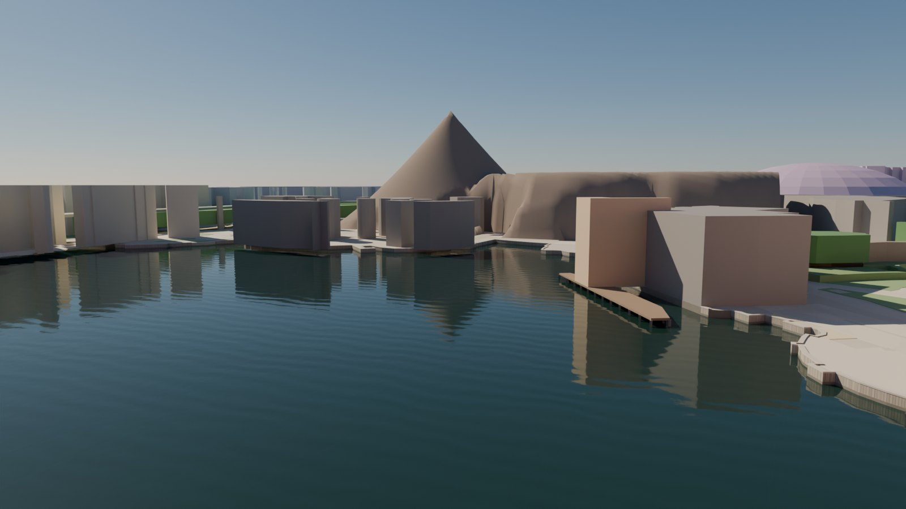

## 今どこまでできているか

| 項目 | 状態 | 主なファイル |
|---|---|---|
| OSM の取得と園の切り出し | 済 | `fetch_disneysea.py`, `ds_core.py` |
| 箱の建物(700 棟)・エリア 8 つの色分け | 済(高さの大半は推定) | `ds_buildings.py`, `ds_core.py` |
| 地形・緑地・岩場・園路・高架鉄道 | 済 | `ds_terrain.py` |
| 階段・橋・トンネル・地面の高低差 | 済(一部は向きの確認が必要) | `ds_levels.py` |
| 水面(水位・水深・護岸・カルデラ湖) | 済 | `ds_water.py`, `disneysea_water_blender.py` |
| プロメテウス火山の岩山 | 済(Blender で岩肌まで作成) | `ds_volcano.py`, `ds_volcano_model.py` |
| アクアスフィア(地球儀の噴水) | 済(詳細モデル、地球儀は作り直し済み) | `ds_aquasphere.py` |
| アクアスフィア周りの地面(ディズニーシー・プラザ) | 済 | `ds_plaza.py` |
| Blender で作ったものをモックに 3D モデルとして表示 | 済(水面・アクアスフィア・プラザ・火山) | `export_models.py` |
| 枠線モック(地図・俯瞰・散歩の 3 モード、PC とスマホ) | 済 | `export_mock.py`, `output/disneysea/mock_template.html` |
| 優先パーツの作り込み(ミラコスタ、コロンビア号など) | これから | — |

## 使い方

```
python fetch_disneysea.py          # OSM を取得(plateau_data/disneysea_osm.json)
python ds_levels.py                # 階段・高低差 → plateau_data/disneysea_levels.json
python ds_water.py                 # 水面モデル   → plateau_data/disneysea_water.json
python ds_volcano.py               # 火山の岩山   → plateau_data/disneysea_volcano.json
python ds_plaza.py                 # プラザの地面 → plateau_data/disneysea_plaza.json
python ds_aquasphere.py --textures # 地球儀のテクスチャ → plateau_data/globe/
python export_mock.py              # 枠線モック   → output/disneysea/tds_outline.html

blender -b --python disneysea_draft.py -- --cams aerial,top --samples 16      # 下書き全体
blender -b --python disneysea_water_blender.py -- --cams harbor,caldera       # 水面
blender -b --python export_models.py -- --parts water,aquasphere,plaza,volcano  # モック用の 3D モデル
blender -b --python export_models.py -- --parts aquasphere --render           # アクアスフィアの確認レンダー
```

Blender は 5.2。複数の作業を同時に進めるときも、Blender を起動するのは一度に 1 つだけにする(同時に動かすと落ちたり止まったりした)。

座標: 原点 35.6267N 139.8851E(メディテレーニアンハーバー付近)、+X が東、+Y が北、単位はメートル。
高さの基準: 国土地理院 DEM5A で測った園路の中央値(標高 5.29 m)を 0 m とする。

## 枠線モック

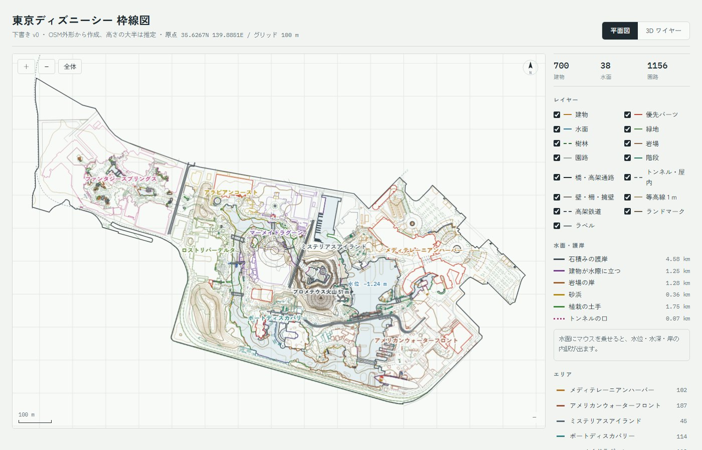

`output/disneysea/tds_outline.html` は 1 ファイルで開ける。画面いっぱいの表示の上に、細い見出しバーとパネルを重ねている。

- 見出しバー: モードの切り替え(**地図 / 俯瞰 / 散歩**)、「共有」(今の視点の URL をコピー。スマホでは共有メニュー)、「軽量」(水の透過・しぶきを切り、解像度を下げる。タッチ端末では最初からオン)、「パネル」。
- パネル(PC は左、スマホは下から出る): 「表示」「エリア・移動」「情報」のタブ。
  - 表示: プリセット 3 つ(モデルのみ / 枠線+モデル / 枠線のみ。キー 1・2・3)、レイヤー、3D モデル。
  - エリア・移動: 地図と俯瞰ではそのエリアへ移動して強調、散歩ではその場所へ移動する。アクアスフィア(スタート地点)も選べる。
  - 情報: 建物・水面・園路の数、操作キーの一覧、水面・護岸、階段の要確認リスト、この下書きについて、出典。
- 地図: ドラッグで移動、ホイールで拡大。建物・階段・水面にマウスを乗せると詳細が出る。
- 俯瞰: 高さつきの枠線と 3D モデルを、ぐるっと回して見られる。右下のミニマップを押すと、そこへカメラが飛ぶ。
- レイヤー: 建物・優先パーツ・水面・緑地・樹林・岩場・園路・階段・橋・トンネル・壁・等高線・高架鉄道・ランドマーク。
- 階段は根拠ごとに色を分けている(DEM で確定 / つながりから推定 / 長さから推定 / 向き不明)。
- 水面は、岸の種類の色分け・水位ラベル・水深の輪郭・「水面・護岸」欄を表示する。
- 今のモードと視点は URL に入る(`#map/…` `#orbit/…` `#walk/…`)。その URL を開くと同じ景色から始まる。
- H キー(または「写真」)で操作部品を隠す写真モード。H・Esc・「表示を戻す」で戻る。
- モードを切り替えると、カメラが滑らかに移る(俯瞰から散歩では、上空から人の目線まで降りる)。

`export_mock.py` は `mock_template.html` にデータを入れて `tds_outline.html` を作る。
水面の描画は、テンプレートの `<script id="ext-water">` の中にある。

### Blender で作ったものは 3D モデルに置き換わる

レイヤーの枠線は下書きなので、Blender で作り終えた部分は、3D 表示ではその 3D モデルに置き換える。
レイヤーの一覧(表示の切り替え)と平面図はそのまま残る。

パネルの「表示」タブの「3Dモデル」欄(俯瞰・散歩)で、モデルごとに表示を切り替えられる。各欄の「すべてオン / すべてオフ」で一括切り替えもできる(「重ねて表示」は対象外)。

- モデルのチェックを外すと、そのモデルに置き換えられていた枠線が出る(枠線だけの表示)。
- 「枠線も重ねて表示」をオンにすると、枠線とモデルを同時に表示する。
- モデルの表示はレイヤーとは独立している。レイヤーを全部オフにすれば、3D モデルだけを表示できる。
- 設定はブラウザの localStorage(`tds-models`)に保存する。
- 水面は、Blender の水(屈折・吸収・さざ波・空の映り込み)を three.js の物理マテリアルで再現している(three.js r147)。建物の映り込みはない。
- アクアスフィアの噴水は、モック側のシェーダーで常に流れているように動かしている。地球儀の表面を流れ落ちる水の筋、受け皿から落ちる水のカーテン(縦の筋が流れ落ちる)、泡の輪、しぶきの粒、池に広がる同心円の波。Blender の材質や動きは glTF に残らないため、Blender 側ではなくモック側で作っている。池の水は、透過にすると縞が出たので不透明の色にしている。

### 散歩(身長 170 cm の人の目線)

「散歩」を押すと、アクアスフィアから 22 m(東寄り)のプラザに、地球儀を向いて身長 170 cm の人が立つ。

- PC: 画面をクリックするとマウスで見回せる(Esc で解除)。W A S D / 矢印キーで歩く(1.4 m/秒)、Shift で走る(4 m/秒)。
- スマホ: 左下のスティックで歩き、画面をドラッグして見回す。右下の「走る」で走る。
- V キー(または「三人称」ボタン)で、一人称(目の高さ 1.58 m)と三人称(人の後ろから)を切り替える。Esc で俯瞰に戻る。
- 画面中央の照準の先にある物(建物の名前・エリア・高さ、3D モデルの面、階段、水面、地面の標高)と距離を表示する。
- ミニマップに現在地と向きを出す。ミニマップや「エリア・移動」の一覧で、その場所へ移動できる(建物や水の中なら、近くの地面に降りる)。
- 上に方位、左下に足元の高さ(園路基準)と位置を表示する。
- 足元の高さは、Blender のモデル(プラザ・火山・水面・桟橋)があればその面、なければ DEM の地面。段差は 0.55 m まで上れ、それより高い崖は越えられない。
- 建物の外形には入れない。水には入れて、水面の高さに立つ。

| モデル | 置き換えるレイヤー | ファイル |
|---|---|---|
| 水面(水面・水底・護岸・笠石・岩場・砂浜・土手・桟橋) | 水面 | `output/disneysea/models/water.json` |
| アクアスフィア | ランドマーク | `output/disneysea/models/aquasphere.json` |
| ディズニーシー・プラザ(舗装・植え込み・木) | 園路(と一緒に表示) | `output/disneysea/models/plaza.json` |
| プロメテウス火山(岩山・台地・カルデラの崖) | ランドマーク(等高線を置き換え) | `output/disneysea/models/volcano.json` |

- `export_models.py` が Blender から glTF に書き出し、それぞれの地面の高さ(DEM 基準)まで持ち上げる。
- Artifact のホストは `.glb` を配信しないので、バッファを埋め込んだ glTF の JSON にしている(GLTFLoader はどちらも読める)。
- Blender の手続き型マテリアルは glTF に残らない。そのため、モック側でメッシュ名(`WS_*`, `AQ_*`, `PZ_*`)ごとに色を付けている。火山は頂点カラーをそのまま使う(glTF はリニアで保存するので、モックで sRGB に戻す)。

| 水面のモデル | アクアスフィアとプラザ |
|---|---|
| 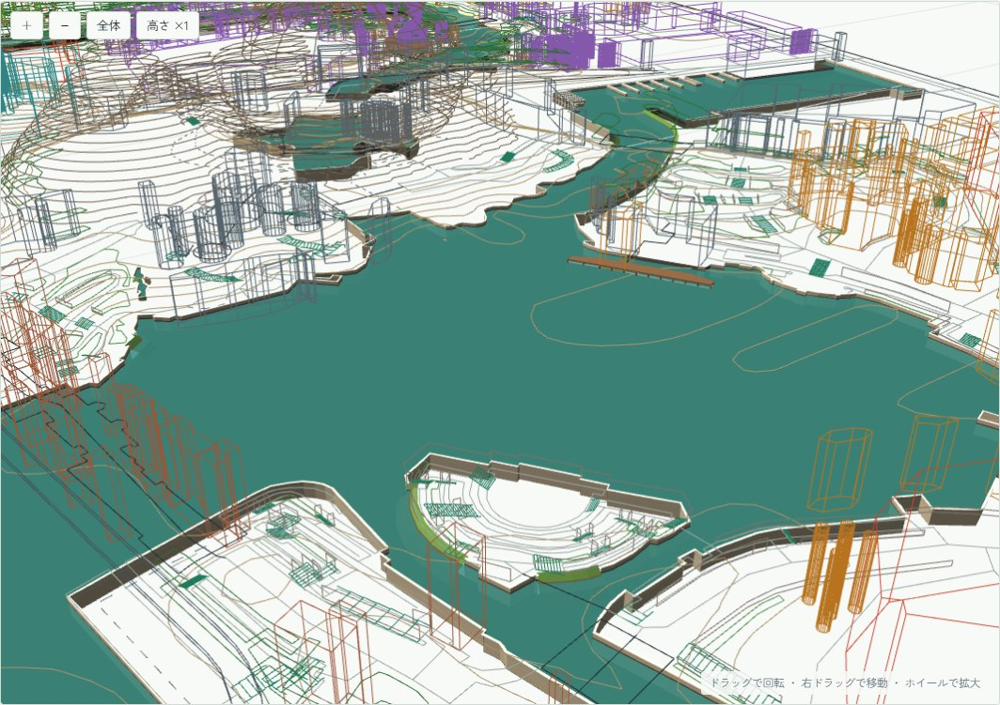 | 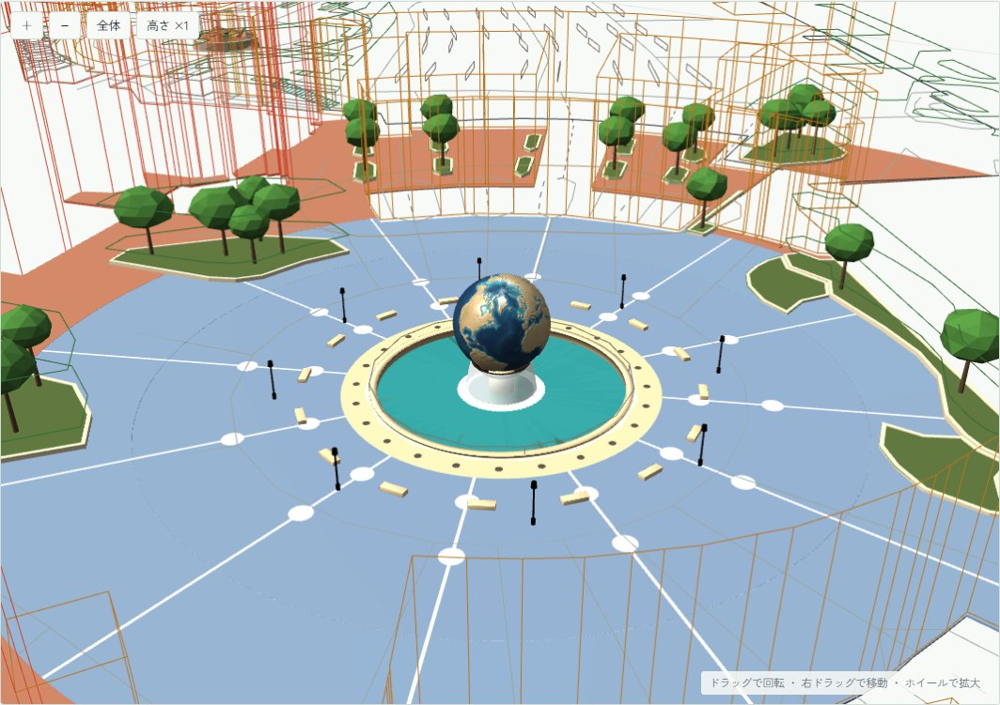 |

## 下書き(Blender)

| | |
|---|---|
| 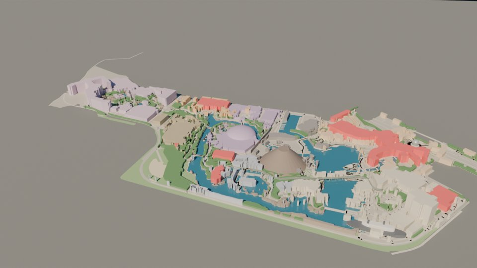 | 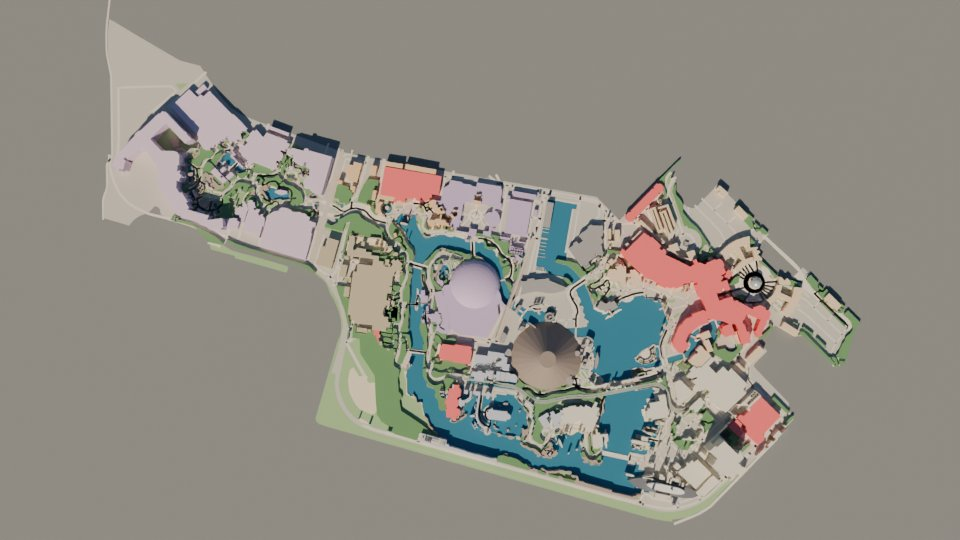 |
| 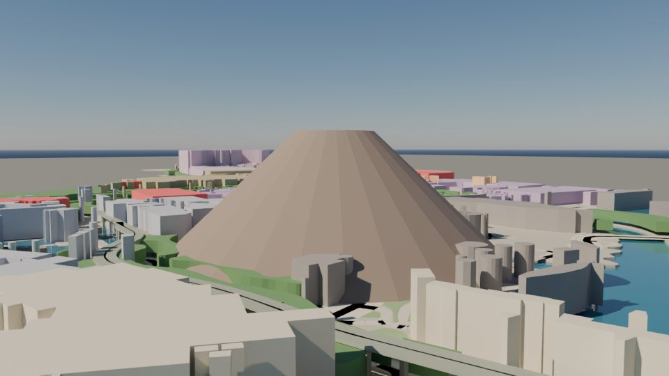 | 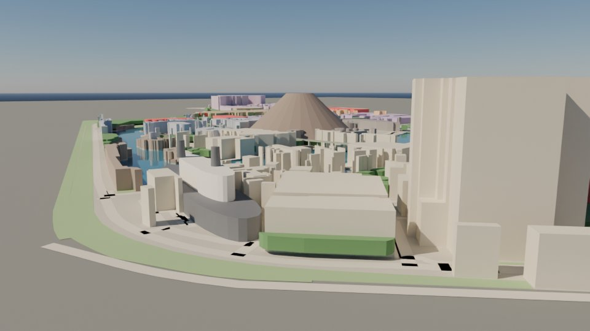 |

- 建物は OSM の外形を押し出した箱。高さの実測タグがあるのは約 15 棟だけで、残りはエリアごとの推定値。
- 建物のエリア(8 つ)は、OSM の施設の点(アトラクション・店・レストラン)の名前から決める(`ds_core.PORT_POI_NAMES`)。建物の中に施設の点があればそのエリア、なければ 90 m 以内で一番近い施設の点のエリア、それもなければエリアごとの代表点(`PORT_ANCHORS`)で一番近いもの。水面のエリアも同じ方法で決める。
  - 以前は代表点だけで決めていたため、アラビアンコーストとロストリバーデルタの東側がマーメイドラグーンに、ケープコッドがポートディスカバリーに、フォートレス・エクスプロレーションがミステリアスアイランドに入っていた(2026-09-24 に修正、127 棟)。
  - フォートレス・エクスプロレーションとマゼランズは、火山のそばにあるがメディテレーニアンハーバーに含める。
  - `docs/draft/` の Blender の画像は、修正前の色分けのまま。
- 参考モデルがある優先パーツ(ミラコスタ、トイ・ストーリー・マニア、シンドバッド、ニモ、コロンビア号など)は赤。
- タワー・オブ・テラー(ホテルハイタワー)は、OSM の高さタグどおり 59 m の箱で置いている。
- マーメイドラグーンの屋内ホールは、平らな屋根(推定 15 m)の上に八角形の屋根(航空写真から中心 (-188, -43)・半径 17 m、頂点は推定 27.5 m)を乗せている(`ds_core.TRITON_ROOF`)。キング・トリトンズ・キャッスル(ホールの北端)はまだ作っていない。

### 階段・高低差(`ds_levels.py`)

OSM には階段が 98 か所あるが、段数と上る向きが入っているのは 1 か所だけ。
そこで、各階段の高さと向きを次の順で決め、根拠を記録している。

1. **DEM で確定**: 両端の標高差が 0.5 m 以上ある
2. **つながりから推定**: 片方の端が橋・高架通路(上)やトンネル(下)につながっている
3. **長さから推定**: 蹴上げ 0.16 m・踏面 0.30 m として段数を出す(上限 3 m)
4. **向き不明**: 上の方法で決まらない。モックで赤く表示し、確認が必要

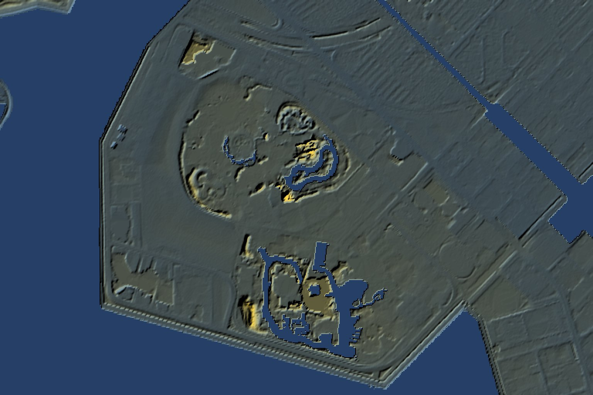

### プロメテウス火山(`ds_volcano.py`)

最初は半径 70 m の円錐を置いていたが、カルデラ湖を埋めてしまっていた。
DEM を見ると、ミステリアスアイランドは園路より約 5.3 m 高い平らな台地で、その中央にカルデラ湖がある。
そこで岩山を、台地の上に湖を囲むリングとして作り直した。

- 山頂: 51 m。OSM の山頂の位置(南側の縁)
- 縁: 高さ約 20 m、湖岸から約 22 m 外側
- 湖岸から 6 m 以内と、園路・建物の周りは岩を置かない

`ds_volcano_model.py`(Blender)が、この高さのグリッドを岩山として作り込む。

- 0.6 m 間隔に細かくし、ゆがませた稜線状のノイズで尾根・谷・副峰を付ける(高い岩ほど強く)
- 地層: 約 1.8 m ごとに、間隔が揺らぐ段(棚)を付ける
- 台地の縁は園路へ、カルデラの縁は湖へ、崖として落とす
- 山頂に火口のくぼみを付ける
- 色は頂点カラーで付ける: 赤茶・黒い玄武岩・黄土の地層の縞、急な崖は暗く、棚はほこりっぽく、火口の周りは焦げた色、台地の床(通路)は砂色

| 港から | 上空から |
|---|---|
| 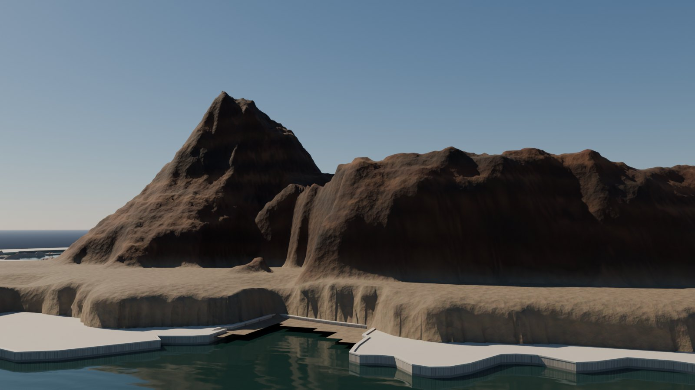 | 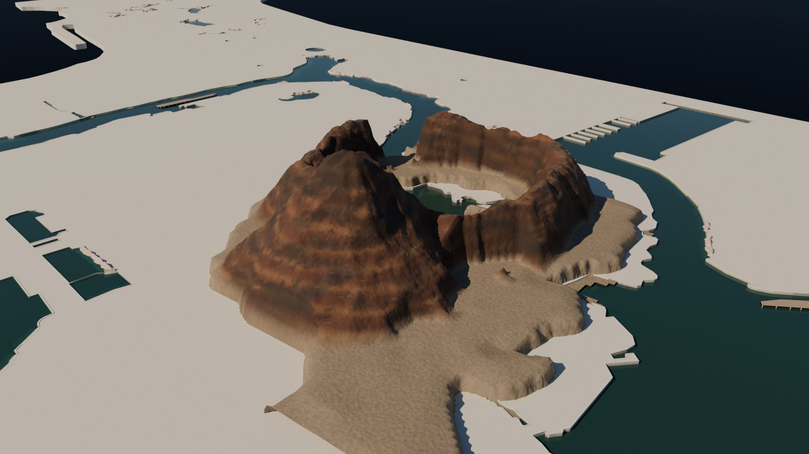 |

モックでの表示:

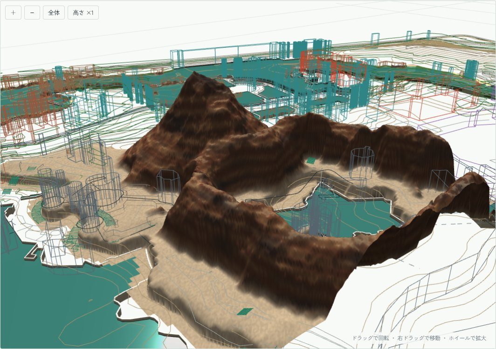

### アクアスフィア(`ds_aquasphere.py`)

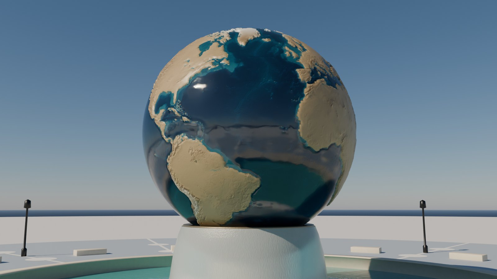

直径 8 m の地球儀を高さ 2 m の台座に載せ、周りを水盤(半径 11.16 m、縁の高さ 0.40 m)が囲む。
石のブロックや街灯の数・配置は推定なので、確認が必要。

地球儀は 2 回目に作り直して、次のようにした。

- **テクスチャ**: NOAA ETOPO(パブリックドメイン)の地形から `python ds_aquasphere.py --textures` で作る。海は深さに応じて紺から青緑、大陸棚は明るい青緑、陸は風化した石の色で、強めの陰影を付けて彫り込んだように見せる。氷床は白。
- **浮き彫り**: 海岸で約 4 cm の段差を付け、山は最大約 12 cm まで盛り上げる。
- **水の膜**: 地球儀の表面を流れ落ちる水を、少し大きい透明な球で表す。縦の筋が入り、地球儀と一緒には回らない。
- **根元**: ブロンズの受け皿で地球儀を受け、そのふちからあふれた水が白いカーテンになって池へ落ち、泡の輪になる。

| 根元 | 全体 |
|---|---|
| 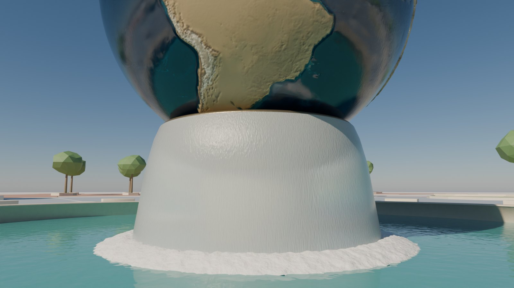 | 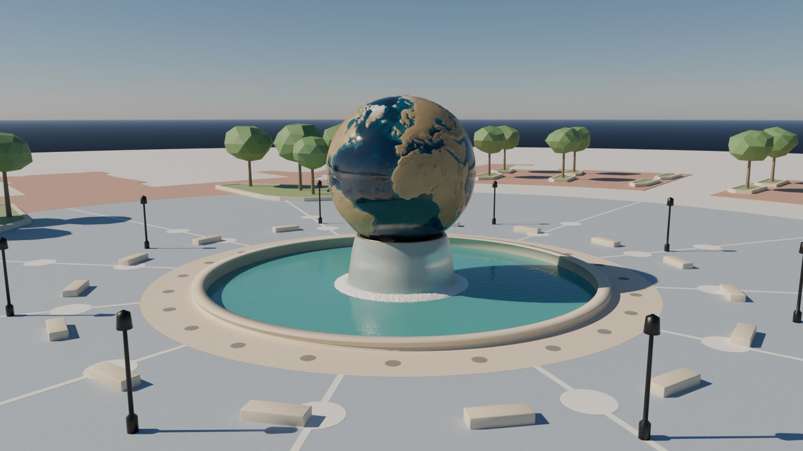 |

### ディズニーシー・プラザ(`ds_plaza.py`)

アクアスフィアの周り半径 85 m の地面。

- **舗装**: 地球儀から 42 m 以内は青灰色の石、その外側は赤茶のレンガ(航空写真の見た目に合わせた)。OSM のプラザ(relation 3297581)は中央の円と西のアーケードだけなので、ホテルミラコスタの中庭(植え込みの周り)も舗装する。地上の建物は除く。
- **白線**: アクアスフィアの 12 本の放射状の線を、42 m まで延長する。
- **植え込み**: プラザの内側の楕円形の穴と、OSM の庭・樹林・花壇。0.45 m の石の縁、芝の土、丸い樹冠の木(約 5 m 間隔、41 本)。同じ植え込みが二重に登録されている分は除く。

| 計画(航空写真に重ねたもの) | 植え込みと木 |
|---|---|
| 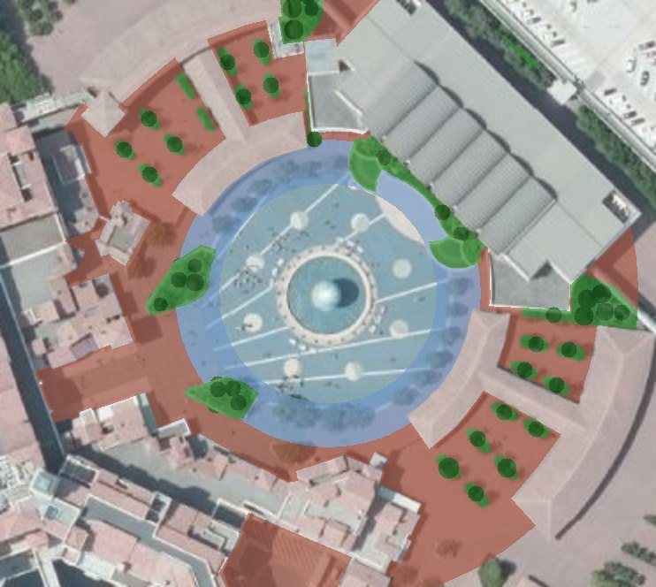 | 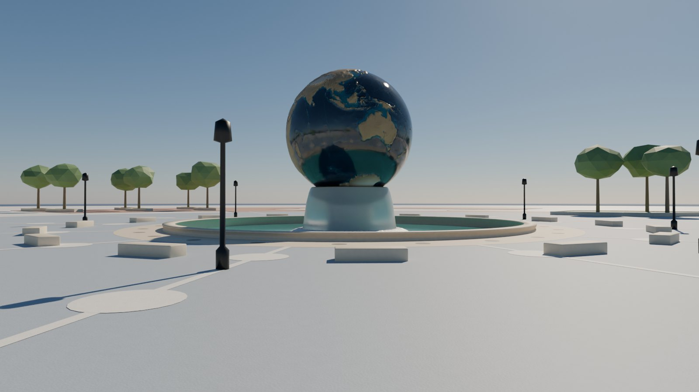 |

## 水面(`ds_water.py` → `disneysea_water_blender.py`)

| | |
|---|---|
| 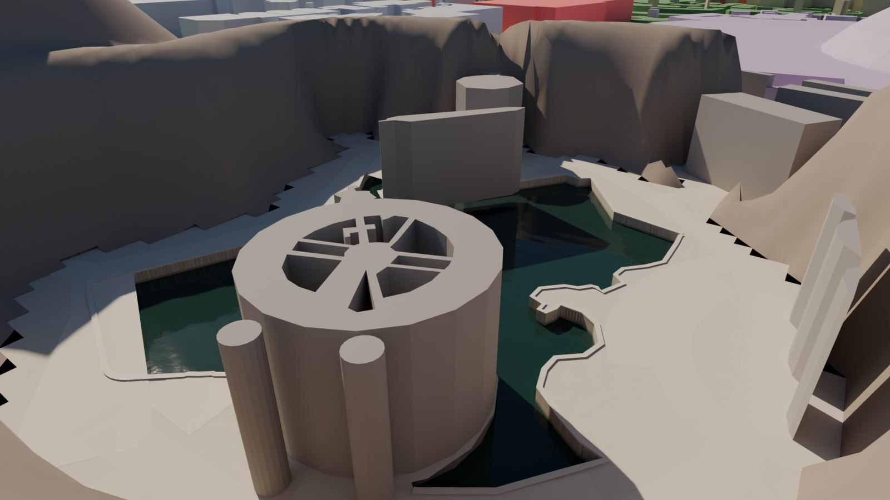 | 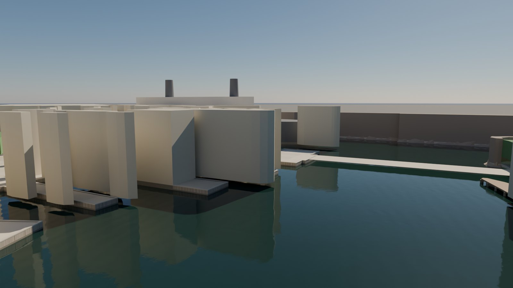 |
| 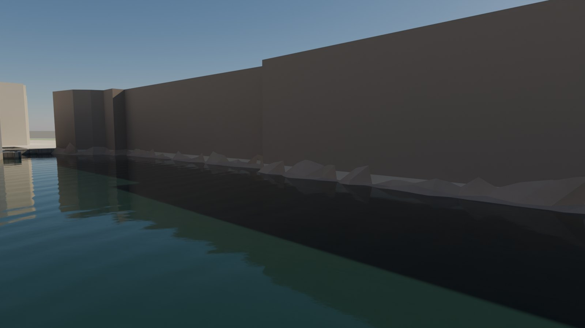 | 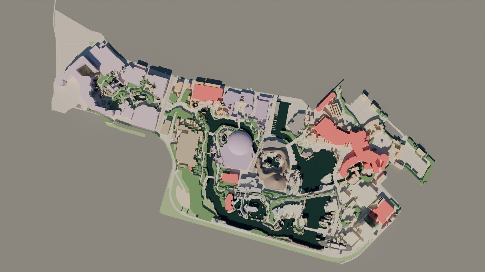 |

- **水域 38 か所**: OSM の `natural=water` から取っている。メインの港(relation 3531413)はミステリアスアイランドの中を通っている(ロストリバー → トンネル → カルデラ湖 → トンネル → 港。トランジットスチーマーラインの経路)。空が見えているカルデラ湖だけを航空写真の色から切り出し、岩の下を通る部分は `tunnels` に分けた(地面に穴を開けない)。

  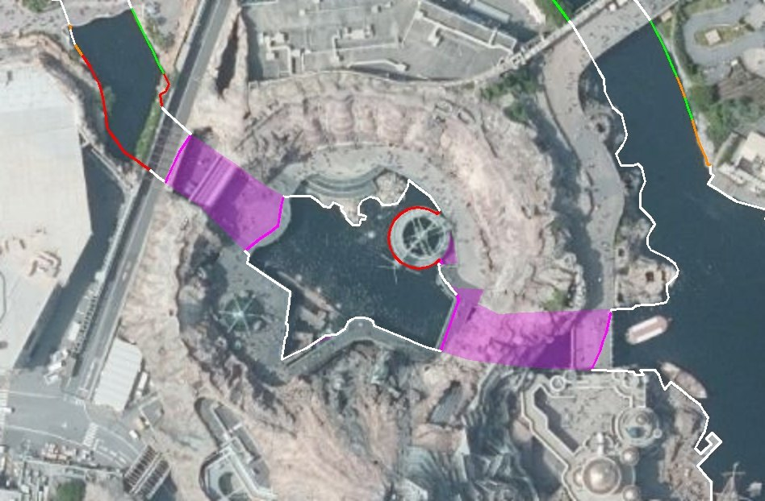

- **水位**: 岸の地面の高さ(DEM)から、水域の種類ごとの余裕高を引いて決める。余裕高は、港 1.0 m、カルデラ湖 1.3 m、水路 0.7 m、池 0.35 m、噴水 0.25 m。DEM の水面部分は補間された値でしかないので、水位そのものは DEM から読まない。カルデラ湖は港とつながっているので、港と同じ水位にしている。
- **水深**(推定): 港 2.5 m、カルデラ湖 3.0 m、水路 1.2 m、池 0.6 m。
- **岸の種類**: 岸の各区間について、陸側 2.5 m の地点に何があるかで決める。

  | 種類 | 判定 | Blender での形 | 長さ |
  |---|---|---|---|
  | 石積みの護岸 | 下のどれにも当たらない | 垂直の石積み + 笠石 | 4.58 km |
  | 植栽の土手 | 芝・庭・樹林 | 草の斜面 → 泥の斜面 | 1.75 km |
  | 岩場の岸 | scree / bare_rock | でこぼこの岩の斜面 | 1.28 km |
  | 建物が水際に立つ | 建物の敷地 | 濡れた基礎の壁 | 1.25 km |
  | 砂浜 | sand / beach | ゆるい砂の斜面 | 0.36 km |
  | トンネルの口 | トンネル部分 | 石積み | 0.07 km |

  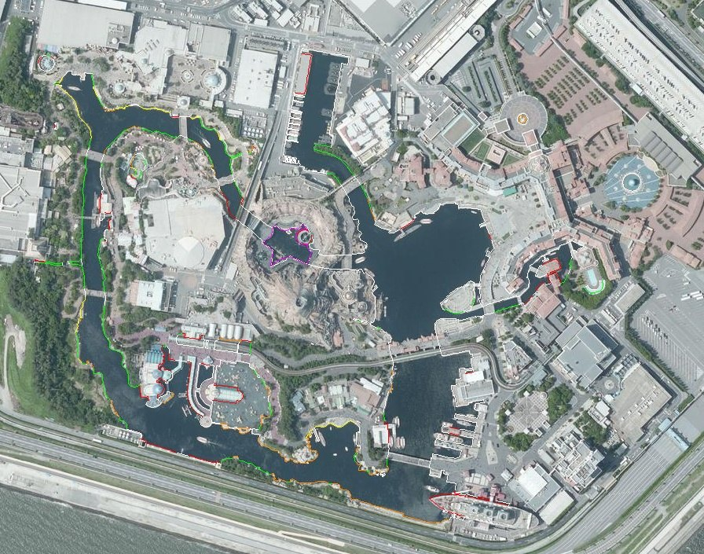

- **桟橋** 3 か所: 板張りの床と杭。
- Blender では、水を閉じた体積として作っている(屈折 + 吸収 + さざ波のバンプ)。地面はブーリアンで水の形をくり抜く。カメラは `top aerial harbor caldera american rock lost_river fantasy`。

## 公開(Vercel)

https://tokyo-disneysea-3d.vercel.app で誰でも見られる。GitHub の main に push すると Vercel が自動でデプロイする。

- `vercel.json` が `output/disneysea/` をそのまま配信し、`/` を `tds_outline.html` に向ける。ビルドはない。
- **push の前に `python export_mock.py` を実行して、`tds_outline.html` と `models/` をコミットする**(CI はない)。
- 画面の右下(3D では地図の隅)とパネルの「出典」欄に、出典を表示している。

## 分かっている限界

- DEM と航空写真は、どちらも**ファンタジースプリングス開業(2024 年)より前**のもの。このエリアの高さと水位は推定。
- Blender の地面は平ら(園路 = 0)。DEM の高さを使っているのはモックだけ。
- 樹林は高さ 7 m の箱なので、水面や建物を隠しやすい。
- 滝・噴水の水の流れ、船、夜の照明はまだ作っていない。
- 余裕高・水深・建物の高さの大半は推定値。
- 地球儀のテクスチャ(`plateau_data/globe/globe_color.png`, `globe_height.png`)は使い捨てのスクリプトで作ったもので、まだ `ds_aquasphere.py` からは作り直せない。そのためリポジトリに含めている。

## データの出典

- 地図: © OpenStreetMap contributors(ODbL)
- 標高: 国土地理院 基盤地図情報 数値標高モデル 5 m メッシュ(DEM5A)
- 航空写真: 国土地理院 シームレス空中写真(カルデラ湖の輪郭を取るのと、岸の確認にだけ使用。テクスチャには使っていない)
- 地球儀: NOAA ETOPO(パブリックドメイン)
