# ディズニーパーク 3D モデル(東京ディズニーシー・ランド / 個人用)

OpenStreetMap と国土地理院のデータから、東京ディズニーシーとランド、舞浜駅まわりを 3D で組み立てるプロジェクト。
ブラウザで見られる **モック**(公開中)で配置・高さを確かめ、Blender で作り込んだパーツをモックに 3D モデルとして重ねていく。
個人の練習用。公開しているのはモックだけで、Blender のファイルや元データは配布しない(2026-09-23 開始)。

**モック: https://tokyo-disneysea-3d.vercel.app**


## 目次

1. [今どこまでできているか](#今どこまでできているか)
2. [はじめに(見る・更新する・別の端末で作業する)](#はじめに)
3. [作業ルールと確認の記録](#作業ルールと確認の記録)
4. [モックの使い方](#モックの使い方)
5. [データと処理の流れ](#データと処理の流れ)
6. [Blender で作ったもの](#blender-で作ったもの)
7. [パーツ別の詳細](#パーツ別の詳細)
8. [公開(Vercel)](#公開vercel)
9. [分かっている限界](#分かっている限界)
10. [データの出典](#データの出典)

## 今どこまでできているか

| 項目 | 状態 | 主なファイル |
|---|---|---|
| シーの建物 700 棟・エリア 8 つの色分け | 済(高さの大半は推定) | `ds_buildings.py`, `ds_core.py` |
| 地形・緑地・岩場・園路・高架鉄道 | 済 | `ds_terrain.py` |
| 階段・橋・トンネル・壁・地面の高低差 | 済(一部は向きの確認が必要) | `ds_levels.py` |
| 水面(水位・水深・護岸・カルデラ湖) | 済 | `ds_water.py`, `disneysea_water_blender.py` |
| プロメテウス火山の岩山 | 済(Blender で岩肌まで) | `ds_volcano.py`, `ds_volcano_model.py` |
| アクアスフィア(地球儀の噴水) | 済(詳細モデル) | `ds_aquasphere.py` |
| ディズニーシー・プラザ(アクアスフィア周りの地面) | 済 | `ds_plaza.py` |
| 入場口・駅(リゾートライン駅とゲート) | 済(モックのレイヤー) | `ds_core.py` の `entrance_layer()` |
| ディズニーランド(建物 375 棟・7 エリアの色分け・階段・高低差) | 済(モックのレイヤー。高さの大半は推定) | `fetch_disneyland.py`, `ds_disneyland.py` |
| 舞浜駅・周辺(JR・リゾートライン全周・イクスピアリ・ホテル・歩道) | 済(モックのレイヤー) | `ds_disneyland.py` |
| モック(地図・俯瞰・散歩、PC とスマホ) | 済 | `export_mock.py`, `output/disneysea/mock_template.html` |
| Blender で作ったものをモックに 3D モデルとして表示 | 済(水面・アクアスフィア・プラザ・火山) | `export_models.py` |
| 東京ディズニーランド・ステーション(参考動画と同じ作り方。写真・航空写真・OSM の外形から) | 済(Blender で作り、モックの 3D モデルに) | `ds_tdl_station.py` |
| 電車(リゾートライン)の Blender モデル(写真と跨座式モノレールの構造から、外装・台車・車内・ガラスまで) | 済(モックの電車はこのモデル。JS 版は `train.html` だけに残す) | `train_blender.py`, `docs/train/spec.md` |
| リゾートラインの電車をモックで走らせる(2 編成が全周を周回、4 駅で停車) | 済(Blender の車両。地図は印、俯瞰・散歩は 3D。車内はカメラから 150 m 以内だけ) | `output/disneysea/models/train.json`, `mock_template.html` の `RL` |
| 京葉線の電車(E233 系 10 両、上下線、舞浜駅に停車) | 済(モック。舞浜駅の前後 約 790 m だけ) | `mock_template.html` の `MOV` |
| 夜のモード・施設の検索 | 済(モック) | `mock_template.html` |
| 屋根だけの構造物を屋根の板に・樹林を木の記号に | 済(モック。屋根は Blender の下書きも) | `ds_core.py`, `ds_buildings.py`, `mock_template.html` |
| 東京ディズニーランドのエントランス(メインエントランスのゲート・ワールドバザールの入口・ミッキーの花壇。参考動画・写真・OSM から) | 済(Blender で作り、ユーザーの確認後にモックの 3D モデルに) | `ds_tdl_entrance.py` |
| 線路(リゾートラインの桁・橋脚・電車線・3 駅のホーム、京葉線の高架・線路・架線・舞浜駅のホーム) | 済(Blender で作り、自分で 3 回見直してからモックに。ユーザーの指示で Blender での確認は省略) | `ds_tracks.py` |
| 優先パーツの作り込み(ミラコスタ、コロンビア号、シンデレラ城など) | これから | — |
| ランド・舞浜駅を Blender のシーンに入れる | スクリプトは済(Blender では未実行) | `disneyland_blender.py` |

## はじめに

### 見る

公開ページを開くか、`output/disneysea/tds_outline.html`(1 ファイル)を直接開く。

### 更新する(Blender なしの端末でもできる)

```
pip install -r requirements.txt
python export_mock.py                  # モックを作り直す → output/disneysea/tds_outline.html
git add -A && git commit && git push   # push すると Vercel が自動で公開する
```

`export_mock.py` はコミット済みのデータだけで動く。元の OSM データ(`plateau_data/*_osm_raw.json`)は git に入れていない(大きいため)。
高低差を元データから計算し直すのは `--relevel` を付けたときだけ。

### データを取り直す(必要なときだけ)

```
python fetch_disneysea.py          # シーの OSM → plateau_data/disneysea_osm.json
python fetch_disneyland.py         # ランド・舞浜駅の OSM → plateau_data/disneyland_osm.json(シーとは別ファイル)
python ds_levels.py                # シーの階段・高低差 → disneysea_levels.json(raw が必要)
python ds_disneyland.py --levels   # ランドの階段・高低差 → disneyland_levels.json(raw が必要)
python ds_water.py / ds_volcano.py / ds_plaza.py   # 水面・火山・プラザの元データ
python ds_aquasphere.py --textures # 地球儀のテクスチャ
```

**注意:** OSM は日々更新される。取り直すと、高低差や火山の元データまで変わる(火山の元データは Blender で作った火山モデルの元になっている)。
データを更新したいときだけ実行し、更新したらモデルとの整合を確かめる。

### 別の端末で作業する(Blender がある端末など)

1. `git clone` して `pip install -r requirements.txt`(通常の Python 側のみ。Blender のスクリプトは Blender に同梱の Python で動くので不要)。
2. Blender のスクリプトは、コミット済みの JSON・DEM・地球儀テクスチャ・`output/disneysea/models/` だけを使う。元の OSM がなくても動く。
3. 使うコマンド(Blender は 5.2。**同時に 1 つだけ**起動する。複数だと落ちたり止まったりした):

```
blender -b --python disneysea_draft.py -- --cams aerial,top --samples 16        # 下書き全体
blender -b --python disneysea_water_blender.py -- --cams harbor,caldera         # 水面
blender -b --python export_models.py -- --parts water,aquasphere,plaza,volcano  # モック用の 3D モデル
blender -b --python export_models.py -- --parts tdl_station,train                # 東京ディズニーランド・ステーションと電車
blender -b --python export_models.py -- --parts tdl_entrance                     # 東京ディズニーランドのエントランス
blender -b --python export_models.py -- --parts tracks                           # 線路(リゾートライン・京葉線)
blender -b --python ds_tracks.py -- --samples 24                                 # 線路の確認レンダーと .blend
blender -b --python ds_tdl_entrance.py -- --samples 32                           # エントランスの確認レンダーと .blend
blender -b --python ds_tdl_station.py -- --samples 32                            # 駅の確認レンダーと .blend(電車も停車中)
blender -b --python export_models.py -- --parts aquasphere --render             # アクアスフィアの確認レンダー
```

4. モデルを書き出し直したら、`python export_mock.py` を実行してからコミットする。

**Blender で最初にやること(2026-09-24 時点で未実行):**

- [ ] `disneysea_draft.py` で下書きを出し直す。トリトンの屋根(`ds_landmarks.build_triton_dome`、`ds_core.TRITON_ROOF`)を屋内ホールの上(中心 -188, -43、軒 15 m・頂点 27.5 m)に移したが、Blender ではまだ確かめていない。
- [ ] `docs/draft/` の画像を撮り直す。エリアの色分けを 2026-09-24 に直したので、今の画像は古い色分けのまま。
- [ ] ランド・舞浜駅: `blender -b --python disneyland_blender.py -- --cams aerial,castle,maihama` を動かす(`ds_disneyland.py` のデータから、建物・水面・緑地・木・線路・京葉線の高架・リゾートラインの桁・舞浜駅周辺の建物を組む)。`python disneyland_blender.py --summary` で、Blender なしに中身の数を見られる。
- [x] 東京ディズニーランド・ステーション: `ds_tdl_station.py` で作り、ユーザーが Blender で確認して OK(2026-09-24)。モックに反映済み。
- [x] エントランス: `ds_tdl_entrance.py` で作り、ユーザーが Blender で確認して OK(花壇は 2 回直した: 入場口に向けて傾ける、円形にして真上からミッキーに見えるように)。モックに反映済み(2026-09-24)。
- [x] 電車: `train_blender.py` を v2 に作り込み(外装・台車・車内・ガラス)、モックの電車をこのモデルに差し替えた(2026-09-24)。汚れのベイクは TODO。

座標: 原点 35.6267N 139.8851E(メディテレーニアンハーバー付近)、+X が東、+Y が北、単位はメートル。
高さ: 国土地理院 DEM5A で測った園路の中央値(標高 5.29 m。厳密には 5.285778 m を `datum_exact` に保存)を 0 m とする。ランドも同じ基準。

### Blender で作るときの参考動画(必ず見る)

- **https://www.youtube.com/watch?v=-VIztXefx5Y** — ディズニーランド・ステーション(ディズニーリゾートライン)の 3D モデルを作っている動画。駅・建物などを Blender で作るときは、形の取り方・作る順番・細部の作り込みをこの動画に合わせる。
- **同じ投稿者の、ほかのディズニーパーク関連の動画も、常に参考にする。** Blender で何かを作り始める前に、その投稿者のチャンネルで、作る対象(建物・乗り物・エリアなど)の動画があるかを確かめ、あれば見てから作る。
- 動画を参考にして作ったものは、どの動画のどこを参考にしたかを、そのパーツの説明(README の「パーツ別の詳細」や `docs/`)に書く。
- 動画の画像・映像そのものはリポジトリに入れない(見て参考にするだけ)。

## 作業ルールと確認の記録

- **この端末(Blender なし)での作業は、毎回このリポジトリにコミットして push する。** コード、データ、確認に使った道具(`tools/`)、確認の結果(この節)、README の更新まで含める。別の端末で作業を引き継ぐため。
- Blender で作るときは、上の「[Blender で作るときの参考動画](#blender-で作るときの参考動画必ず見る)」の動画(と同じ投稿者のディズニーパーク関連の動画)を必ず参考にする。
- 確認に使う道具(Blender なしで動く):
  - `python tools/blender_smoke.py` — Blender 用スクリプトを、Blender の機能を空の代用品に置き換えて読み込み、構文・import・データファイルの有無を確かめる。
  - `python tools/aerial_overlay.py X0 Y0 X1 Y1 [OUT.jpg]` — モックのデータを国土地理院の航空写真に重ねて、位置を目で確かめる(範囲はローカル座標 m)。
- 2026-09-24 の確認の記録(航空写真との照合):
  - シー・ランドとも、建物・水面・園路・線路の位置は写真とほぼ重なった(1〜2 m 程度)。
  - 直したもの: マーメイドラグーンのエリアの範囲、トリトンの屋根の位置と高さ、タワー・オブ・テラーの誤った記述、`10;3` の高さタグ、ランドの建設区域と機関庫。
  - PLATEAU に浦安市はない(千葉県は千葉市・柏市・木更津市・八千代市・茂原市・多古町だけ)。国土地理院の航空レーザー点群は購入と申請が必要。実物の高さは今も推定のまま。
  - クリーンな clone から、元データなしで `export_mock.py` を実行して、コミット済みのページと同じものができることを確認した(違いはシーの等高線の 6 点が 0.1 m ずれるだけ)。
- 2026-09-24 の確認の記録(リゾートラインの電車をモックに入れたとき。Chromium のヘッドレス、描画はソフトウェア):
  - `train.html` を共有ファイル(`train_model.js`)に切り替える前と後で、外観・車内・断面の画面が同じになること(違いは組み立て時間の表示だけ)。
  - 地図: 2 編成の印が線路の上を動き、印に乗せると編成・停車駅・次の駅・速度が出る。駅に停まると印がホームに重なる。
  - 俯瞰・散歩: 電車が高架の桁の上を走り、カーブで車両ごとに向きが変わる。近くは詳細版(窓の穴と車内)、遠くと軽量モードは簡略版。散歩では近くを通る電車が見え、当たり判定はない。
  - 運行: 1 周(4,998 m)をたどると後戻りはなく、4 駅すべてで停まり、最高 時速 35 km。1 周期(637 秒)後に同じ位置へ戻る(ずれ 0.000 m)。
  - 「高架鉄道」か「舞浜駅・周辺」をオフにすると、電車の印と 3D が消える。ほかのレイヤー・3D モデル・散歩にエラーや変化はない。
- 2026-09-24 の確認の記録(まとめて実装した分):
  - 階段: 周辺の DEM で 7 か所の向きが決まり、向き不明は 16 → 9 か所。情報タブの内訳に「周辺のDEMから推定」が出る。
  - 屋根・樹林: 地図の点線、3D の屋根の板と柱、木の記号を画面で確認。散歩の当たり判定から屋根を外した。
  - 検索: 「シンデレラ」でシンデレラ城、「ベイサイド」でベイサイド・ステーション、「タワー・オブ・テラー」で施設の点が出る。地図・俯瞰・散歩(シーの外なら案内)で移動する。
  - 京葉線: 地図の赤い印と、3D の 10 両編成が舞浜駅の中心に停まること、上下線で向きが逆なこと、「枠線のみ」では枠線で出ること。
  - 夜: N と「夜」ボタンで切り替わり、再読み込み後も続く。
  - Blender: `python tools/blender_smoke.py` がすべて ok(`disneyland_blender.summary()`、`train_blender` の寸法が `train_model.js` と一致)。Blender の代用品で両方の組み立てを最後まで通した。
  - スマホ(iPhone 13・Pixel 7 の画面): 見出しバー・ボタン・パネルのはみ出しなし、エラーなし。描く三角形は 俯瞰 約 17 万、電車を追う 約 3 万、散歩の開始地点 約 44 万(上の「分かっている限界」)。
- 2026-09-24 の確認の記録(電車の切り替え): 「2本目へ」と T で追う電車が入れ替わり、カメラの注視点が電車から 8 m 以内に来る。レイヤーの「電車」をオフにすると地図の印が消え、3D モデルの「電車」をオフにすると 3D の電車が消える。プリセット 1・3 での切り替わりと、「電車を追う」で 3D モデルの電車がオンに戻ることを確かめた。
- 2026-09-24 の確認の記録(東京ディズニーランド・ステーションと Blender の電車をモックに入れたとき。Chromium のヘッドレス):
  - 駅: 俯瞰でパーク側・ホテル側・電車の停車中を確認。駅の箱(枠線)はモデルに置き換わる。ガラス屋根と窓から中が見える。コンソールのエラーなし。
  - 電車: 2 編成が Blender の車両で走り、ブルーとイエローの色帯が出る。窓から車内(赤い座席など)が見える。桁の上面(4.21 m)を走り、東京ディズニーランド・ステーションのホームに停まる。
  - `python tools/blender_smoke.py` がすべて ok(`ds_tdl_station` を追加)。
- 2026-09-24 の確認の記録(電車を追うカメラ): 「電車を追う」で追いかけ、カメラが電車と一緒に動く。地図のパネルから押すと俯瞰に切り替わって追う。追いかけ中のドラッグ、Esc と F、ボタンでの解除、イエローの編成、散歩に切り替えたときの解除を確かめた。

## モックの使い方


画面いっぱいの表示の上に、細い見出しバーとパネルを重ねている。

### 3 つのモード(見出しバーで切り替え)

| モード | 内容 |
|---|---|
| **地図** | 平面図。ドラッグで移動、ホイールで拡大。建物・階段・水面にマウスを乗せると詳細が出る。 |
| **俯瞰** | 高さつきの枠線と 3D モデルを、ぐるっと回して見る。右下のミニマップを押すと、そこへカメラが飛ぶ。 |
| **散歩** | 身長 170 cm の人の目線で歩く(ディズニーシーの中だけ)。 |

どのモードでも、リゾートラインの電車 2 編成が全周を走っている(地図は印、俯瞰・散歩は 3D。詳しくは[電車](#電車ディズニーリゾートライン))。
俯瞰では「電車を追う」(F キー)で、カメラが電車を斜め後ろの上から追いかける。

見出しバーのボタン: **共有**(今の視点の URL をコピー。スマホでは共有メニュー)、**夜**(配色を暗くし、3D は月明かりに。N キー。次に開いたときも夜のまま)、**軽量**(水の透過・しぶきを切り、解像度を下げる。タッチ端末では最初からオン)、**パネル**。
今のモードと視点は URL に入る(`#map/…` `#orbit/…` `#walk/…`)。その URL を開くと同じ景色から始まる。
モードを切り替えると、カメラが滑らかに移る。H キー(または「写真」)で操作部品を隠す写真モード。

### パネル(PC は左、スマホは下から出る)

- **表示**: プリセット 3 つ(モデルのみ / 枠線+モデル / 枠線のみ。キー 1・2・3)、レイヤー、3D モデル。「レイヤー」と「3Dモデル」の欄は、見出しを押すと折りたためる(状態はブラウザの `tds-fold` に保存)。
- **エリア・移動**: 先頭に**施設を探す**欄(アトラクション・店・レストラン・建物・エリア・駅の名前。ひらがな / カタカナ・空白・中黒の違いは無視。Enter で一番上へ移動)。地図では近づいて建物を強調、俯瞰ではそこへ飛ぶ、散歩ではその場所へ移動(ディズニーシーの中だけ)。その下のエリア一覧は、地図と俯瞰ではそのエリアへ移動して強調。散歩ではその場所へ移動。アクアスフィア(散歩のスタート地点)、ディズニーランドの各エリア、舞浜駅、ランドのエントランスも選べる(ランドと舞浜駅は地図と俯瞰のみ)。
- **情報**: 建物・水面・園路の数、操作キー、水面・護岸の内訳、階段の要確認リスト、この下書きについて、出典。

### レイヤー

建物・優先パーツ・水面・緑地・樹林・岩場・園路・階段・橋・トンネル・壁・等高線・高架鉄道・ランドマーク・**入場口・駅**・**ディズニーランド**・**舞浜駅・周辺**・ラベル。
ランドの階段・橋・壁・等高線などは、その機能のレイヤーと「ディズニーランド」の両方がオンのときに出る。屋根だけの構造物(OSM の `building=roof`。シー 59・ランド 47)は、地図では点線、3D では屋根の板と数本の柱で表し、散歩では下を通れる。樹林は、3D では地面の輪郭と 9 m おきの木の記号(幹と樹冠)で表す。京葉線の電車も「電車(リゾートライン・京葉線)」のレイヤー・3D モデルで切り替える。リゾートラインの電車は、地図の印を「電車(リゾートライン)」レイヤーで、俯瞰・散歩の電車を 3D モデルの「電車(リゾートライン)」で切り替える。「全体」ボタンは、表示中のレイヤーに合わせて、シーだけ / シー+ランド+舞浜駅の範囲に合わせる。

### 散歩(身長 170 cm の人の目線)

「散歩」を押すと、アクアスフィアから 22 m(東寄り)のプラザに、地球儀を向いて人が立つ。

- **PC**: 画面をクリックするとマウスで見回せる(Esc で解除)。W A S D / 矢印キーで歩く(1.4 m/秒)、Shift で走る(4 m/秒)。V キーで一人称(目の高さ 1.58 m)と三人称を切り替える。Esc で俯瞰に戻る。
- **スマホ**: 左下のスティックで歩き、画面をドラッグして見回す。右下の「走る」で走る。
- 画面中央の照準の先にある物(建物の名前・エリア・高さ、3D モデルの面、階段、水面、地面の標高)と距離を表示する。上に方位、左下に足元の高さ(園路基準)と位置、ミニマップに現在地と向きを出す。ミニマップや「エリア・移動」の一覧で、その場所へ移動できる(建物や水の中なら、近くの地面に降りる)。
- 足元の高さは、Blender のモデル(プラザ・火山・水面・桟橋)があればその面、なければ DEM の地面。段差は 0.55 m まで上れ、それより高い崖は越えられない。
- 建物の外形には入れない。水には入れて、水面の高さに立つ。入場ゲートは通り抜けられる。

## データと処理の流れ

```
OpenStreetMap ─ fetch_*.py ─▶ plateau_data/*_osm.json ─┐
国土地理院 DEM5A(plateau_data/gsi_dem5a/)───────────────┤
                                                         ├▶ ds_*.py(高低差・水面・火山・プラザ・ランド)
                                                         │        │
                                                         │        ├▶ export_mock.py ▶ tds_outline.html ─ push ▶ Vercel
                                                         │        └▶ Blender(disneysea_*.py / export_models.py)
                                                         │                 └▶ output/disneysea/models/*.json ─┘(モックに 3D モデルとして重なる)
```

- 元データ(`plateau_data/`)のうち git に入っているのは、`*_osm.json`、`*_levels.json`、水面・火山・プラザの JSON、DEM、地球儀のテクスチャ。生の OSM(`*_osm_raw.json`)と航空写真のキャッシュは入っていない。
- **建物のエリア**(シー 8、ランド 7+その他)は、OSM の施設の点(アトラクション・店・レストラン)と名前付きの建物の名前から決める(`ds_core.PORT_POI_NAMES`、`ds_disneyland.LANDS`)。建物の中に施設の点があればそのエリア、なければ 90 m 以内で一番近い施設の点のエリア、それもなければエリアごとの代表点で決める。水面のエリアも同じ方法。以前は代表点だけで決めていたため、隣のエリアに 127 棟が入っていた(2026-09-24 に修正)。
- **建物の高さ**: OSM の `height` タグ(`10;3` のような値は先頭を使う)。ないものはエリアごとの推定値(シー 10〜16 m、ランド 12 m)。実測があるのは、シーで約 15 棟、ランドでシンデレラ城(51 m)などごく一部。

## Blender で作ったもの

レイヤーの枠線は下書きなので、Blender で作り終えた部分は、3D 表示ではその 3D モデルに置き換える。レイヤーの一覧(表示の切り替え)と平面図はそのまま残る。

| モデル | 置き換えるレイヤー | ファイル |
|---|---|---|
| 水面(水面・水底・護岸・笠石・岩場・砂浜・土手・桟橋) | 水面 | `output/disneysea/models/water.json` |
| アクアスフィア | ランドマーク | `output/disneysea/models/aquasphere.json` |
| ディズニーシー・プラザ(舗装・植え込み・木) | 園路(と一緒に表示) | `output/disneysea/models/plaza.json` |
| プロメテウス火山(岩山・台地・カルデラの崖) | ランドマーク(等高線を置き換え) | `output/disneysea/models/volcano.json` |
| 東京ディズニーランド・ステーション | 舞浜駅・周辺(駅の箱を置き換え) | `output/disneysea/models/tdl_station.json` |
| 東京ディズニーランドのエントランス(ゲート・ワールドバザールの入口・花壇) | ディズニーランド(枠線はそのまま) | `output/disneysea/models/tdl_entrance.json` |
| 線路(リゾートライン・京葉線) | 舞浜駅・周辺(線路とホームの枠線を置き換え) | `output/disneysea/models/tracks.json` |
| リゾートラインの電車(先頭車・中間車・幌) | 電車(3D モデルの「電車」で切り替え) | `output/disneysea/models/train.json` |

- パネルの「3Dモデル」欄で、モデルごとに表示を切り替えられる(「すべてオン / オフ」あり)。チェックを外すと、そのモデルに置き換えられていた枠線が出る。「枠線も重ねて表示」で同時に見られる。モデルの表示はレイヤーとは独立で、レイヤーを全部オフにすればモデルだけを表示できる。設定はブラウザの localStorage(`tds-layers` `tds-models` `tds-ui`)に保存する。
- `export_models.py` が Blender から glTF に書き出し、それぞれの地面の高さ(DEM 基準)まで持ち上げる。Artifact のホストは `.glb` を配信しないので、バッファを埋め込んだ glTF の JSON にしている。
- Blender の手続き型マテリアルは glTF に残らない。そのため、モック側でメッシュ名(`WS_*` `AQ_*` `PZ_*`)ごとに材質を付ける(three.js r147)。
  - **水面**: Blender の水(屈折・吸収・さざ波・空の映り込み)を物理マテリアルで再現する。建物の映り込みはない。
  - **アクアスフィアの噴水**: 地球儀の水の筋、水のカーテン、泡の輪、しぶき、池の同心円の波を、シェーダーで常に流れているように動かす。池は、透過にすると縞が出たので不透明の色にしている。
  - **火山**: 頂点カラーをそのまま使う(glTF はリニアで保存するので、モックで sRGB に戻す)。

| 水面のモデル | アクアスフィアとプラザ |
|---|---|
|  |  |

## パーツ別の詳細

### 下書き(Blender)

| | |
|---|---|
|  |  |
|  |  |

- 建物は OSM の外形を押し出した箱。参考モデルがある優先パーツ(ミラコスタ、トイ・ストーリー・マニア、シンドバッド、ニモ、コロンビア号など)は赤。
- タワー・オブ・テラー(ホテルハイタワー)は、OSM の高さタグどおり 59 m の箱。
- マーメイドラグーンの屋内ホールは、平らな屋根(推定 15 m)の上に八角形の屋根(航空写真から中心 (-188, -43)・半径 17 m、頂点は推定 27.5 m)を乗せている。キング・トリトンズ・キャッスル(ホールの北端)は未作成。
- `docs/draft/` の画像は、エリアの色分けを直す前のまま。

### 階段・高低差(`ds_levels.py`)

OSM には階段がシーに 98 か所あるが、段数と上る向きが入っているのは 1 か所だけ。そこで、各階段の高さと向きを次の順で決め、根拠を記録している。ランドにも同じ処理を使う(階段 24 か所)。

1. **DEM で確定**: 両端の標高差が 0.5 m 以上ある
2. **つながりから推定**: 片方の端が橋・高架通路(上)やトンネル(下)につながっている
3. **長さから推定**: 蹴上げ 0.16 m・踏面 0.30 m として段数を出す(上限 3 m)
4. **周辺の DEM から推定**(`export_mock.resolve_stairs`、コミット済みのデータだけで動く): 3 で向きが決まらなかったものを、両端から 6・10・15 m 先の DEM の差で決める(3 か所とも同じ向きで、0.25 m 以上の差)。片方の端だけがトンネルにつながるものは、そちらが下。シー 6、ランド 1。
5. **向き不明**: 上の方法で決まらない。モックで赤く表示し、確認が必要(シー 7、ランド 2)。航空写真で確かめるのが次の手(この端末では航空写真を取れなかった)


### 東京ディズニーランド・ステーション(`ds_tdl_station.py`)

ディズニーリゾートラインの駅。参考動画(【背景メイキング】ディズニーランドステーション / WALT.)と同じ作り方で作った。

- **作る順番(動画どおり)**: ① 基準になる時計(ミッキーの文字盤。パーク側とホール側の両面)。② 半円の扇窓: 放射状の桟を 1 本作って「配列」(回転した Empty を使うオブジェクトオフセット)、珠の列を「配列 + カーブ」、石の枠とキーストーン。③ ガラスのかまぼこ屋根: 骨と桟を「配列」で並べ、「カーブ」で半円に曲げる。④ 台座、アーチ形の飾り板の列(1 枚 + 配列)、柱、角の面取り(ベベル)。⑤ 星のメダル、渦巻きの持ち送り(カーブにベベル)、柱の間の透かし板。⑥ そのまわりの建物。材質はクリームを基本に色違い、れんが、銅板(緑青)、金、ガラス。
- 動画はカメラに映る改札ホールだけを作っているが、モックで使うため駅全体を作った: パーク側の正面(2 つのアーチ、出窓、時計)、ホテル側の正面(駅名の看板、アーチの壁画、2 階の列柱と透かしのアーチ、スレートのフードの下の金の扇窓)、改札ホール(ガラスの屋根、改札機、横断幕、つり下げの照明)、ホーム(タイル、ホームドア、天井、照明)、両側の階段とエスカレーター(緑の屋根、かまぼこ形の屋根、下の「DISNEY RESORT LINE」の小屋)、1 階のれんがの壁(ロッカー・トイレの扉)、2 階の窓と赤い日よけ。
- **資料**: OSM の駅舎の外形・ホーム・線路、日本語版 Wikipedia(1 面 1 線の高架駅、改札とホームは同じ 2 階、改札の上はガラス屋根、アーチの壁画、ミッキーの時計、エスカレーター上下 各 1 基)、Wikimedia Commons の写真 16 枚、国土地理院の航空写真。どれも見て参考にしただけで、リポジトリには入れていない。
- **推定の寸法**(写真と外形の比から): ホームの床 7.0 m、桁の上面 6.0 m、軒 11.0 m、中央の軒 11.5 m、ガラス屋根は半径 6.4 m・頂上 18 m、時計の中心 12.9 m、アーチは幅 7.3 m・起点 4.6 m、階段 44 段。
- ガラスはすべて外が見える(Cycles は屈折、EEVEE・マテリアルプレビューとモックは半透明)。
- `.blend` は駅を原点に置く(開くとパーク側から見える)。モックへの書き出しでは、駅の向き(24.78°)と位置 (-583.08, 1023.04)、地面の高さ(基準 -1.79 m)を付ける。モック用は面取りを外し、約 11 万三角形。
- カメラ: `CAM_park`(パーク側)、`CAM_hotel`(ホテル側)、`CAM_gates`(改札ホール)、`CAM_concourse`(動画と同じ魚眼)、`CAM_platform`、`CAM_stairs`、`CAM_aerial`。

| パーク側 | ホテル側 |
|---|---|
| 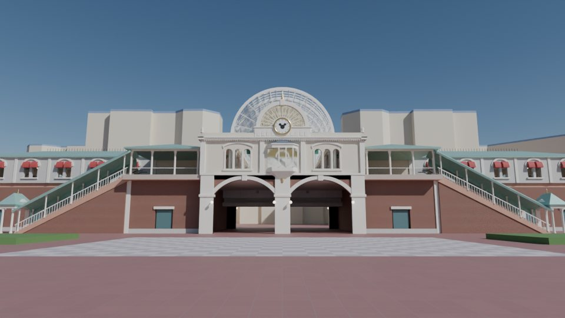 | 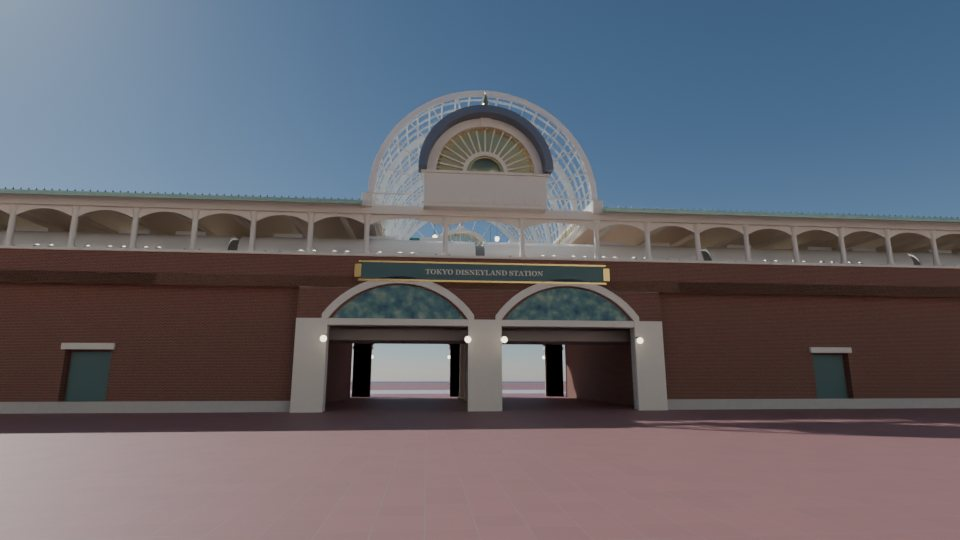 |
| **改札ホール** | **魚眼(動画の視点)** |
| 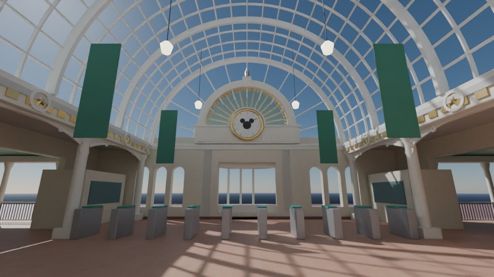 | 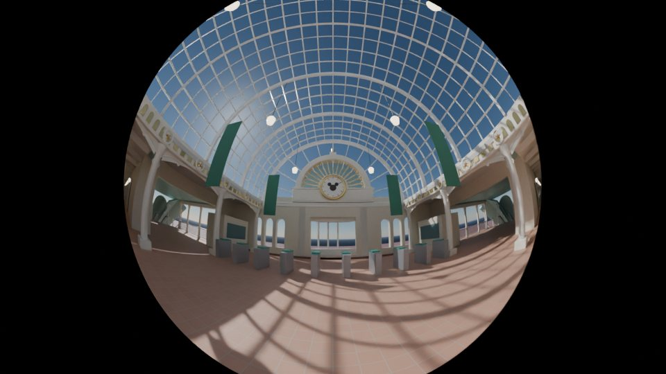 |
| **階段・エスカレーター** | **モックでの表示** |
| 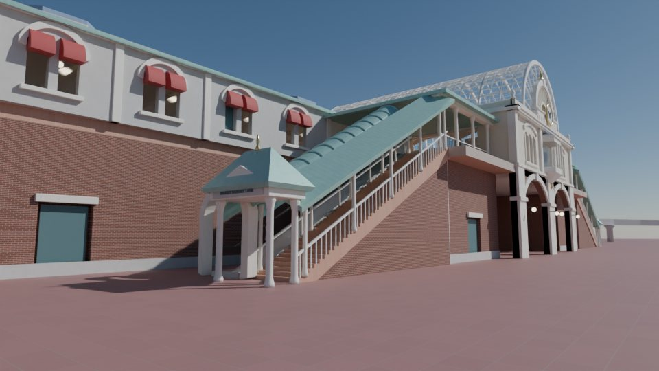 | 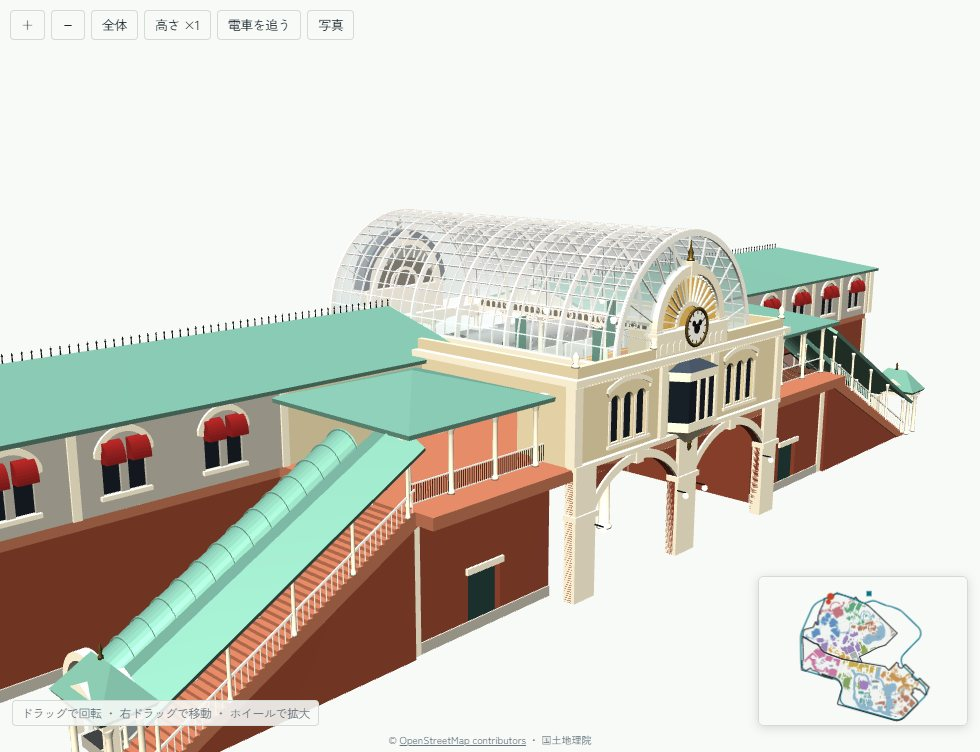 |

### 東京ディズニーランドのエントランス(`ds_tdl_entrance.py`)

参考動画(同じ投稿者の Shorts「Blenderでディズニーエントランスをモデリング」)が作っているワールドバザールの入口と、2023 年に建て替えられたメインエントランスのゲート、その間の入口の広場。

- **ワールドバザールの入口(動画の順番)**: ① 看板(赤い板に金の縁と渦巻き、「Tokyo Disneyland」、楕円の「Welcome」、上の縁の電球は 1 個 +「配列 + カーブ」、メダル)。② 柱(台座の百合の紋章、細い柱、柱頭、球形の灯り)。③ 梁(エンタブレチュア、飾り板 1 枚 + 配列、手すり子 1 本 + 配列)。④ アーチ(透かし板と輪の飾り)。⑤ 奥のれんがの建物(アーチの 1 階、Main Street への通路、アーチ窓の 2 階、バルコニーの青緑の手すりと花箱、付け柱、コーニス)。
- **メインエントランス(写真 2023〜2025 年)**: 中央の建物(青いスレートの寄棟屋根と手すりの付いた屋上、2 本の尖塔、白い破風と透かしの破風板、ミントグリーンの菱形の格子、赤い楕円の「Tokyo Disneyland」の看板、メダル、緑の「ENTRANCE」の板)。左右のゲートの列は、1 区画(四角い柱とミントのパネル、透かし板、区画ごとの小さな破風とマゼンタのメダル、屋根の飾りの鉄柵、改札機、灯り)を作り、OSM の屋根(半径 54〜66 m の弧)に沿って「配列 + カーブ」で並べた。両端に小さな建物。
- **ミッキーの花壇**: 円形(柵までの直径 約 34 m)。外から、アーチ模様の鉄の柵(1 区画 + 配列 + カーブ)、植え込みの土手、赤れんがの縁、芝生。芝生は入場口に向けて 7° 傾き(手前 0.5 m、奥 3.7 m)、入場口から全体が見える。顔は真上から見てミッキーになる形(丸い頭と耳、目のまわりが 2 つにふくらんだ白い顔、縦長の目、楕円の鼻、口角の上がった口、赤い舌)を紫と白の花で。
- **資料**: OSM(ゲートの屋根、ワールドバザールの建物、花壇の位置)、Wikimedia Commons の写真 18 枚、参考動画の画面。どれも見て参考にしただけ。
- **推定**: 高さ(柱 3.7 m、区画の破風 6.1 m、中央の建物の屋上 10 m、尖塔 12.5 m、ワールドバザールの柱 6.6 m・手すり 8.4 m)、区画の数、花壇の大きさと傾き、顔の描き方。
- モック用(`export_models.py --parts tdl_entrance`)は面取りと区画ごとの小さな「ENTRANCE」の文字を外し、約 13 万三角形。材質は駅と同じ名前の色を使う(メッシュ名 `EN_*`)。
- カメラ: `CAM_gate_in` `CAM_gate_out` `CAM_gates_arc` `CAM_wb_porch` `CAM_wb_sign` `CAM_flowerbed` `CAM_flowerbed_top` `CAM_flowerbed_plan`(真上) `CAM_aerial`。

| メインエントランス(広場側) | ワールドバザールの入口 |
|---|---|
| 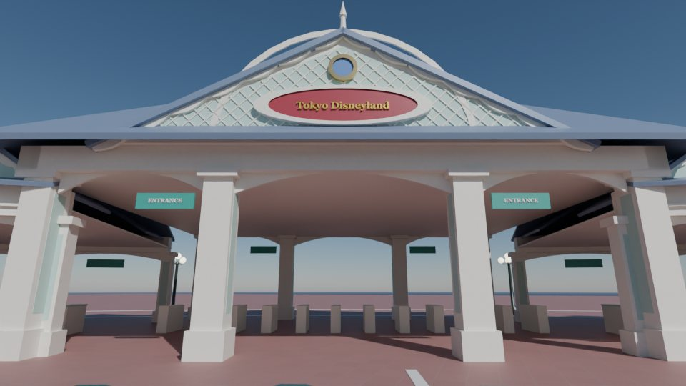 | 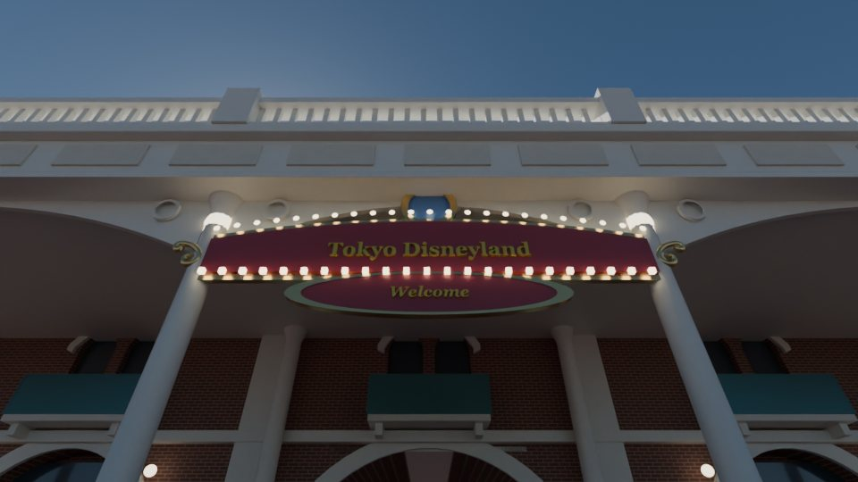 |
| **ミッキーの花壇(真上)** | **モックでの表示** |
| 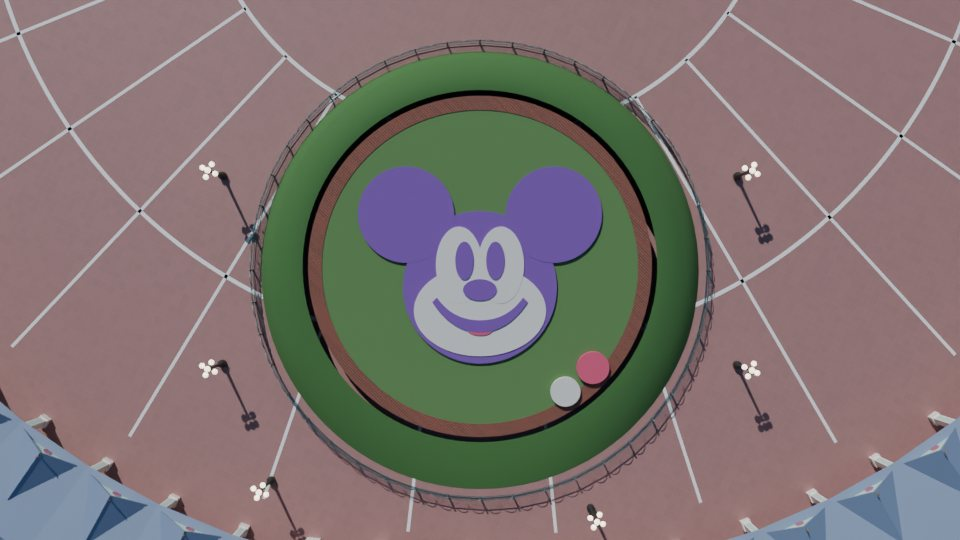 | 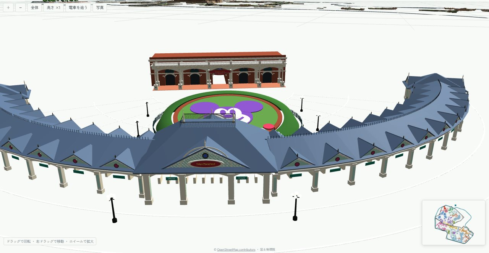 |

### 線路(`ds_tracks.py`)

モックの線(OSM)をなめらかにして、その上に作った。高さはモックの電車と同じ(リゾートラインの桁の上面 4.21 m、京葉線のレールの上面 10.0 m、基準面から)。

- **リゾートライン(跨座式モノレール)**: 幅 0.85 m・高さ 1.5 m のコンクリートの桁(カーブでは最大 6° 内側へ傾ける)、約 22 m ごとの継ぎ目と鋼の伸縮板、その下にラッパ形の頭の丸い橋脚と支承、桁の側面の電車線(Blender では碍子の腕木を 1 個 +「配列 + カーブ」で並べる)。リゾートゲートウェイ・ベイサイド・東京ディズニーシーの 3 駅は、電車の床の高さのホーム、黄色い線、ホームドア、切妻の屋根、ホームを支える柱。東京ディズニーランド・ステーションの区間は駅のモデルに任せる。
- **京葉線(高架・複線)**: 2 本の線路に合わせて幅が変わる高架の床(舞浜駅で広がる)、防音の壁と上の防音板・支柱、10 m ごとの 2 本柱の橋脚、両側のケーブルの溝、暗い防水面、コンクリートの板の上のレール(頭・腹・底の断面)と締結具、50 m ごとの架線柱とトラスの梁、トロリー線・吊り線と 5 m ごとの吊り下げ線。舞浜駅は島式ホーム(OSM の形)、切妻の屋根と柱、両側の黄色い線。データは舞浜駅の前後 約 790 m だけなので、両端は壁で閉じている。
- **作り方(3 回の見直し)**: 1 回目: カーブでの桁の傾き、継ぎ目、ラッパ形の橋脚、ホームの屋根を切妻に、黄色い線、ケーブルの溝。2 回目: 風化したコンクリートの色、ホームの下の柱、架線の吊り下げ線、端の壁、電車線を太く。3 回目: 高架の暗い防水面、防音板と支柱。
- **モック用**は間隔を粗くし(リゾートライン 4 m、京葉線 5 m)、腕木を外して約 16 万三角形。線路とホームの枠線(舞浜駅・周辺)を置き換える。
- **推定**: 図面がないので、桁の断面、継ぎ目の間隔、橋脚の形、電車線の高さ、高架の幅、防音壁の高さ、架線の高さと間隔、ホームの屋根はすべて推定。

| リゾートライン(ベイサイドのカーブ) | 京葉線(舞浜駅の東) |
|---|---|
| 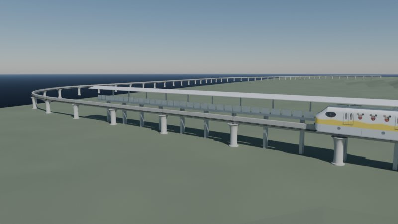 | 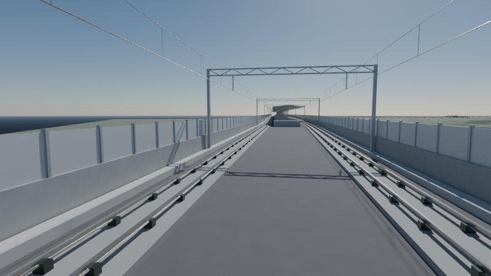 |
| **モック: リゾートラインの電車と桁** | **モック: 京葉線の高架と舞浜駅** |
| 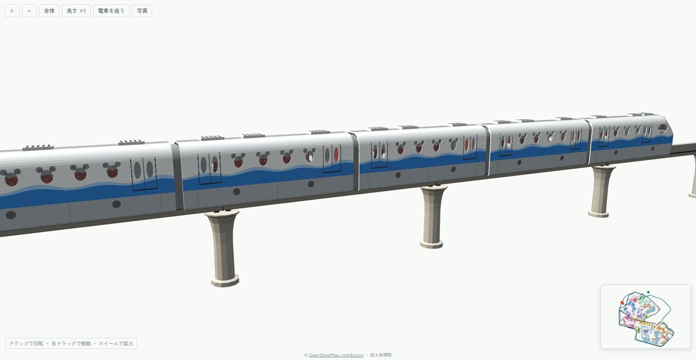 | 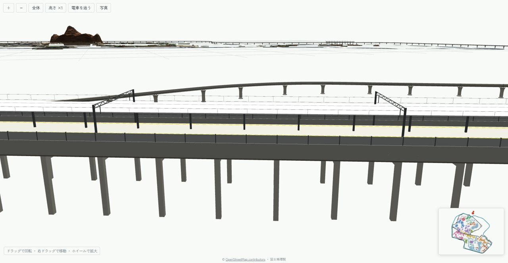 |

### 電車(ディズニーリゾートライン)

`output/disneysea/train.html`(公開 URL の `/train.html`)は、リゾートラインの 6 両編成を JS(three.js)だけで作った単独のページ。車両の作り方は `output/disneysea/train_model.js` にまとめてあり、モックも同じファイルを使う(下の「モックで走らせる」)。

- 寸法は Wikipedia の値。形と色は、Wikimedia Commons の写真(CC0 / CC BY-SA。個人利用の参考として見ただけで、リポジトリには入れていない)に合わせた: 白い車体 + 波形の色帯 + 銀灰のスカート、縦長のミッキー窓、楕円窓のドア、後ろへ傾いた先頭部と回り込む大きなフロントガラス。
- 窓は実際に穴が開いていて、ガラス越しに車内が見える。車内は、柄入りの長い座席、黄色い床、アーチ形の手すり、つり革、照明、貫通路、先頭車の運転台と展望席まで作った。
- 視点(外から 6、断面、車内の通路・運転席・座席)、断面表示(手前の壁・屋根を外す)、5 色の編成、走行を切り替えられる。
- 仕様・参考写真の一覧・JS と Blender の比較は `docs/train/spec.md`。
- **2026-09-24 からモックの電車は Blender 版**(`train_blender.py` → `export_models.py --parts train` → `models/train.json`)。ユーザーの指示で JS 版はモックから外し、`train.html` にだけ残している。

#### Blender 版(v2)

Type C の写真(Wikimedia Commons。一覧は `docs/train/spec.md`)と、跨座式(アルウェーグ式・日立式)モノレールの作りを参考に作り込んだ。

- **外装**: 厚み 10 cm の殻に窓の穴(ミッキーの頭・展望窓・ドアの楕円窓)を開け、穴の内側は白い額縁になる。全部の窓にガラス。ドアの合わせ目と戸袋の線、ドア下のステップ、スカートの丸いルーバーと点検蓋の線、屋根の空調装置とグリル、傾いた前面ガラスと中央の柱、縁取りのある丸い前照灯、連結器。
- **走行部(跨座式の構造)**: 各車に台車 2 つ。桁の上面にゴムタイヤの走行輪(1 軸 2 本 × 2 軸)、桁の側面の上に案内輪、下に安定輪、それを支える側枠、桁の側面の電車線から電気を取る集電靴。スカートの中に隠れる。
- **車内**: 市松模様の床、天井の照明 2 列、赤い妻壁とガラスの貫通扉、黒い座面と赤い波形の背もたれ(黄色い水玉)、端の丸い透明の仕切りと赤い玉、白いポール、天井の 2 本のレールとミッキーの輪のつり革(黄色い帯・赤い玉)、ドアの上の案内画面。先頭車は運転台(画面・スイッチ盤)、ガラスの仕切り、マゼンタに黄色い水玉の展望ソファ。
- **色**: 車体の色帯は、モックで編成ごとの色(ブルー・イエロー)をシェーダーで塗る(式は JS 版と同じ)。ほかの材質は Blender の色をそのまま使う。
- 三角形: 先頭車 約 2.9 万、中間車 約 2.0 万(車内込み)。モックでは車内をカメラから 150 m 以内の車両だけに出し、軽量モードでは出さない。

| 外観 | 車内 |
|---|---|
| 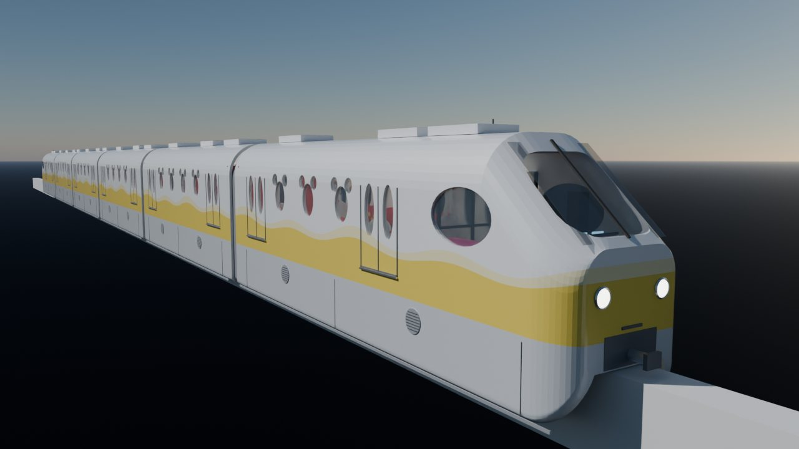 | 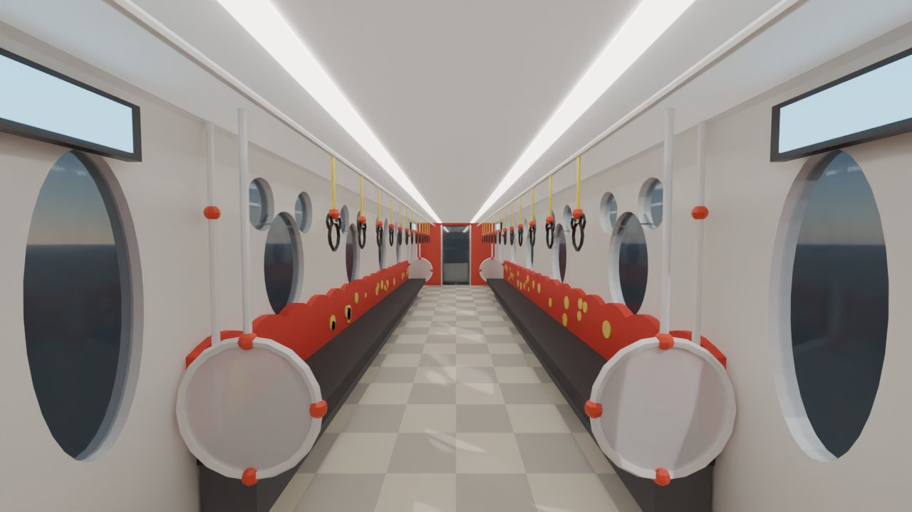 |
| **側面(窓とガラス)** | **運転台・展望席** |
| 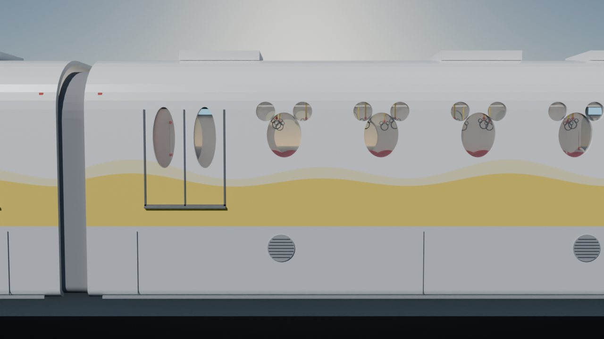 | 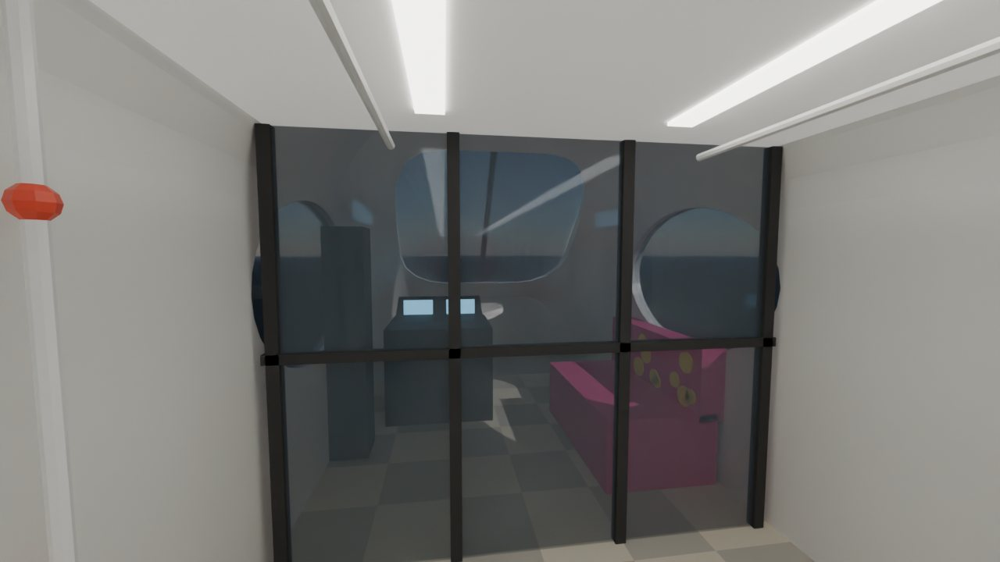 |

| 外観 | 車内 |
|---|---|
|  |  |

#### モックで走らせる

- **範囲**: 「舞浜駅・周辺」レイヤーのリゾートラインの全周(OSM の 4 本の線をつないだ 1 周 4,998 m)。反時計回り(リゾートゲートウェイ → 東京ディズニーランド → ベイサイド → 東京ディズニーシー)。
- **駅**: リゾートラインの 4 駅すべてで停まる。停車位置は、駅のホーム(OSM)の中心に編成の中央を合わせる。モックの駅の一覧にある 5 つ目の「舞浜」は JR 京葉線の駅で、線路から 90 m 離れているので停まらない。
- **編成**: 2 本(ブルーとイエロー)。同じ走り方を半周期ずらしてくり返すので、ほぼ反対側を走る。
- **走り方**: 最高 時速 35 km(営業は最高 50 km)。加速・減速は 0.9 m/s²、各駅 20 秒停車。1 周 10 分 37 秒。実際の時刻表ではない。
- **向きと高さ**: 車両ごとに、前後の台車の位置から線路の向きを取る(カーブで車両が折れ曲がる)。桁の上面は基準から 4.21 m(全周で一定)。東京ディズニーランド・ステーションの Blender モデル(地面から 6.0 m、地面は基準 -1.79 m)に合わせた。線路沿いの地面は -3.2〜-0.1 m なので、桁は地面から 4.3〜7.4 m。車両の床は桁の 1 m 上で、4 駅のホームもその高さ。
- **見え方**: 地図では線路の上の色付きの印(黒い点が先頭)。俯瞰・散歩では 3D。カメラから 170 m 以内の車両だけ詳細版(窓の穴・車内。1 両約 1.6 万三角形)、それより遠い車両と「軽量」モードでは簡略版(窓を塗った殻。1 両数百三角形)。詳細版は近づいたときに初めて組み立てる。散歩では当たり判定がなく、すり抜ける。ミニマップにも位置を出す。
- **表示の切り替え**: レイヤーの「電車(リゾートライン)」は、地図の印・ミニマップの点と、俯瞰・散歩の枠線の電車(編成の色の線)。3D モデルの「電車(リゾートライン)」は立体の電車。ほかのパーツと同じく、3D モデルがオンのときは枠線の代わりに立体を出し(「枠線も重ねて表示」なら両方)、プリセット「枠線のみ」では枠線の電車、「3Dモデルのみ」では立体の電車になる。
- **電車を追う**(俯瞰): 左上の「電車を追う」、F キー、または「エリア・移動」タブの「1本目(ブルー)を追う」「2本目(イエロー)を追う」(地図からでも俯瞰に切り替わる)。「電車を追う」と F は 1 本目を追う。電車のレイヤーも 3D モデルもオフなら、3D モデルをオンに戻す。
  - カメラは斜め後ろの上(後ろ 70 m・右 24 m・上 32 m)から始まり、1.2 秒かけて滑らかに移る。追っている間もドラッグで回す・ホイールで寄ることができ、電車が曲がるとカメラも一緒に回る。
  - 追っている間は「電車を追う」の隣に「2本目へ」(2 本目を追っているときは「1本目へ」)が出て、押すか T キーで、もう一方の電車へカメラが滑らかに移る(離れているほど長く、最大 3 秒)。
  - もう一度「電車を追う」・F・Esc でやめる。散歩・地図・ミニマップ・エリア移動・「全体」でもやめる。
- **情報**タブに、2 編成の今の状態(停車中の駅・速度・次の駅)を出す。確かめるときは、ブラウザのコンソールで `TDS_TRAINS.setClock(秒, 倍速)` で時計を動かせる(`TDS_TRAINS.state()` で位置)。
- 3D の車両は `models/train.json`(先頭車 `TRH`・中間車 `TRM`・幌 `TRG`、それぞれ材質ごとのメッシュ)を読み、編成ごとに 6 両を複製する。電車を直したら `blender -b --python export_models.py -- --parts train` と `python export_mock.py` を実行する。読み込めなかったときは、画面に理由を出す(地図の印と「電車を追う」のカメラは、それでも動く)。コンソールの `TDS_TRAIN3D` で 3D の電車を調べられる。

| 地図(印と説明) | 俯瞰(駅に停車中) |
|---|---|
| 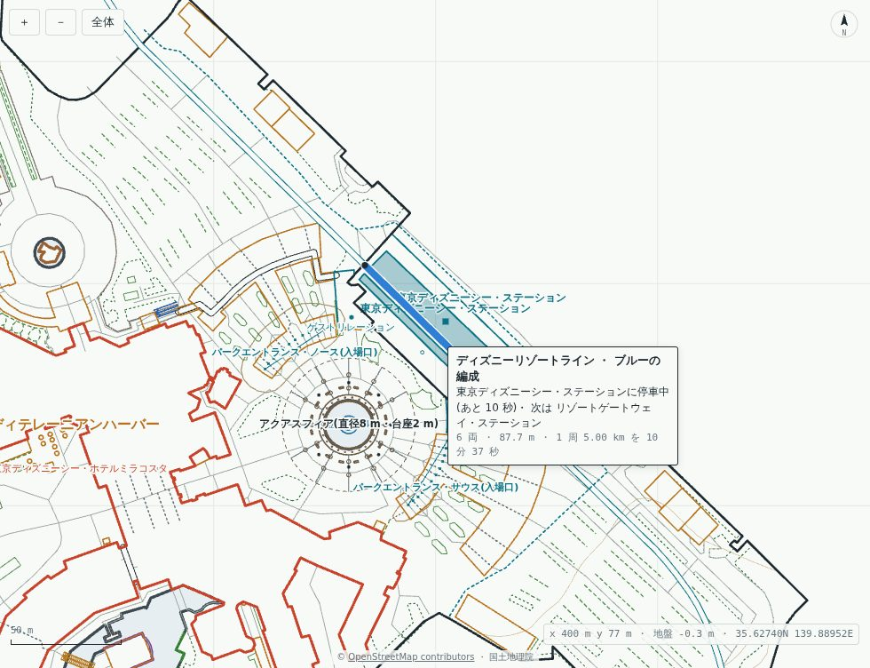 |  |
| **カーブ** | **散歩(プラザから)** |
|  | 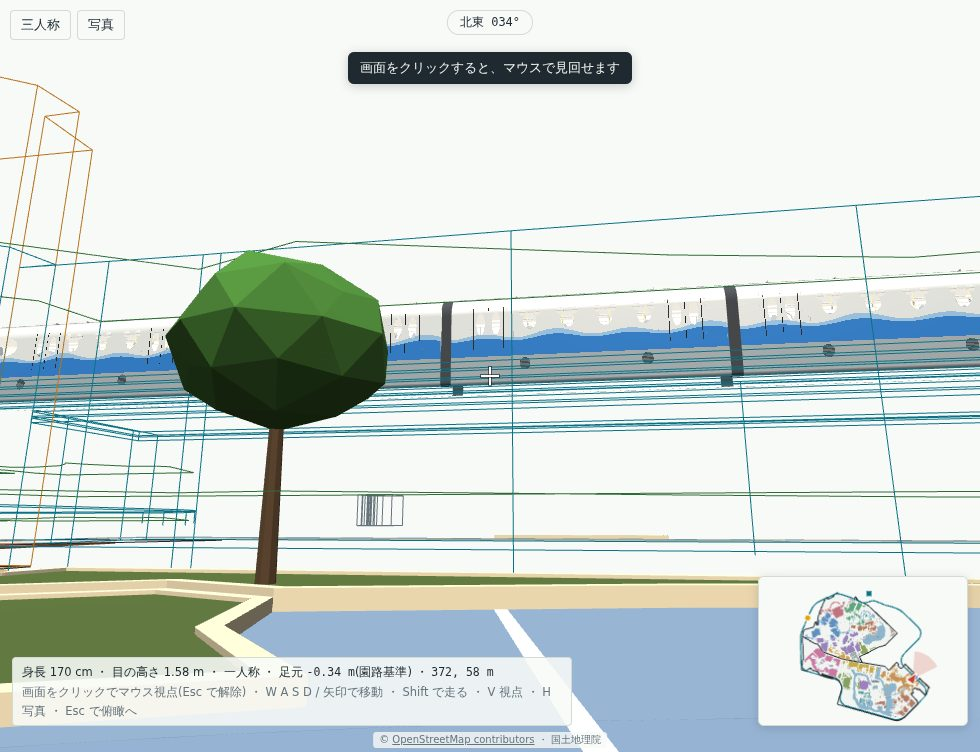 |
| **電車を追う** | |
| 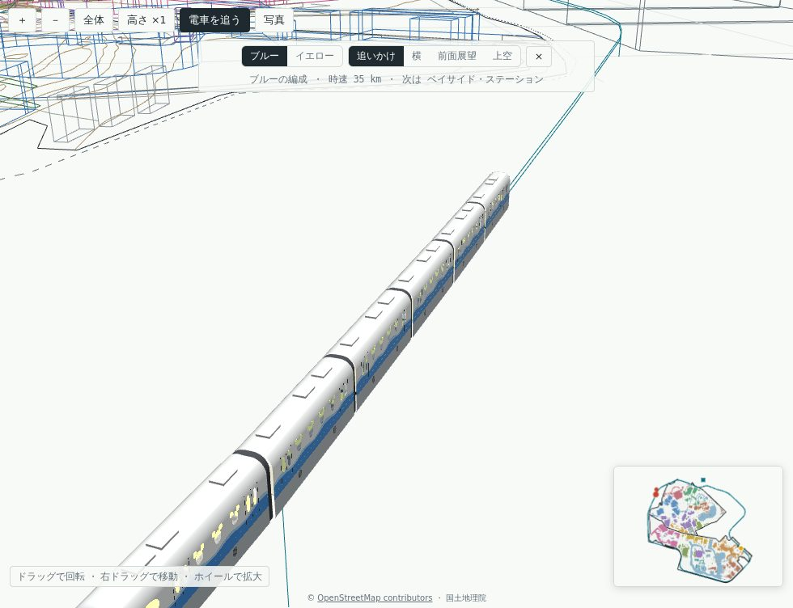 | |

### 入場口・駅(`ds_core.entrance_layer()`)

ディズニーリゾートラインの東京ディズニーシー・ステーション(ホームと駅の前後の線路。ホームは電車の床の高さ、地面から 5.5 m)、入場ゲートの列(パークエントランス・ノース / サウス、各 12 か所。高さ 1.2 m の枠)、回転式の改札、ゲストリレーション、駅前の通路。

### ディズニーランドと舞浜駅(`fetch_disneyland.py`, `ds_disneyland.py`)

- **ランド**: 園の境界・建物(375 棟。7 エリア + バックステージ)・水面・緑地・樹林・園路・ウエスタンリバー鉄道・階段・橋・トンネル・壁・1 m の等高線。シンデレラ城は 51 m。OSM の建設工事の区域は点線で示す(旧スペース・マウンテン跡の新アトラクションの区域内の建物はトゥモローランド、ウエスタンリバー鉄道の機関庫など裏手の建物は「その他」)。
- **舞浜駅・周辺**: 舞浜駅(JR 京葉線。高架は推定 10 m)、リゾートラインの全周と 4 駅(桁の上面は基準から 4.21 m。東京ディズニーランド・ステーションに合わせた)、イクスピアリ、ホテル(ディズニーのホテルと範囲内のオフィシャルホテル)、舞浜駅からランドのエントランスまでの歩道。
- データはシーとは別の OSM ファイル(`disneyland_osm.json`)。シーのデータを取り直すと火山などの元データまで変わってしまうため。標高はシーと同じ DEM5A のタイルがランドと舞浜駅まで覆っている。

### プロメテウス火山(`ds_volcano.py` → `ds_volcano_model.py`)

最初は半径 70 m の円錐を置いていたが、カルデラ湖を埋めてしまっていた。DEM を見ると、ミステリアスアイランドは園路より約 5.3 m 高い平らな台地で、その中央にカルデラ湖がある。そこで岩山を、台地の上に湖を囲むリングとして作り直した。

- 山頂: 51 m(OSM の山頂の位置、南側の縁)。縁: 高さ約 20 m、湖岸から約 22 m 外側。湖岸から 6 m 以内と、園路・建物の周りは岩を置かない。
- Blender(`ds_volcano_model.py`)は、この高さのグリッドを岩山として作り込む: 0.6 m 間隔に細かくし、ゆがませた稜線状のノイズで尾根・谷・副峰を付ける。約 1.8 m ごとに間隔が揺らぐ地層の段(棚)、台地の縁は園路へ・カルデラの縁は湖へ落ちる崖、山頂の火口のくぼみ。
- 色は頂点カラー: 赤茶・黒い玄武岩・黄土の縞、急な崖は暗く、棚はほこりっぽく、火口の周りは焦げた色、台地の床(通路)は砂色。

| 港から | 上空から | モックでの表示 |
|---|---|---|
|  |  |  |

### アクアスフィア(`ds_aquasphere.py`)


直径 8 m の地球儀を高さ 2 m の台座に載せ、周りを水盤(半径 11.16 m、縁の高さ 0.40 m)が囲む。石のブロックや街灯の数・配置は推定なので、確認が必要。

- **テクスチャ**: NOAA ETOPO(パブリックドメイン)の地形から `python ds_aquasphere.py --textures` で作る。海は深さに応じて紺から青緑、大陸棚は明るい青緑、陸は風化した石の色で、強めの陰影を付けて彫り込んだように見せる。氷床は白。
- **浮き彫り**: 海岸で約 4 cm の段差を付け、山は最大約 12 cm まで盛り上げる。
- **水の膜**: 地球儀の表面を流れ落ちる水を、少し大きい透明な球で表す。縦の筋が入り、地球儀と一緒には回らない。
- **根元**: ブロンズの受け皿で地球儀を受け、そのふちからあふれた水が白いカーテンになって池へ落ち、泡の輪になる。

| 根元 | 全体 |
|---|---|
|  |  |

### ディズニーシー・プラザ(`ds_plaza.py`)

アクアスフィアの周り半径 85 m の地面。

- **舗装**: 地球儀から 42 m 以内は青灰色の石、その外側は赤茶のレンガ(航空写真の見た目に合わせた)。OSM のプラザ(relation 3297581)は中央の円と西のアーケードだけなので、ホテルミラコスタの中庭(植え込みの周り)も舗装する。地上の建物は除く。
- **白線**: アクアスフィアの 12 本の放射状の線を、42 m まで延長する。
- **植え込み**: プラザの内側の楕円形の穴と、OSM の庭・樹林・花壇。0.45 m の石の縁、芝の土、丸い樹冠の木(約 5 m 間隔、41 本)。同じ植え込みが二重に登録されている分は除く。

| 計画(航空写真に重ねたもの) | 植え込みと木 |
|---|---|
|  |  |

### 水面(`ds_water.py` → `disneysea_water_blender.py`)

| | |
|---|---|
|  |  |
|  |  |

- **水域 38 か所**: OSM の `natural=water` から取っている。メインの港(relation 3531413)はミステリアスアイランドの中を通っている(ロストリバー → トンネル → カルデラ湖 → トンネル → 港。トランジットスチーマーラインの経路)。空が見えているカルデラ湖だけを航空写真の色から切り出し、岩の下を通る部分は `tunnels` に分けた(地面に穴を開けない)。

  

- **水位**: 岸の地面の高さ(DEM)から、水域の種類ごとの余裕高を引いて決める。余裕高は、港 1.0 m、カルデラ湖 1.3 m、水路 0.7 m、池 0.35 m、噴水 0.25 m。DEM の水面部分は補間された値でしかないので、水位そのものは DEM から読まない。カルデラ湖は港とつながっているので、港と同じ水位にしている。
- **水深**(推定): 港 2.5 m、カルデラ湖 3.0 m、水路 1.2 m、池 0.6 m。
- **岸の種類**: 岸の各区間について、陸側 2.5 m の地点に何があるかで決める。

  | 種類 | 判定 | Blender での形 | 長さ |
  |---|---|---|---|
  | 石積みの護岸 | 下のどれにも当たらない | 垂直の石積み + 笠石 | 4.58 km |
  | 植栽の土手 | 芝・庭・樹林 | 草の斜面 → 泥の斜面 | 1.75 km |
  | 岩場の岸 | scree / bare_rock | でこぼこの岩の斜面 | 1.28 km |
  | 建物が水際に立つ | 建物の敷地 | 濡れた基礎の壁 | 1.25 km |
  | 砂浜 | sand / beach | ゆるい砂の斜面 | 0.36 km |
  | トンネルの口 | トンネル部分 | 石積み | 0.07 km |

  

- **桟橋** 3 か所: 板張りの床と杭。
- Blender では、水を閉じた体積として作っている(屈折 + 吸収 + さざ波のバンプ)。地面はブーリアンで水の形をくり抜く。カメラは `top aerial harbor caldera american rock lost_river fantasy`。

## 公開(Vercel)

https://tokyo-disneysea-3d.vercel.app で誰でも見られる。GitHub の main に push すると Vercel が自動でデプロイする。

- `vercel.json` が `output/disneysea/` をそのまま配信し、`/` を `tds_outline.html` に向ける。ビルドはない。CI もない。
- 配信するのは `.gitignore` の許可リストにあるファイルだけ(`tds_outline.html`、`train.html`、`train_model.js`、`models/`。駅と電車のモデルも `models/` に入る)。新しいファイルを足したら許可リストにも足す。
- **push の前に `python export_mock.py` を実行して、`tds_outline.html` と `models/` をコミットする。**
- 出典は、画面の下(3D では地図の隅)とパネルの「出典」欄に表示している。

## 分かっている限界

- **高さの実測がほとんどない**。建物の高さの大半(シー約 690 棟、ランド約 360 棟)と、水位・水深・余裕高は推定。PLATEAU に浦安市はなく、国土地理院の航空レーザー点群は購入と申請が必要。
- DEM と航空写真は、どちらも**ファンタジースプリングス開業(2024 年)より前**のもの。このエリアの配置は照合できず、高さと水位は推定。
- Blender の地面は平ら(園路 = 0)。DEM の高さを使っているのはモックだけ。
- Blender の下書きの樹林は、まだ高さ 2〜7 m の板(モックは木の記号に直した)。屋根だけの構造物の高さは、OSM に高さがなければ推定 4.5 m。
- 階段の向き不明が 9 か所(シー 7、ランド 2)。
- 船、ディズニーシー・エレクトリックレールウェイ、ウエスタンリバー鉄道は動かしていない(作らないことにした)。夜のモードは配色と月明かりだけで、建物やアトラクションの照明はない。
- 京葉線は、データのある舞浜駅の前後 約 790 m だけを走る(端で現れて消える)。本数・速度・停車時間は推定。
- スマホでは、散歩のスタート地点で描く三角形が約 44 万になる(アクアスフィアの地球儀 約 15 万・火山 約 14 万)。軽量モードでもモデルは同じなので、重い端末では地球儀と火山の軽い版(Blender で減らす)が要る。
- リゾートラインの電車は、推定の走り方をくり返すだけ(実際の時刻表・編成数ではない)。桁と橋脚は Blender のモデル(`ds_tracks.py`)。桁の高さは全周で一定(実物は場所によって違う)。
- 東京ディズニーランドのエントランスは、ランドの建物の枠線(ワールドバザールの箱など)と重なる。「3Dモデルのみ」で見るとモデルだけになる。
- 東京ディズニーランド・ステーションは、図面も実測もないので、寸法は写真から割り出した推定(ホームの床 7 m など)。モックでは Blender の手続き型の質感(れんがの目地など)は出ず、材質ごとの単色になる。
- 電車を 12 両すべて近くで見ると、車内込みで約 30 万三角形になる(車内は 150 m 以内だけ)。スマホで重いときは軽量モード。
- ランド・舞浜駅の Blender の場面(`disneyland_blender.py`)は、まだ Blender で動かしていない。トイ・ストーリーホテルの建物は OSM にない。
- 地球儀のテクスチャ(`plateau_data/globe/globe_color.png`, `globe_height.png`)は使い捨てのスクリプトで作ったもので、まだ `ds_aquasphere.py` からは作り直せない。そのためリポジトリに含めている。

## データの出典

- 地図: © OpenStreetMap contributors(ODbL)
- 標高: 国土地理院 基盤地図情報 数値標高モデル 5 m メッシュ(DEM5A)
- 航空写真: 国土地理院 シームレス空中写真(位置の確認と、カルデラ湖の輪郭・岸の確認にだけ使用。テクスチャには使っていない)
- 地球儀: NOAA ETOPO(パブリックドメイン)
