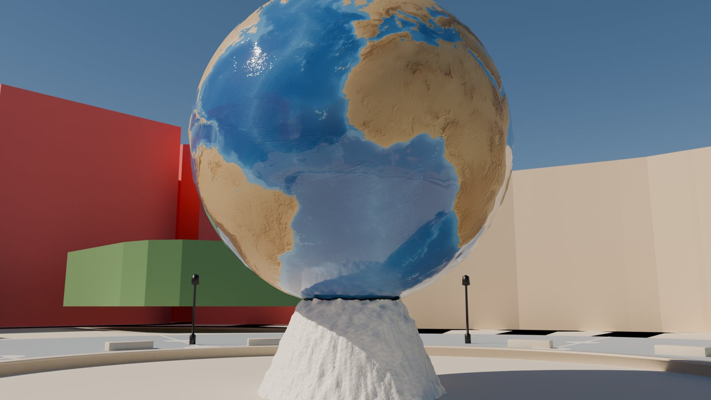

# 東京ディズニーシー 3D 再現(個人用)

OpenStreetMap と国土地理院のデータから、東京ディズニーシーを Blender で組み立てる下書きプロジェクト。
個人の練習用で、公開や配布はしない。2026-09-23 に始めた。

まず「枠線など土台の下書き」を作り、そこからパーツごとに作り込む方針で進めている。
Blender で作る前に、ブラウザで見られる**枠線モック**で配置・高さを確認する。


## 今どこまでできているか

| 項目 | 状態 | 主なファイル |
|---|---|---|
| OSM の取得と園の切り出し | 済 | `fetch_disneysea.py`, `ds_core.py` |
| 箱の建物(700 棟)・エリア 8 つの色分け | 済(高さの大半は推定) | `ds_buildings.py`, `ds_core.py` |
| 地形・緑地・岩場・園路・高架鉄道 | 済 | `ds_terrain.py` |
| 階段・橋・トンネル・地面の高低差 | 済(一部は向きの確認が必要) | `ds_levels.py` |
| 水面(水位・水深・護岸・カルデラ湖) | 済 | `ds_water.py`, `disneysea_water_blender.py` |
| プロメテウス火山の岩山 | 済(概形) | `ds_volcano.py` |
| アクアスフィア(地球儀の噴水) | 済(詳細モデル) | `ds_aquasphere.py` |
| 枠線モック(平面図 + 3D ワイヤー) | 済 | `export_mock.py`, `output/disneysea/mock_template.html` |
| 優先パーツの作り込み(ミラコスタ、コロンビア号など) | これから | — |

## 使い方

```
python fetch_disneysea.py          # OSM を取得(plateau_data/disneysea_osm.json)
python ds_levels.py                # 階段・高低差 → plateau_data/disneysea_levels.json
python ds_water.py                 # 水面モデル   → plateau_data/disneysea_water.json
python ds_volcano.py               # 火山の岩山   → plateau_data/disneysea_volcano.json
python export_mock.py              # 枠線モック   → output/disneysea/tds_outline.html

blender -b --python disneysea_draft.py -- --cams aerial,top --samples 16      # 下書き全体
blender -b --python disneysea_water_blender.py -- --cams harbor,caldera       # 水面
```

Blender は 5.2。複数の作業を同時に進めるときも、Blender を起動するのは一度に 1 つだけにする(同時に動かすと落ちたり止まったりした)。

座標: 原点 35.6267N 139.8851E(メディテレーニアンハーバー付近)、+X が東、+Y が北、単位はメートル。
高さの基準: 国土地理院 DEM5A で測った園路の中央値(標高 5.29 m)を 0 m とする。

## 枠線モック


`output/disneysea/tds_outline.html` は 1 ファイルで開ける。

- 平面図: ドラッグで移動、ホイールで拡大。建物・階段・水面にマウスを乗せると詳細が出る。
- 3D ワイヤー: 高さつきの枠線で、ぐるっと回して見られる。
- レイヤー: 建物・優先パーツ・水面・緑地・樹林・岩場・園路・階段・橋・トンネル・壁・等高線・高架鉄道・ランドマーク。
- 階段は根拠ごとに色を分けている(DEM で確定 / つながりから推定 / 長さから推定 / 向き不明)。
- 水面は、岸の種類の色分け・水位ラベル・水深の輪郭・「水面・護岸」欄を表示する。

`export_mock.py` は `mock_template.html` にデータを入れて `tds_outline.html` を作る。
水面の描画は、テンプレートの `<script id="ext-water">` の中にある。

## 下書き(Blender)

| | |
|---|---|
|  |  |
|  |  |

- 建物は OSM の外形を押し出した箱。高さの実測タグがあるのは約 15 棟だけで、残りはエリアごとの推定値。
- 参考モデルがある優先パーツ(ミラコスタ、トイ・ストーリー・マニア、シンドバッド、ニモ、コロンビア号など)は赤。
- タワー・オブ・テラーは 2022 年に解体されているので作っていない。

### 階段・高低差(`ds_levels.py`)

OSM には階段が 98 か所あるが、段数と上る向きが入っているのは 1 か所だけ。
そこで、各階段の高さと向きを次の順で決め、根拠を記録している。

1. **DEM で確定**: 両端の標高差が 0.5 m 以上ある
2. **つながりから推定**: 片方の端が橋・高架通路(上)やトンネル(下)につながっている
3. **長さから推定**: 蹴上げ 0.16 m・踏面 0.30 m として段数を出す(上限 3 m)
4. **向き不明**: 上の方法で決まらない。モックで赤く表示し、確認が必要


### プロメテウス火山(`ds_volcano.py`)

最初は半径 70 m の円錐を置いていたが、カルデラ湖を埋めてしまっていた。
DEM を見ると、ミステリアスアイランドは園路より約 5.3 m 高い平らな台地で、その中央にカルデラ湖がある。
そこで岩山を、台地の上に湖を囲むリングとして作り直した。

- 山頂: 51 m。OSM の山頂の位置(南側の縁)
- 縁: 高さ約 20 m、湖岸から約 22 m 外側
- 湖岸から 6 m 以内と、園路・建物の周りは岩を置かない

### アクアスフィア(`ds_aquasphere.py`)

直径 8 m の地球儀を高さ 2 m の台座に載せ、周りを水盤(半径 11.16 m、縁の高さ 0.40 m)が囲む。
地球儀の模様は NOAA ETOPO(パブリックドメイン)の地形データから作っている。
石のブロックや街灯の数・配置は推定なので、確認が必要。

## 水面(`ds_water.py` → `disneysea_water_blender.py`)

| | |
|---|---|
|  |  |
|  |  |

- **水域 38 か所**: OSM の `natural=water` から取っている。メインの港(relation 3531413)はミステリアスアイランドの中を通っている(ロストリバー → トンネル → カルデラ湖 → トンネル → 港。トランジットスチーマーラインの経路)。空が見えているカルデラ湖だけを航空写真の色から切り出し、岩の下を通る部分は `tunnels` に分けた(地面に穴を開けない)。

  

- **水位**: 岸の地面の高さ(DEM)から、水域の種類ごとの余裕高を引いて決める。余裕高は、港 1.0 m、カルデラ湖 1.3 m、水路 0.7 m、池 0.35 m、噴水 0.25 m。DEM の水面部分は補間された値でしかないので、水位そのものは DEM から読まない。カルデラ湖は港とつながっているので、港と同じ水位にしている。
- **水深**(推定): 港 2.5 m、カルデラ湖 3.0 m、水路 1.2 m、池 0.6 m。
- **岸の種類**: 岸の各区間について、陸側 2.5 m の地点に何があるかで決める。

  | 種類 | 判定 | Blender での形 | 長さ |
  |---|---|---|---|
  | 石積みの護岸 | 下のどれにも当たらない | 垂直の石積み + 笠石 | 4.58 km |
  | 植栽の土手 | 芝・庭・樹林 | 草の斜面 → 泥の斜面 | 1.75 km |
  | 岩場の岸 | scree / bare_rock | でこぼこの岩の斜面 | 1.28 km |
  | 建物が水際に立つ | 建物の敷地 | 濡れた基礎の壁 | 1.25 km |
  | 砂浜 | sand / beach | ゆるい砂の斜面 | 0.36 km |
  | トンネルの口 | トンネル部分 | 石積み | 0.07 km |

  

- **桟橋** 3 か所: 板張りの床と杭。
- Blender では、水を閉じた体積として作っている(屈折 + 吸収 + さざ波のバンプ)。地面はブーリアンで水の形をくり抜く。カメラは `top aerial harbor caldera american rock lost_river fantasy`。

## 分かっている限界

- DEM と航空写真は、どちらも**ファンタジースプリングス開業(2024 年)より前**のもの。このエリアの高さと水位は推定。
- Blender の地面は平ら(園路 = 0)。DEM の高さを使っているのはモックだけ。
- 樹林は高さ 7 m の箱なので、水面や建物を隠しやすい。
- 滝・噴水の水の流れ、船、夜の照明はまだ作っていない。
- 余裕高・水深・建物の高さの大半は推定値。
- 地球儀のテクスチャ(`plateau_data/globe/globe_color.png`, `globe_height.png`)は使い捨てのスクリプトで作ったもので、まだ `ds_aquasphere.py` からは作り直せない。そのためリポジトリに含めている。

## データの出典

- 地図: © OpenStreetMap contributors(ODbL)
- 標高: 国土地理院 基盤地図情報 数値標高モデル 5 m メッシュ(DEM5A)
- 航空写真: 国土地理院 シームレス空中写真(カルデラ湖の輪郭を取るのと、岸の確認にだけ使用。テクスチャには使っていない)
- 地球儀: NOAA ETOPO(パブリックドメイン)
