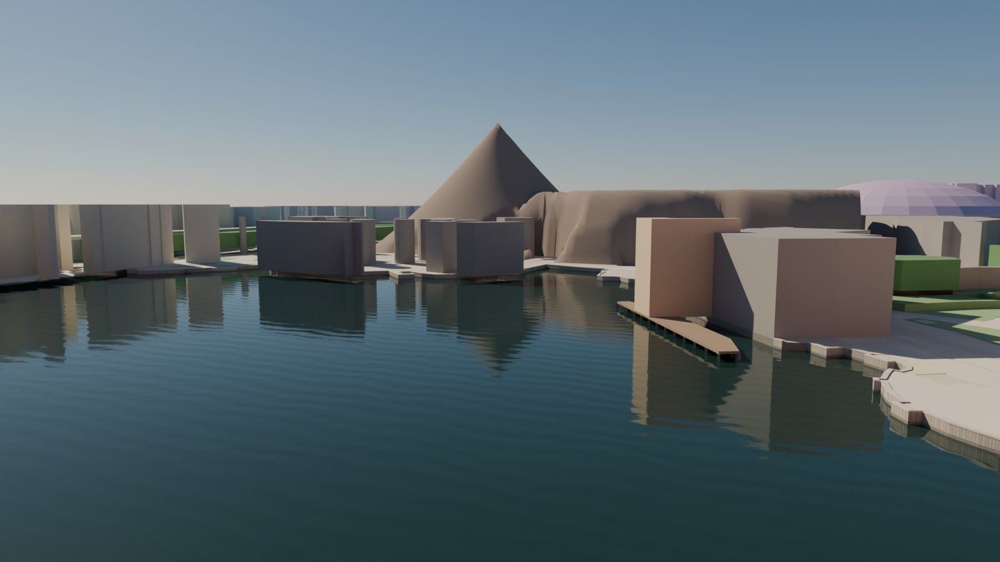

# ディズニーパーク 3D モデル(東京ディズニーシー・ランド / 個人用)

OpenStreetMap と国土地理院のデータから、東京ディズニーシーとランド、舞浜駅まわりを 3D で組み立てるプロジェクト。
ブラウザで見られる **モック**(公開中)で配置・高さを確かめ、Blender で作り込んだパーツをモックに 3D モデルとして重ねていく。
個人の練習用。公開しているのはモックだけで、Blender のファイルや元データは配布しない(2026-09-23 開始)。

**モック: https://tokyo-disneysea-3d.vercel.app**



## 文書の案内

| 読みたいこと | 場所 |
|---|---|
| 何がどこまでできているか(一覧) | [docs/status.md](docs/status.md) |
| モックの操作(モード・レイヤー・散歩) | [docs/mock.md](docs/mock.md) |
| データの流れ、Blender で作ったモデルの一覧 | [docs/pipeline.md](docs/pipeline.md) |
| パーツごとの作り方・数値・確認の結果 | [docs/parts.md](docs/parts.md) |
| Blender の使い方・コマンド・参考動画 | [docs/blender.md](docs/blender.md) |
| 作業ルールと確認の記録 | [docs/log.md](docs/log.md) |
| 電車の仕様 / プラザの資料 / 計画 3 の進み具合 | [docs/train/spec.md](docs/train/spec.md) / [docs/plaza/README.md](docs/plaza/README.md) / [docs/plan3_progress.md](docs/plan3_progress.md) |

## クイックスタート

### フォルダ構成

```
src/                 Python のスクリプトすべて(データ取得・加工、モックの書き出し、Blender 用)。コマンドはリポジトリの直下から python src/… で実行する
tools/               確認用の道具(Blender なしのスモークテスト、航空写真との重ね合わせ)
plateau_data/        元データ(OSM の抜き出し・DEM・階段・水面・火山・テクスチャ)。名前は歴史的なもので、PLATEAU のデータは使っていない
output/disneysea/    公開するモック(Vercel がこのフォルダをそのまま配信)。mock_template.html が元、tds_outline.html は書き出し結果
  models/            モックに載せる 3D モデル(glTF を JSON に埋め込んだもの)
docs/                詳細文書(status / mock / pipeline / parts / blender / log)と、README・文書で使う画像
```

### 見る

公開ページを開くか、`output/disneysea/tds_outline.html`(1 ファイル)を直接開く。

### 更新する(Blender なしの端末でもできる)

```
pip install -r requirements.txt
python src/export_mock.py                  # モックを作り直す → output/disneysea/tds_outline.html
git add -A && git commit && git push   # push すると Vercel が自動で公開する
```

`export_mock.py` はコミット済みのデータだけで動く。元の OSM データ(`plateau_data/*_osm_raw.json`)は git に入れていない(大きいため)。
高低差を元データから計算し直すのは `--relevel` を付けたときだけ。

### データを取り直す(必要なときだけ)

```
python src/fetch_disneysea.py          # シーの OSM → plateau_data/disneysea_osm.json
python src/fetch_disneyland.py         # ランド・舞浜駅の OSM → plateau_data/disneyland_osm.json(シーとは別ファイル)
python src/ds_levels.py                # シーの階段・高低差 → disneysea_levels.json(raw が必要)
python src/ds_disneyland.py --levels   # ランドの階段・高低差 → disneyland_levels.json(raw が必要)
python src/ds_water.py / src/ds_volcano.py / src/ds_plaza.py   # 水面・火山・プラザの元データ
python src/ds_tdl_water.py                              # ランドの水面の元データ(plateau_data/disneyland_water.json)
python src/ds_aquasphere.py --textures # 地球儀のテクスチャ
python src/ds_tdl_ground.py            # エントランス広場の地面 → models/tdl_ground.json(Blender なし。shapely 2.1 以上)
python src/ds_tdl_hotel_ground.py      # ホテル周辺の道 → models/tdl_hotel_ground.json(同上)
python src/ds_ground.py                # ランド・シーの地面 → models/{tdl_land_ground,tds_ground}.json(同上。約 5 分。水面・プラザ・火山のモデルを先に)
```

**注意:** OSM は日々更新される。取り直すと、高低差や火山の元データまで変わる(火山の元データは Blender で作った火山モデルの元になっている)。
データを更新したいときだけ実行し、更新したらモデルとの整合を確かめる。

### 別の端末・Blender で作業する

`git clone` して `pip install -r requirements.txt`。Blender のスクリプトはコミット済みの JSON・DEM・`output/disneysea/models/` だけで動く(Blender 5.2、同時に 1 つだけ起動)。
コマンド一覧と作業の決まりは [docs/blender.md](docs/blender.md) と [docs/log.md](docs/log.md)。モデルを書き出し直したら `python src/export_mock.py` を実行してからコミットする。

### 座標と高さ

原点 35.6267N 139.8851E(メディテレーニアンハーバー付近)、+X が東、+Y が北、単位はメートル。
高さは国土地理院 DEM5A で測った園路の中央値(標高 5.29 m。厳密には 5.285778 m を `datum_exact` に保存)を 0 m とする。ランドも同じ基準。

## 公開(Vercel)

https://tokyo-disneysea-3d.vercel.app で誰でも見られる。GitHub の main に push すると Vercel が自動でデプロイする。

- `vercel.json` が `output/disneysea/` をそのまま配信し、`/` を `tds_outline.html` に向ける。ビルドはない。CI もない。
- 配信するのは `.gitignore` の許可リストにあるファイルだけ(`tds_outline.html`、`train.html`、`train_model.js`、`models/`。駅と電車のモデルも `models/` に入る)。新しいファイルを足したら許可リストにも足す。
- **push の前に `python src/export_mock.py` を実行して、`tds_outline.html` と `models/`(`models/web/` の圧縮版も)をコミットする。**
- 出典は、画面の下(3D では地図の隅)とパネルの「出典」欄に表示している。

## 分かっている限界

- **高さの実測がほとんどない**。建物の高さの大半(シー約 690 棟、ランド約 360 棟)と、水位・水深・余裕高は推定。PLATEAU に浦安市はなく、国土地理院の航空レーザー点群は購入と申請が必要。
- DEM と航空写真は、どちらも**ファンタジースプリングス開業(2024 年)より前**のもの。このエリアの配置は照合できず、高さと水位は推定。
- Blender の地面は平ら(園路 = 0)。DEM の高さを使っているのはモックだけ。
- Blender の下書きの樹林は、まだ高さ 2〜7 m の板(モックは木の記号に直した)。屋根だけの構造物の高さは、OSM に高さがなければ推定 4.5 m。
- 階段の向き不明が 9 か所(シー 7、ランド 2)。
- 船、ディズニーシー・エレクトリックレールウェイ、ウエスタンリバー鉄道は動かしていない(作らないことにした)。
- 京葉線は、データのある舞浜駅の前後 約 790 m だけを走る(端で現れて消える)。本数・速度・停車時間は推定。
- スマホでは、散歩のスタート地点で描く三角形が約 44 万になる(アクアスフィアの地球儀 約 15 万・火山 約 14 万)。重い端末では地球儀と火山の軽い版(Blender で減らす)が要る。
- リゾートラインの電車は、推定の走り方をくり返すだけ(実際の時刻表・編成数ではない)。桁と橋脚は Blender のモデル(`ds_tracks.py`)。桁の高さは全周で一定(実物は場所によって違う)。
- 東京ディズニーランドのエントランスは、ランドの建物の枠線(ワールドバザールの箱など)と重なる。「3Dモデルのみ」で見るとモデルだけになる。
- 東京ディズニーランド・ステーションは、図面も実測もないので、寸法は写真から割り出した推定(ホームの床 7 m など)。モックでは Blender の手続き型の質感(れんがの目地など)は出ず、材質ごとの単色になる。
- 電車を 12 両すべて近くで見ると、車内込みで約 30 万三角形になる(車内は 150 m 以内だけ)。
- ランド・舞浜駅の Blender の場面(`disneyland_blender.py`)は、まだ Blender で動かしていない。トイ・ストーリーホテルの建物は OSM にない。
- 地球儀のテクスチャ(`plateau_data/globe/globe_color.png`, `globe_height.png`)は使い捨てのスクリプトで作ったもので、まだ `ds_aquasphere.py` からは作り直せない。そのためリポジトリに含めている。

## データの出典

- 地図: © OpenStreetMap contributors(ODbL)
- 標高: 国土地理院 基盤地図情報 数値標高モデル 5 m メッシュ(DEM5A)
- 航空写真: 国土地理院 シームレス空中写真(位置の確認と、カルデラ湖の輪郭・岸の確認にだけ使用。テクスチャには使っていない)
- 地球儀: NOAA ETOPO(パブリックドメイン)
