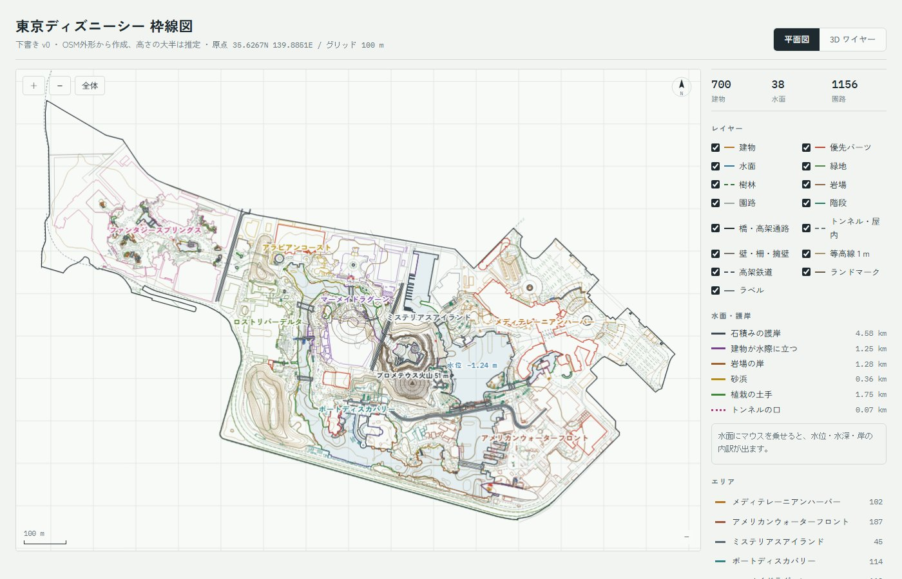

# モックの使い方

画面いっぱいの表示の上に、細い見出しバーを重ねている。ページを開くとオープニング(俯瞰)が流れ、タップしてズームアップが終わると**散歩**の状態になる。枠線のレイヤーはすべて非表示(3D モデルだけ)。(パネルは 2026-09-28 に削除。)

## 2 つのモード(見出しバーで切り替え)

| モード | 内容 |
|---|---|
| **俯瞰** | 高さつきの枠線と 3D モデルを、ぐるっと回して見る。右下のミニマップを押すと、そこへカメラが飛ぶ。ページを開くたびにオープニング(俯瞰): 操作部品を隠し、映画のような上下の黒帯と周辺減光のなか、まず飛び出す絵本(ポップアップブック)を映す: ろうそくの灯る木の机に、革装に金の箔押しタイトル・角金具・しおりのリボンの本が舞い降り、ひとりでに開いて物語のページが 3 枚めくれる。両パークの水彩の地図のページから、手描きインクと水彩(くすんだ紺・えんじ・苔色・金)の紙の切り絵が順に立ち上がる: プロメテウス火山、シンデレラ城、メディテレーニアンハーバーの家並み、アクアスフィア(台座の上で回る地球儀)、木、波とゴンドラ、いちばん手前に左右のカーテン。切り絵は光を受けてページに本物の影を落とし、火山の煙がゆらぎ、ゴンドラが揺れ、ろうそくの炎がちらつく(どれもこのページで描いたもの)。本はパークとは別の小さな 3D 画面(`popbook`)で、その間、後ろではパークの準備が進む(本が覆っている間はパークを描かない)。切り絵が立ち終わると封蝋と「Tap to start」が出る。それまではどこをタップしても何も起きない。タップすると本へ寄りながら本が消え、パークが現れる。(2 つ目の 3D 画面を作れない端末では、本なしで以下の流れになる。)枠線が地面から約 2.8 秒で伸び上がり、伸び切ったら 3D モデルを 1 つずつ読み込んで伸ばして出し、タイトル「DISNEY ADVENTURE」(ラプンツェルのイメージ: 紫と金の文字が Cinzel の書体で 1 文字ずつ現れて光り、後ろでゆっくり回る太陽の紋章、両脇から伸びるつると咲く花、下に花の飾り、画面の下から空へ昇るランタン(手前の大きなものも)、金の弧の先から舞う金の粉、タイトルの後ろで回る光の筋、外側で逆に回る金の粒の輪、画面の四隅の金の飾りと花、舞い落ちる花びら、タイトルの周りで弾ける金の光、数秒おきに文字を走る光。紋章や飾りはこのページで描いたもの)を出す。その間カメラはゆっくり回る。「Tap to start」が出たあと画面のどこかをタップすると、カメラがパーク全体から東京ディズニーランド・ステーションへズームアップし(約 3.2 秒。少しだけレンズも寄る。「視差効果を減らす」がオンでも省かない)、着いたところで黒帯が抜けていつもの画面に戻る(途中でタップしても同じ)。レイヤー・3D モデルのオン/オフは保存しない(毎回すべてオンで始まる)。URL の視点は共有のためだけで、開いたときには使わない。3D のライブラリを読み込めないときは地図で開く。 |
| **散歩** | 身長 170 cm の人の目線で歩く(ディズニーシーの中だけ)。 |

どのモードでも、リゾートラインの電車 2 編成が全周を走っている(地図は印、俯瞰・散歩は 3D。詳しくは[電車](parts.md#電車ディズニーリゾートライン))。
俯瞰では「電車を追う」(F キー)で、カメラが電車を斜め後ろの上から追いかける。

見出しバーのボタン: **共有**(今の視点の URL をコピー。スマホでは共有メニュー)。
(夜のモード・軽量モード・高さの強調(高さ ×3)と地図のモードは 2026-09-25 に廃止(夜のモードは 2026-09-28 に一度作り直したが、ユーザーの希望でまた廃止。地図は 3D のライブラリを読み込めないときの予備としてだけ残す)。画面の隅の出典表示もやめ、出典は画面下の小さな 1 行だけに載せる(OpenStreetMap と国土地理院の利用条件で、出典の記載は必要)。端末がダークモードでも、いつも明るい配色で出す。スマホでは描画解像度を自動で 1.5 倍までに抑える。)
今のモードと視点は URL に入る(`#map/…` `#orbit/…` `#walk/…`)。その URL を開くと同じ景色から始まる。
モードを切り替えると、カメラが滑らかに移る。H キー(または「写真」)で操作部品を隠す写真モード。

## パネル(2026-09-28 に削除)

表示の切り替え・エリア移動・施設検索・情報のパネルは削除した。表示のプリセットはキー 1・2・3(モデルのみ / 枠線+モデル / 枠線のみ)で切り替えられる。

## レイヤー

建物・優先パーツ・水面・緑地・樹林・岩場・園路・階段・橋・トンネル・壁・等高線・高架鉄道・ランドマーク・**入場口・駅**・**ディズニーランド**・**舞浜駅・周辺**・ラベル。
ランドの階段・橋・壁・等高線などは、その機能のレイヤーと「ディズニーランド」の両方がオンのときに出る。屋根だけの構造物(OSM の `building=roof`。シー 59・ランド 47)は、地図では点線、3D では屋根の板と数本の柱で表し、散歩では下を通れる。樹林は、3D では地面の輪郭と 9 m おきの木の記号(幹と樹冠)で表す。京葉線の電車も「電車(リゾートライン・京葉線)」のレイヤー・3D モデルで切り替える。リゾートラインの電車は、地図の印を「電車(リゾートライン)」レイヤーで、俯瞰・散歩の電車を 3D モデルの「電車(リゾートライン)」で切り替える。「全体」ボタンは、表示中のレイヤーに合わせて、シーだけ / シー+ランド+舞浜駅の範囲に合わせる。

## 散歩(身長 170 cm の人の目線)

「散歩」を押すと、東京ディズニーランドのメインエントランスから東京ディズニーランドホテルの方へ 40 m の広場に、エントランスを向いて人が立つ。操作する人は**ウッディ**(`output/disneysea/models/woody.glb`。[enoden-walk](https://github.com/kouki-takezawa/enoden-walk) の `public/models/character.glb` と同じもの。Blender で手続き生成した個人用のファンメイドで、骨組みと待機・歩く・走るなどの動きが入っている)。止まる・歩く・走るで動きが滑らかに切り替わり、進む方向を向く。身長は 170 cm に合わせた。このモデルのシャツとベストの色の画像は、体に貼る位置の情報(UV)とずれていて、どの three.js でも黒く出るため、シャツと襟は黄色のチェック、ベストは白地に黒い斑点の模様をページで描いて繰り返し貼っている。手の肌・ジーンズ・ブーツ・髪・スカーフ・バッジなども同じずれで黒い部分が出るので、元の画像の平均の色で塗っている(顔・目・口・眉・まぶた・帽子は元の画像のまま)。カメラはいつも三人称(一人称は 2026-09-25 に廃止)。読み込むまでは簡単な人形。ウッディ / Toy Story © Disney / Pixar。

- **PC**: マウスでドラッグすると、キャラクターの周りをカメラが回る(キャラクターの向きは変わらない)。ホイールか左上の ＋ / － で、キャラクターを中心にズームイン・ズームアウト(1.2〜25 m)。W A S D / 矢印キーでカメラの向きを基準に歩き(1.4 m/秒)、キャラクターは進む方向を向く。Shift で走る(6 m/秒。ウッディは全力疾走の動き)。Esc で俯瞰に戻る。
- **スマホ**: 左下のスティックで歩き、画面をドラッグしてカメラを回す。2 本指で広げる・つまむとズーム。右下の「走る」で走る。
- **リゾートラインに乗る**: 散歩で東京ディズニーランド・ステーションから 60 m 以内に行くと、画面の下に「電車に乗る」ボタンが出る(電車が停まっていないときは「次の電車まで あと ○ 秒」)。乗ると、6 両編成の車内(通路と車両のつなぎ目)を歩け、電車はそのまま路線を回るので窓の外の景色が流れる。カメラは車内に収まるように近づき、電車が曲がると一緒に向きが変わる。「降りる」を押すと、東京ディズニーランド・ステーションのホーム(高さ 5.21 m)に戻る。運転席は入れない。
- 足元の高さは、Blender のモデル(プラザ・火山・水面・桟橋)があればその面、なければ DEM の地面。段差は 0.55 m まで上れ、それより高い崖は越えられない。
- 建物の外形には入れない。水には入れて、水面の高さに立つ。入場ゲートは通り抜けられる。
- **3D モデルの当たり判定**: 3D モデルがあるところでは、モデルの三角形から立っている面(壁・柵・手すり・改札ブース・柱・岩肌など。傾きが約 66° より急な面)を取り出し、体(半径 0.28 m)がめり込む動きを止める。判定するのは、ぶつかる場所で足元から 0.45 m〜頭の高さにかかる部分だけなので、縁石・階段の蹴上げ・なだらかな縁は今まで通り上れ、頭上の軒や高架の桁はくぐれる。壁から離れる向きには動けるので挟まらない。壁に斜めに当たると壁に沿って滑る。ランドのエントランスは改札ブースの間を通り抜けられ、ブース・案内の柵・門の枠は通れない。3D モデルをオフにした部分とモデルのない場所は、これまで通り建物の外形だけで判定する。
