# パーツ別の詳細

## 下書き(Blender)

| | |
|---|---|
| 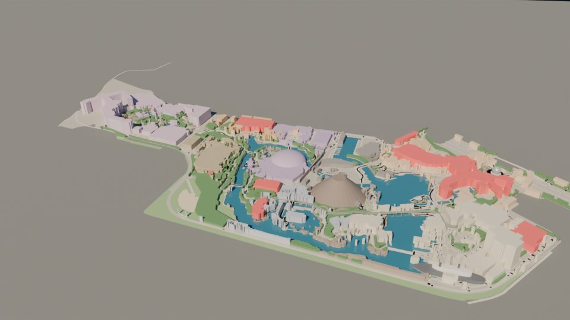 | 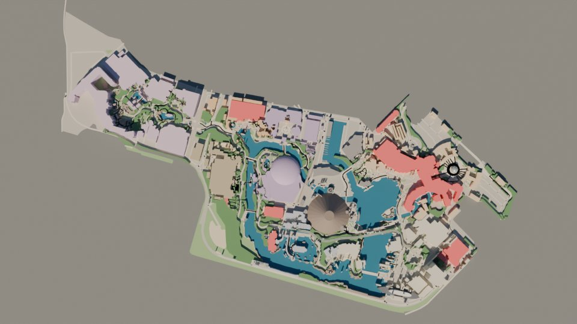 |
| 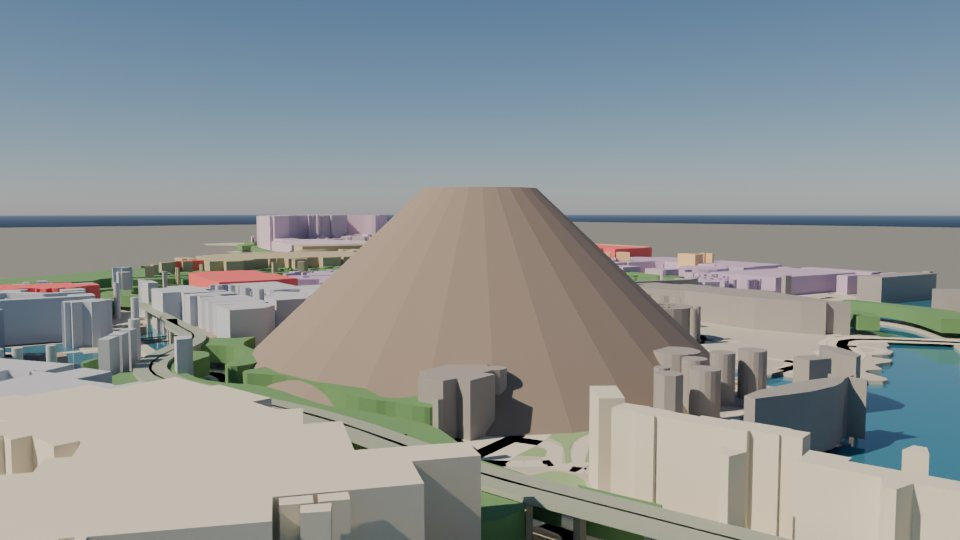 | 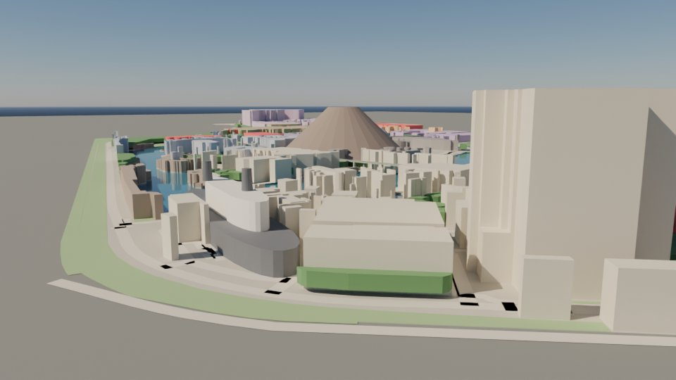 |

- 建物は OSM の外形を押し出した箱。参考モデルがある優先パーツ(ミラコスタ、トイ・ストーリー・マニア、シンドバッド、ニモ、コロンビア号など)は赤。
- タワー・オブ・テラー(ホテルハイタワー)は、OSM の高さタグどおり 59 m の箱。
- マーメイドラグーンの屋内ホールは、平らな屋根(推定 15 m)の上に八角形の屋根(航空写真から中心 (-188, -43)・半径 17 m、頂点は推定 27.5 m)を乗せている。キング・トリトンズ・キャッスル(ホールの北端)は未作成。
- `docs/draft/` の画像は、エリアの色分けを直す前のまま。

## 階段・高低差(`ds_levels.py`)

OSM には階段がシーに 98 か所あるが、段数と上る向きが入っているのは 1 か所だけ。そこで、各階段の高さと向きを次の順で決め、根拠を記録している。ランドにも同じ処理を使う(階段 24 か所)。

1. **DEM で確定**: 両端の標高差が 0.5 m 以上ある
2. **つながりから推定**: 片方の端が橋・高架通路(上)やトンネル(下)につながっている
3. **長さから推定**: 蹴上げ 0.16 m・踏面 0.30 m として段数を出す(上限 3 m)
4. **周辺の DEM から推定**(`export_mock.resolve_stairs`、コミット済みのデータだけで動く): 3 で向きが決まらなかったものを、両端から 6・10・15 m 先の DEM の差で決める(3 か所とも同じ向きで、0.25 m 以上の差)。片方の端だけがトンネルにつながるものは、そちらが下。シー 6、ランド 1。
5. **向き不明**: 上の方法で決まらない。モックで赤く表示し、確認が必要(シー 7、ランド 2)。航空写真で確かめるのが次の手(この端末では航空写真を取れなかった)

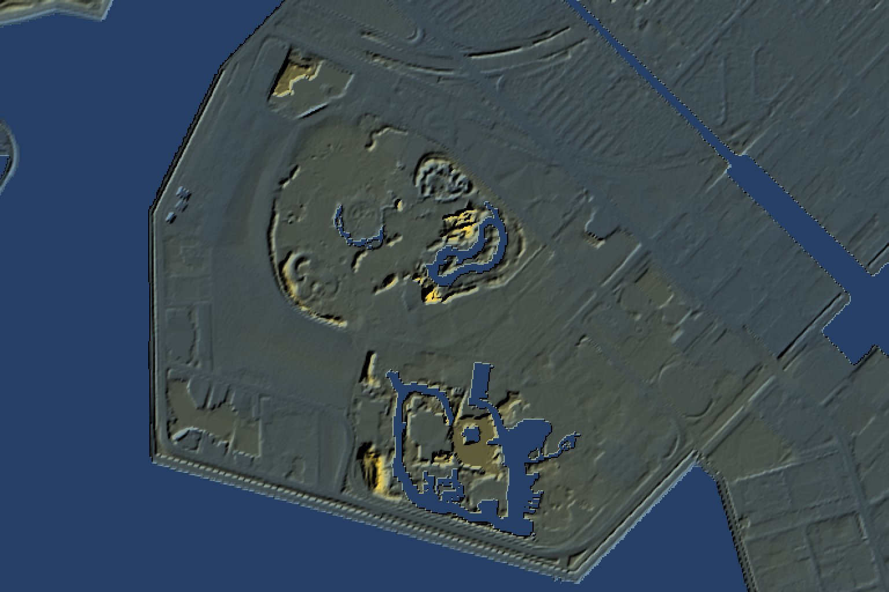

## 東京ディズニーランド・ステーション(`ds_tdl_station.py`)

ディズニーリゾートラインの駅。参考動画(【背景メイキング】ディズニーランドステーション / WALT.)と同じ作り方で作った。

- **作る順番(動画どおり)**: ① 基準になる時計(ミッキーの文字盤。パーク側とホール側の両面)。② 半円の扇窓: 放射状の桟を 1 本作って「配列」(回転した Empty を使うオブジェクトオフセット)、珠の列を「配列 + カーブ」、石の枠とキーストーン。③ ガラスのかまぼこ屋根: 骨と桟を「配列」で並べ、「カーブ」で半円に曲げる。④ 台座、アーチ形の飾り板の列(1 枚 + 配列)、柱、角の面取り(ベベル)。⑤ 星のメダル、渦巻きの持ち送り(カーブにベベル)、柱の間の透かし板。⑥ そのまわりの建物。材質はクリームを基本に色違い、れんが、銅板(緑青)、金、ガラス。
- 動画はカメラに映る改札ホールだけを作っているが、モックで使うため駅全体を作った: パーク側の正面(2 つのアーチ、出窓、時計)、ホテル側の正面(駅名の看板、アーチの壁画、2 階の列柱と透かしのアーチ、スレートのフードの下の金の扇窓)、改札ホール(ガラスの屋根、改札機、横断幕、つり下げの照明)、ホーム(タイル、ホームドア、天井、照明)、両側の階段とエスカレーター(緑の屋根、かまぼこ形の屋根、下の「DISNEY RESORT LINE」の小屋)、1 階のれんがの壁(ロッカー・トイレの扉)、2 階の窓と赤い日よけ。
- **資料**: OSM の駅舎の外形・ホーム・線路、日本語版 Wikipedia(1 面 1 線の高架駅、改札とホームは同じ 2 階、改札の上はガラス屋根、アーチの壁画、ミッキーの時計、エスカレーター上下 各 1 基)、Wikimedia Commons の写真 16 枚、国土地理院の航空写真。どれも見て参考にしただけで、リポジトリには入れていない。
- **推定の寸法**(写真と外形の比から): ホームの床 7.0 m、桁の上面 6.0 m、軒 11.0 m、中央の軒 11.5 m、ガラス屋根は半径 6.4 m・頂上 18 m、時計の中心 12.9 m、アーチは幅 7.3 m・起点 4.6 m、階段 44 段。
- ガラスはすべて外が見える(Cycles は屈折、EEVEE・マテリアルプレビューとモックは半透明)。
- 線路は駅の中も途切れずに通る(桁は `ds_tracks.py` のもの。駅のモデルの桁はモックに書き出さない)。電車が通れるように、駅の両端の壁はなく、1 階は線路の下だけ低くしてある(2026-09-25 に直した)。
- `.blend` は駅を原点に置く(開くとパーク側から見える)。モックへの書き出しでは、駅の向き(24.78°)と位置 (-583.08, 1023.04)、地面の高さ(基準 -1.79 m)を付ける。モック用は面取りを外し、約 11 万三角形。
- カメラ: `CAM_park`(パーク側)、`CAM_hotel`(ホテル側)、`CAM_gates`(改札ホール)、`CAM_concourse`(動画と同じ魚眼)、`CAM_platform`、`CAM_stairs`、`CAM_aerial`。

| パーク側 | ホテル側 |
|---|---|
| 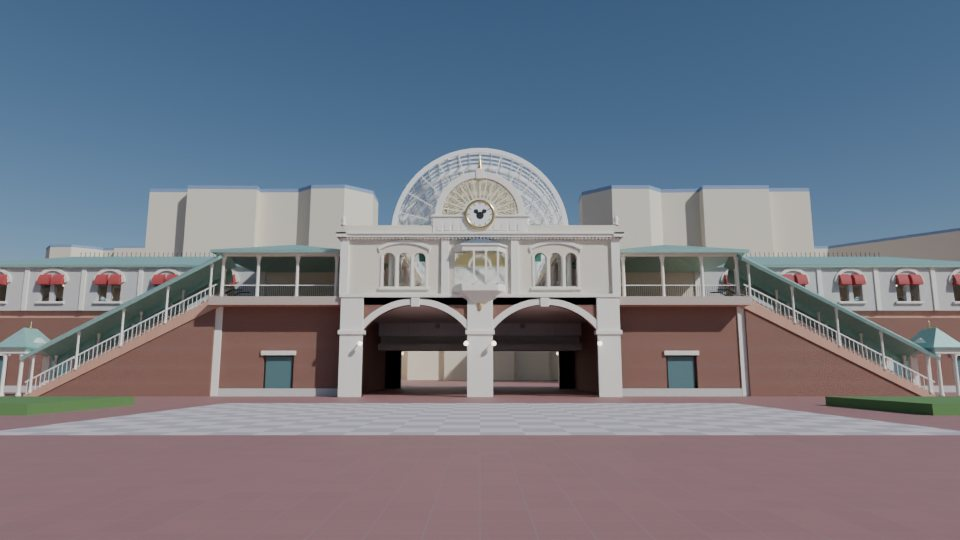 | 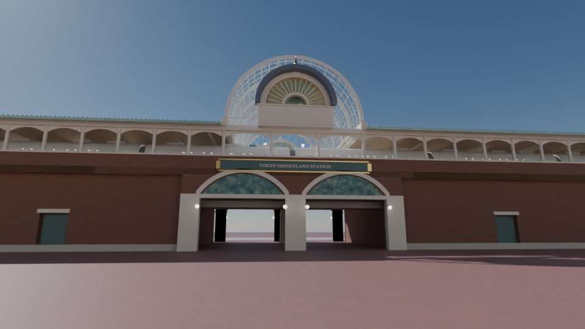 |
| **改札ホール** | **魚眼(動画の視点)** |
| 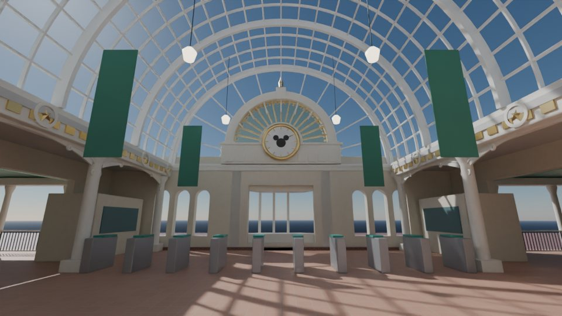 | 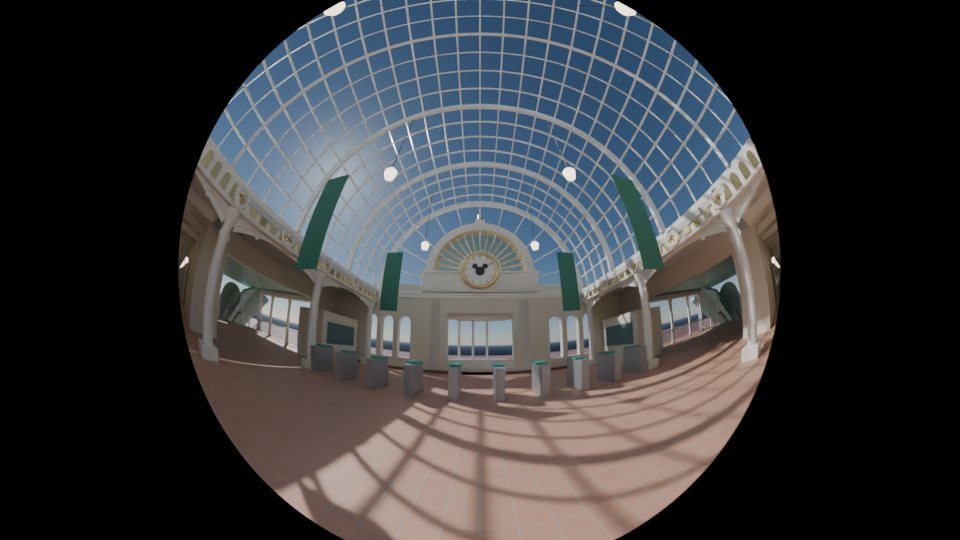 |
| **階段・エスカレーター** | **モックでの表示** |
| 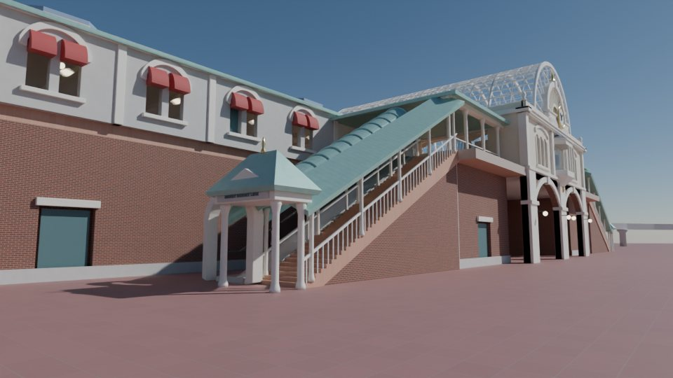 | 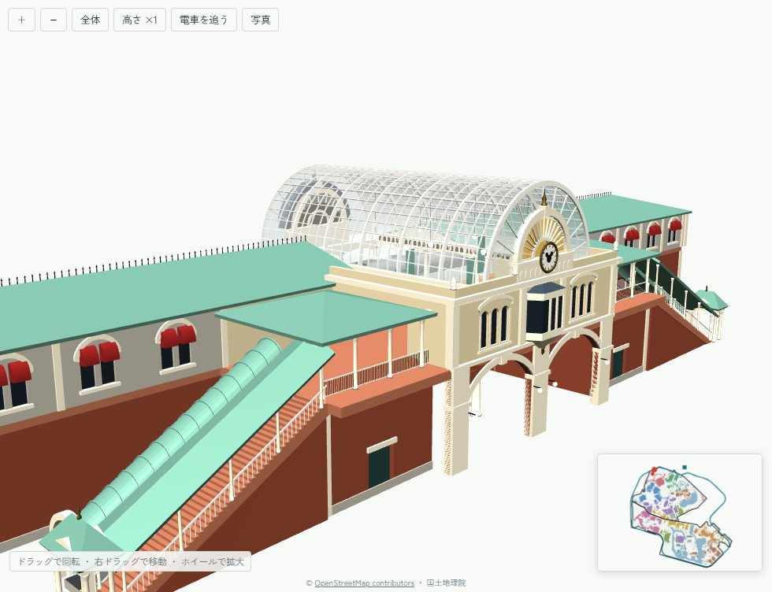 |

## 東京ディズニーランドのエントランス(`ds_tdl_entrance.py`)

参考動画(同じ投稿者の Shorts「Blenderでディズニーエントランスをモデリング」)が作っているワールドバザールの入口と、2023 年に建て替えられたメインエントランスのゲート、その間の入口の広場。

- **ワールドバザールの入口(動画の順番)**: ① 看板(赤い板に金の縁と渦巻き、「Tokyo Disneyland」、楕円の「Welcome」、上の縁の電球は 1 個 +「配列 + カーブ」、メダル)。② 柱(台座の百合の紋章、細い柱、柱頭、球形の灯り)。③ 梁(エンタブレチュア、飾り板 1 枚 + 配列、手すり子 1 本 + 配列)。④ アーチ(透かし板と輪の飾り)。⑤ 奥のれんがの建物(アーチの 1 階、Main Street への通路、アーチ窓の 2 階、バルコニーの青緑の手すりと花箱、付け柱、コーニス)。
- **メインエントランス(写真 2023〜2025 年)**: 中央の建物(青いスレートの寄棟屋根と手すりの付いた屋上、2 本の尖塔、白い破風と透かしの破風板、ミントグリーンの菱形の格子、赤い楕円の「Tokyo Disneyland」の看板、メダル、緑の「ENTRANCE」の板)。左右のゲートの列は、1 区画(四角い柱とミントのパネル、透かし板、区画ごとの小さな破風とマゼンタのメダル、屋根の飾りの鉄柵、改札機、灯り)を作り、OSM の屋根(半径 54〜66 m の弧)に沿って「配列 + カーブ」で並べた。両端に小さな建物。
- **ミッキーの花壇**: 円形(柵までの直径 約 34 m)。外から、アーチ模様の鉄の柵(1 区画 + 配列 + カーブ)、植え込みの土手、赤れんがの縁、芝生。芝生は入場口に向けて 7° 傾き(手前 0.5 m、奥 3.7 m)、入場口から全体が見える。顔は真上から見てミッキーになる形(丸い頭と耳、目のまわりが 2 つにふくらんだ白い顔、縦長の目、楕円の鼻、口角の上がった口、赤い舌)を紫と白の花で。
- **資料**: OSM(ゲートの屋根、ワールドバザールの建物、花壇の位置)、Wikimedia Commons の写真 18 枚、参考動画の画面。どれも見て参考にしただけ。
- **推定**: 高さ(柱 3.7 m、区画の破風 6.1 m、中央の建物の屋上 10 m、尖塔 12.5 m、ワールドバザールの柱 6.6 m・手すり 8.4 m)、区画の数、花壇の大きさと傾き、顔の描き方。
- モック用(`export_models.py --parts tdl_entrance`)は面取りと区画ごとの小さな「ENTRANCE」の文字を外し、約 13 万三角形。材質は駅と同じ名前の色を使う(メッシュ名 `EN_*`)。
- カメラ: `CAM_gate_in` `CAM_gate_out` `CAM_gates_arc` `CAM_wb_porch` `CAM_wb_sign` `CAM_flowerbed` `CAM_flowerbed_top` `CAM_flowerbed_plan`(真上) `CAM_aerial`。

| メインエントランス(広場側) | ワールドバザールの入口 |
|---|---|
| 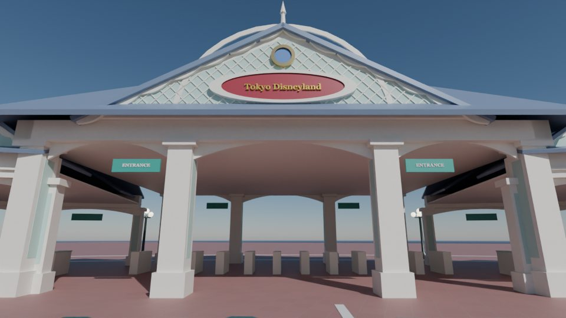 | 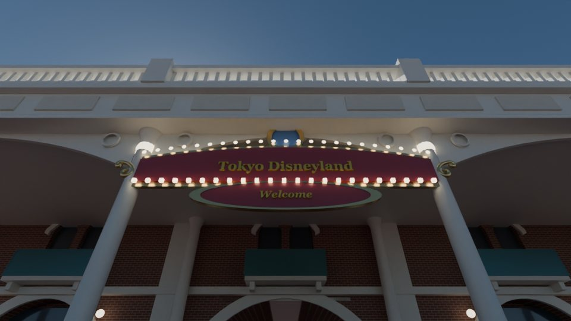 |
| **ミッキーの花壇(真上)** | **モックでの表示** |
| 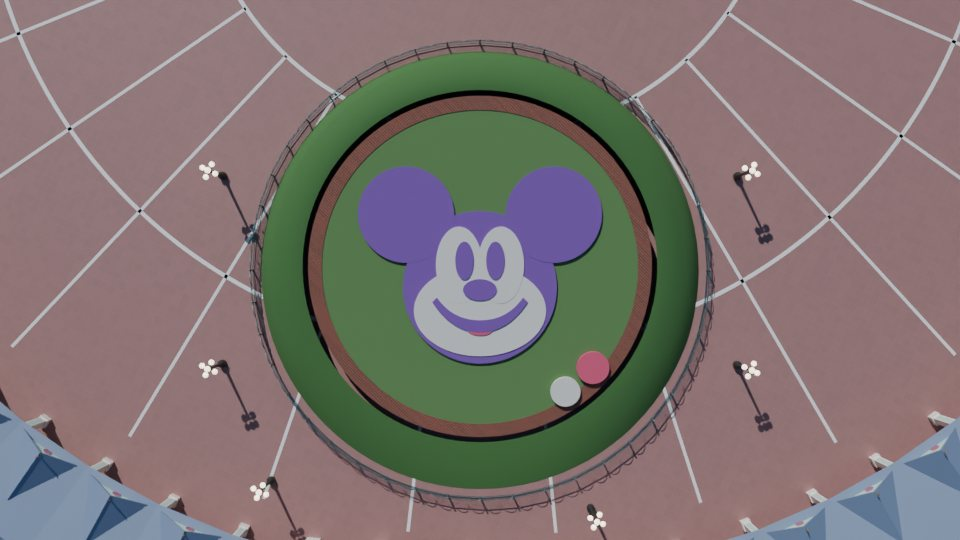 | 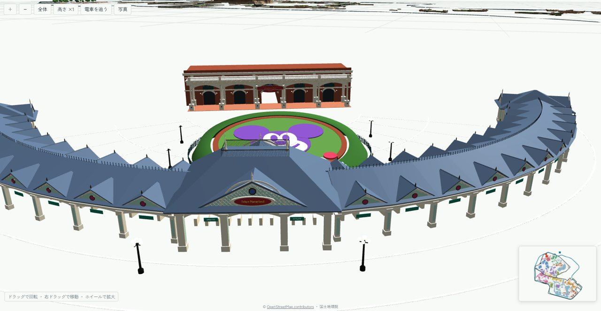 |

## ワールドバザール(`ds_tdl_entrance.py` 1 節 + `ds_tdl_world_bazaar.py`)

- **入口(2026-09-27 作り直し)**: ユーザーの写真で、写っている人を 1.70 m として採寸(柱廊の面で約 25 px/m)。柱廊は 3 区画(3.9 / 4.0 / 3.9 m)、手すりの上端 9.56 m、看板は幅 6 m・高さ 5.2〜6.3 m(文字はアーチに沿う)。細い柱の 2 本組・3 本組、帯の付いた柱身、透かしのアーチ(輪・渦巻き・垂れ飾り)、区画ごとの吊りランタン、左右に低い柱廊。奥にれんがの建物、ガラス屋根の正面の破風、左右のお店。Main Street 側の面はユーザーの 2 枚目の写真から(通り抜けのアーチ 5 つ、窓、ドーマー)。
- **通り**: OSM のガラス屋根(way 72216847)が通りそのもの: Main Street は幅 24.5 m、入口の建物の裏(WB 座標 y = -8.5)から y = -106.6 まで、Center Street が y = -41〜-64 で交わり、両側は約 18° 折れて x = ±57 まで。切妻のガラス屋根(トラス、城側の端は 3 つの丸いアーチ)、交差点の 4 本の格子の塔。街路(青灰色の車道とテラコッタの歩道)、街灯、時計、木、ベンチ。
- **お店(約 50 軒)**: 通りの面ごとに幅 5.5〜9.5 m で割り、色・窓・屋根・日よけ・バルコニー・出窓をばらつかせる。写真の角の店(コンフェクショナリー、ハウス・オブ・グリーティング、「1894」のペディメント)は位置を決めて置く。店先: 羽目板の腰壁、欄間、付け柱の柱頭と柱礎、扉の脇のランプ、突き出しの看板、花箱、2 階以上の一部の窓に明かり。
- **店内(歩いて入れる)**: 1 階は透明なショーウィンドウと、内側に開いたガラス扉の奥に本物の部屋: 板張りの床、店の色の壁、奥の壁と側面の棚、中央の陳列台、レジのあるカウンター、吊り下げ灯。商品はテーマごと(ぬいぐるみのミッキー、瓶と缶のお菓子、畳んだ T シャツとハンガーラック、マグとお皿、グリーティングカード)。通りの角では別の面の店が 9 m 奥まで重なるので、部屋は各面の端から 4.2 m 離し、端から 9.2 m 以内は奥行き 4 m、それ以外は 7.5 m。部屋の外の 1 階は固い箱で、窓の奥は明るい飾りの面。
- **散歩で入れる**: ランドの建物はモックの歩行判定(`buildingAt`)に使われず、壁はモデルの面で止まるので、開いた扉から店内に入れる。三人称のカメラは、人物との間に壁があるとその手前まで寄る(`camHit`)。
- **推定**: ガラス屋根の高さ(軒 12.1 m、棟 16.2 m)、店の高さ・幅・意匠、店内の配置と商品。

| 入口(ユーザーの写真と同じ視点) | 通り |
|---|---|
| 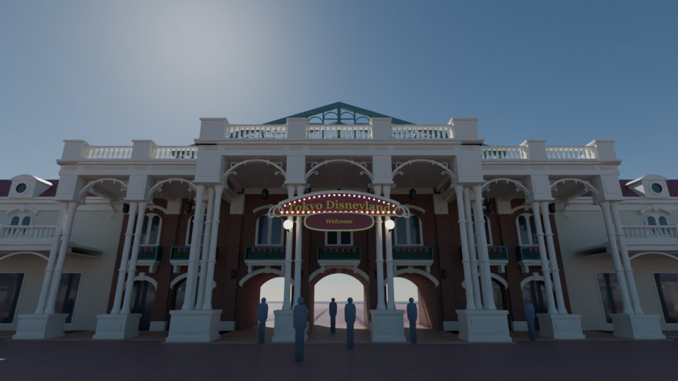 | 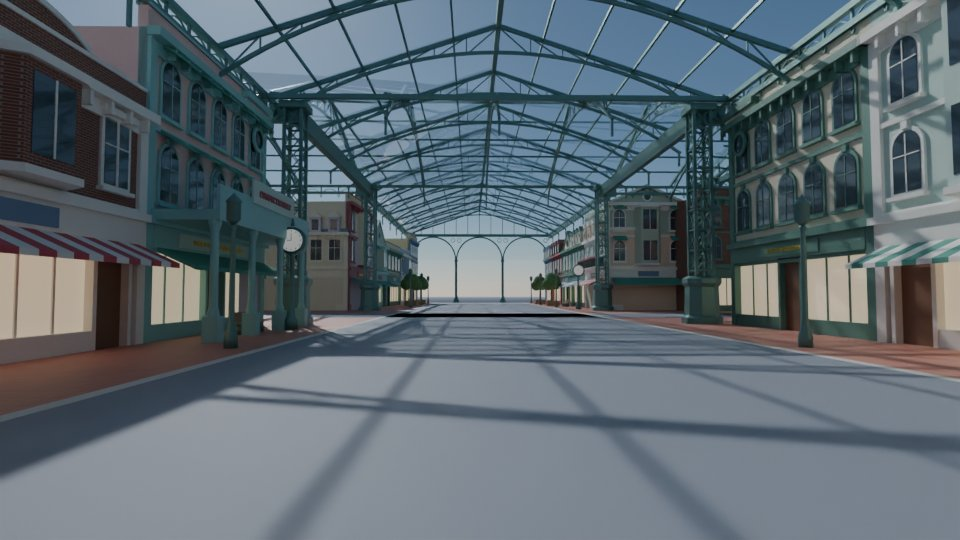 |
| **モック: 店先** | **モック: 店内** |
| 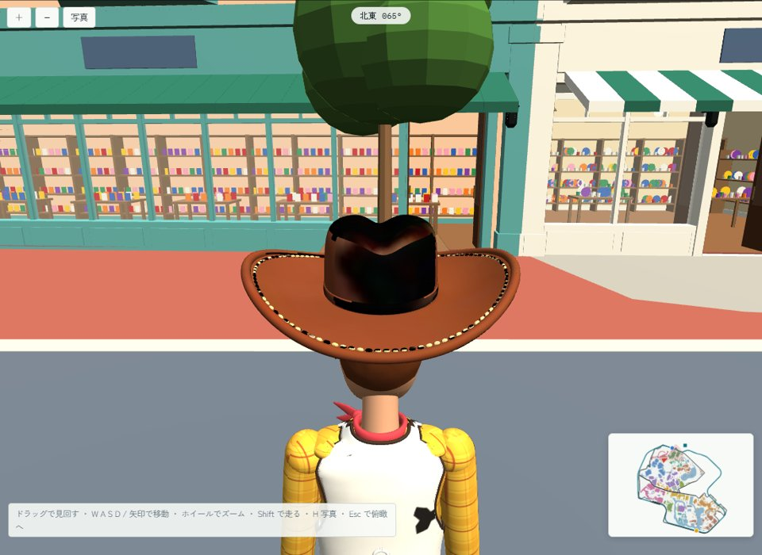 | 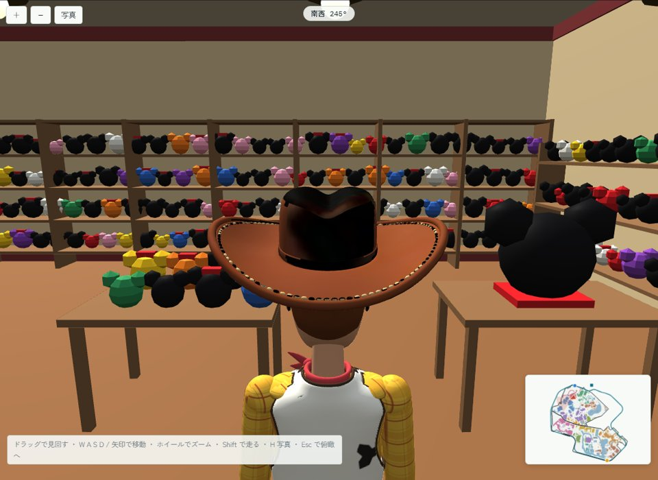 |

## 東京ディズニーランドホテル(`ds_tdl_hotel_plan.py` → `ds_tdl_hotel.py`)

- **正面は駅側(南)**: ユーザーの写真(2026-09-28)は駅側の正面。OSM の輪郭(way 218553057、本館と New Grand Wing が 1 つの輪郭)の南に、幅 約 45 m の U 字の中庭があり、真ん中に丸い庭(OSM の円い建物 788770688 と輪の道 1340488354)がある。`ds_tdl_hotel_plan.py`(shapely)が輪郭を分けて `plateau_data/tdl_hotel_plan.json` に書く: 本館(8 階)、北東の高い棟(58 m、OSM の高さ 60 m をここに)、中庭の入口より先の西の低い棟(青)と東の低い棟(紫)、中庭の座標系(原点は丸い庭の正面の奥の壁、+y は駅の方向)。
- **本館**: 輪郭を一周、同じ外壁(1 階のアーチ窓、各階の白い手すりのバルコニー、コーニス、手すり、壁から奥へ傾くマンサード屋根とドーマー)。1 m 未満の折れ目は単純化し、3.2 m 未満の区間は窓の無い壁。
- **中庭(写真から)**: 奥の中央棟(3 つの大きなアーチ窓、中央が一番高く扇形の桟、2 本組の付け柱、屋階の手すりと壺、八角形のドラムに乗った金のドームとランタン)、扉の前の青いドームのあずまや、両翼の先(中庭の入口の角)の八角形の高い塔(11 階、手すりの冠、青い尖塔)、その先の青と紫のヴィクトリア調の棟(出窓、破風、丸窓)。丸い庭の位置に 3 段の円い段と TDH のバラ窓模様、その両脇に金のメダリオンとトピアリーの大きなれんがの植木鉢、曲がった手すり、中庭の入口を横切る壺付きの石の門柱・鉄の門・石の手すり、街灯。
- **北側**(ロータリーに面した三日月形)は本館と同じ外壁だけ(写真なし)。
- **モックでの高さ**: 建物は中庭の奥の壁ぎわの地面(`tdl_hotel_ground.json` の高さ)に置き、石の基壇を 5 m 下まで伸ばす。中庭の物はそれぞれの場所の地面に、中庭の床はその高さに沿った 1.5 m の格子にする。
- **圧縮前のファイル**(約 70 MB)は git に入れず、Draco 版(`models/web/tdl_hotel.json`、約 4 MB)だけをコミットする(ワールドバザールも同じ。`compress_models.py` の `WEB_ONLY`)。
- **推定**: 階高、塔・ドームの高さ、あずまや・段・門の大きさと位置、北東の棟と奥の棟の外装。

| 中庭(写真と同じ視点) | 上から |
|---|---|
| 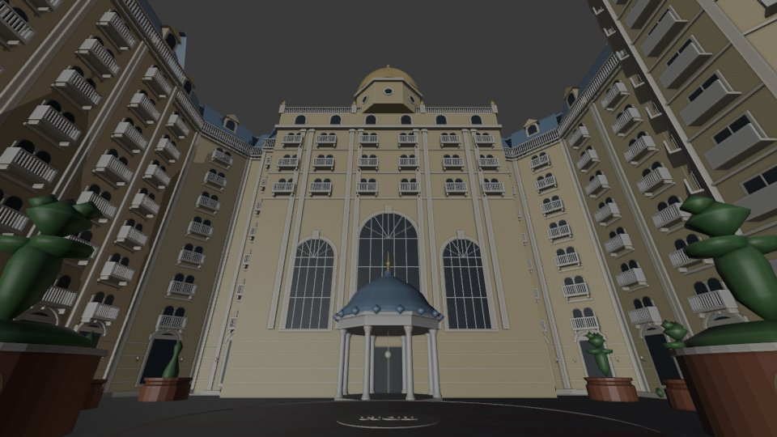 | 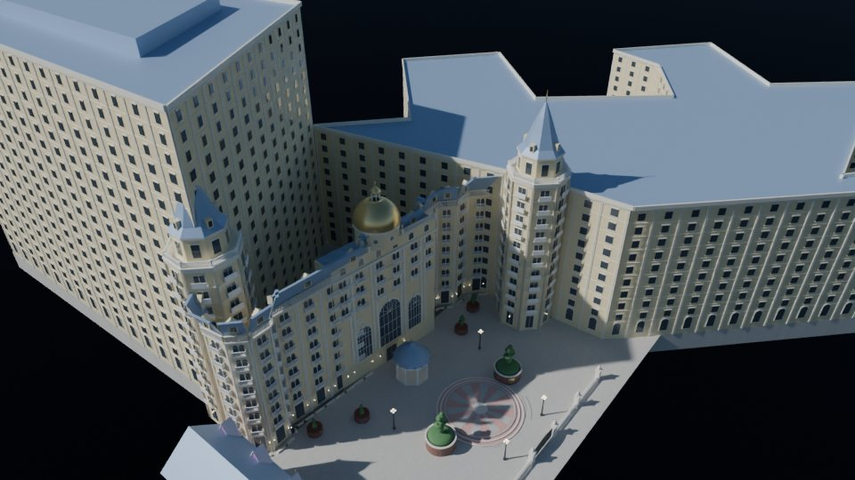 |
| **モック: 中庭** | |
| 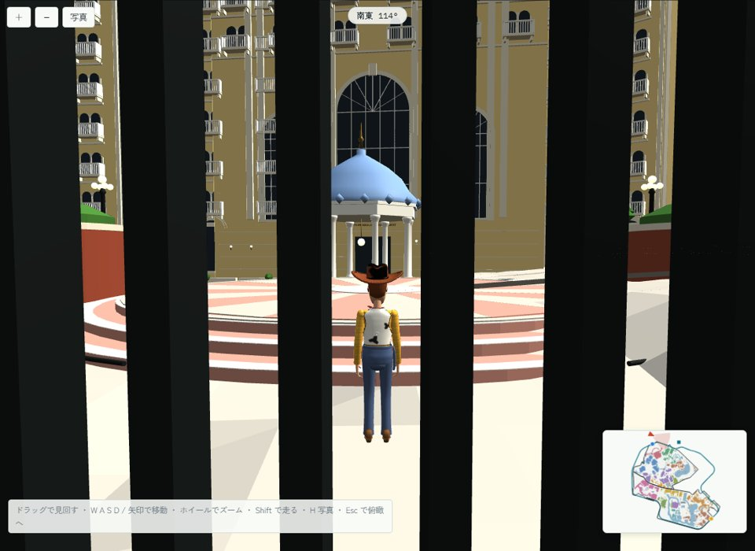 | |

## エントランス周りの仕上げ(2026-09-28)

- **ゲート**(Commons の 2023〜2025 年の写真): 改札のレーン(腰の高さの台が約 1.5 m おき、小さな画面付き)、梁の下の波形の飾り(シーフォームとクリーム)、レーンの上の画面、天井の灯り、中央の建物の風見。
- **ミッキーの花壇**: 柵の直径を 34 m → 24 m に。ワールドバザールの柱廊とゲートの内側の間は約 49 m しかなく、写真では人と比べて植え込みが直径 15〜20 m。顔のまわりに赤・白・紫の花の輪。
- **広場の舗装**: ゲートの中心のまわりに扇形の 2 色(14〜165 m の輪、36 本の放射線)と、明るい石の目地の帯(`ds_tdl_ground.paving_pattern`)。
- **ワールドバザール**: OSM の店(英語名 21 軒)を最寄りの店先に割り当て、看板と店内のテーマをそれに合わせる。4 つの街区(365357846, 72216851, 196943265, 72216845)の通り以外の面に外壁、OSM の高さに屋根。
- **広場まわりの建物**(`ds_tdl_plaza_buildings.py`): OSM の輪郭からプロムナードの建物(クリームの壁、アーチの店の窓、波形の日よけ、緑のマンサード)、保安検査などの屋根(柱と屋根)、小さな建物、モンスターズ・インク(黄土色の箱、列柱、ロゴの丸い青い看板の塔、ガラスのドーム)。どれも写真が少なく推定が多い。
- **ホテル**: 各ベイの間に 0.55 m 張り出した柱を 1 階上から軒まで通し、窓とバルコニーを奥まらせた(部屋の凹凸)。
- **モックの見た目**: 空の映り込みは艶のある材質(金属・ガラス・艶のある塗装)だけに、艶の強さに応じて(全部に掛けると平らな地面が白く飛ぶ。ページはトーンマッピング無し)。太陽の影は見ている所の周りだけ、視点が動いたときだけ描き直す(スマホでは無し)。材質の模様はシェーダーでワールド座標から描くので、モデルの書き出し直しは要らない。木と丸い刈り込みは置かない(ユーザーの希望。生垣・花壇は置く)。

## 影と重さ(2026-09-28)

- **影**: 影の地図は GPU が許せば 4096 px(スマホ以外)。影の範囲を影の地図の 1 画素ごとにそろえて、視点を動かしたときのちらつきを無くし、ずれ(normalBias)を 1 画素の大きさに合わせる。
- **重さ**(Draco 圧縮後): モデル 17 個で 17.6 MB(ホテル 6.09・ワールドバザール 3.47・シンデレラ城 1.17・エントランス 1.13・美女と野獣の城 0.93・火山 0.80、ほかは 0.7 MB 以下)、ページ 2.5 MB。
- **スマホ向けの軽量化**(2026-09-28):
  - **近い順に読み込む**: カメラ(オープニング中は駅)に近いモデルから読み込む(`D.models[].box` = モデルの範囲、`compress_models.bounds`)。
  - **遠く用の軽いモデル**: ホテル・ワールドバザール・エントランス・広場まわりの建物・駅は `models/web/<id>_far.json`(`tools/lod/lod.mjs`: カーテン・街灯・手すり・文字・店内などを外し、残りを meshoptimizer で簡略化。小さな離れた部品は Prune で消す)。ホテル 6.09 → 0.99 MB(154 万 → 25 万三角形)、ワールドバザール 3.47 → 0.58 MB、エントランス 1.13 → 0.45 MB。はじめは遠く用を出し、カメラがモデルの範囲から 320 m(スマホ 170 m)以内に来たら本物を読み込んで差し替える。スマホは本物を同時に 2 つまで持ち、離れたら捨ててメモリを返す。`export_mock.py` が `compress_models.py` 経由で作る(Node と npm が要る。初回に `tools/lod` で npm install)。
  - **3D が落ちたとき**: 端末のメモリ不足などで WebGL が止まったら待ち、戻ったら空の映り込みと背景色を描き直し、本物のモデルを置く距離を 6 割に縮める。5 秒で戻らなければ「再読み込み」を出す。
  - **止まっているときは描き直さない**: 操作中・カメラの移動中・オープニング・散歩・電車を追う間は毎フレーム。何も触っていないときは、800 m 以内の電車が見えていれば毎秒 30 回(スマホ 20 回)、水面だけなら 10 回(スマホ 8 回)、何も動かなければ 1 回。

## 東京ディズニーランドのエントランス広場の地面(`ds_tdl_ground.py`)

ゲートの前(駅側の扇形の広場)と後ろ(ミッキーの花壇のある広場)の地面。Blender は使わず、shapely と numpy だけで作って glTF に書き出す(木は作らない)。

- **舗装(OSM)**: relation 17641752(メインエントランスの広場。駅と駐車場の間の扇形、約 2.2 万 m²)を赤茶、relation 17641753(ゲートの内側、ワールドバザールまで、約 5.5 千 m²)を暗い青灰、ゲートの屋根(way 795427065)の下と面のすき間を淡い石にした。色は航空写真から(外側は赤みのある舗装、内側は暗い舗装)。
- **植え込み**: 2 つの relation の内側の輪 42 か所。高さ 0.30 m・幅 0.35 m の縁石と、その内側の一段低い緑の面。木は無し。ミッキーの花壇の柵(半径 17 m)の中にある輪は、OSM に描かれた旧い花壇なので除いた(モデルが自前の花壇を持っている)。
- **高さ**: 国土地理院 DEM5A(基準 5.29 m = 0)を 4 m の格子で読み、約 5 m でならした。Blender のエントランスは平ら(0 m)に作ってあるので、ゲートの中心から 75 m 以内は -0.03 m の平らにして、105 m まで DEM につなぐ。それより外は DEM のまま(西と駅側へ 2〜2.4 m 下がる)。
- **作り方**: 面を格子(4 m)で切り分けて、1 枚ずつ三角形に分ける(制約付き Delaunay)。地形に沿い、切り分けの境で隙間が出ない。自由な縁には厚さ 0.15 m のふちを付けた。約 1 万三角形・500 KB。
- **推定・未確認**: 色、縁石の寸法、ゲートの床。航空写真は 2023 年のゲート建て替えより前なので、今の舗装の模様と植え込みの中身は写真と照らしていない。舗装の目地の線・タイルの模様は作っていない。

| モックでの表示(俯瞰) |
|---|
| 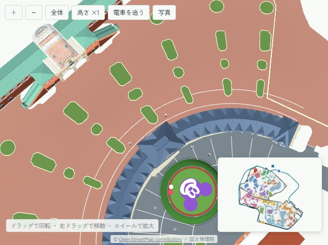 |

## 東京ディズニーランドホテル周辺の道(`ds_tdl_hotel_ground.py`)

ホテルの周りの道の地面。エントランス広場と同じ作り方(`ds_tdl_ground.py` の関数を使う。Blender なし、木は作らない)で、**ホテルの建物の場所は作らない**。

- **車道**(アスファルト): OSM の `highway=service` のうち、ホテルから 60 m 以内にある地上のもの。ホテルの車寄せのループとロータリー、北東の道、ホテル脇の駐車場の通路。幅は推定(往復 6.0 m、一方通行 4.5 m、駐車場の通路 5.5 m)。
- **園路**(淡い石): `highway=footway`。駅との間の歩道、ホテルの周りの道、庭の細い園路(楕円の庭の十字と輪、池のある庭の模様)。幅 3.0 m、庭の中の園路は 1.8 m。
- **歩行者広場**(赤茶のレンガ): ミッキー＆フレンズ・スクエア(relation 18377374。中の丸い花壇は縁石つきの植え込み)と、`highway=pedestrian` の面。
- **ホテルと駅の間の埋め**: OSM では線だけで面が無いところ(ホテル前のプロムナードと駅の周り)は、OSM の線(道・柵・建物・庭・水・リゾートラインの桁)で囲まれた区画を面として埋める。庭・芝・花壇の区画は縁石つきの植え込み、サービス道路から 6 m 以内(幅 12 m)はアスファルト、残りは赤茶のレンガ(航空写真: 駅前の道は灰色、その両側の歩道はレンガ)。
- **駅の中の通路**: 東京ディズニーランド・ステーションの外形の中にある短い通路 7 本(OSM では tunnel / covered / layer=-1。建物の下と棟の間を抜ける通路)を幅 4 m の石の道にした。駅の外形の下には、Blender の駅の床の高さ(-1.79 m)で石の床を敷いたので、駅の下に空白は出ない。
- **作らないもの**: ホテルとほかの建物の場所(屋根だけの構造物は除く)、水面、地下道・橋(ゲートウェイの歩道橋)・屋根つきの道(駅の中の通路は除く)、階段、公道(浦安市道幹線7号)、遠くの大きな駐車場の通路、エントランス広場(`ds_tdl_ground.py` が作るので、その範囲は切り抜く)。ホテル正面の車寄せの舗装は OSM に面として無いので作っていない。
- **高さ**: エントランス広場と同じ地形(DEM5A、約 5 m でならす)。ただしホテルの建物の下は DEM が補間値(-0.8 m で平ら)なので、地面ではないとして周りの高さから補間してからならす。**DEM では、ホテル北側の車寄せのループ・ロータリー・ループ内の林が、約 +5.8 m の平らな台地**になっていて、北と西に向けて -1 m の地面まで下る(OSM でもホテルは layer=1 で、真下に地下道がある)。地面はこれに従う。DEM 以外では確かめていない。
- **推定・未確認**: 道の幅、色(航空写真)、「ホテル周辺」の範囲(ホテルの外形から 60 m 以内、85 m で切る)。切り口は道がそのまま途切れる。航空写真は 2023 年より前。
- 約 2 万三角形・1.1 MB(車道 6,700 m²、園路 5,400 m²、広場 3,100 m²、植え込み 22 か所)。

| モックでの表示(俯瞰。枠線のホテルと重ねたもの) |
|---|
| 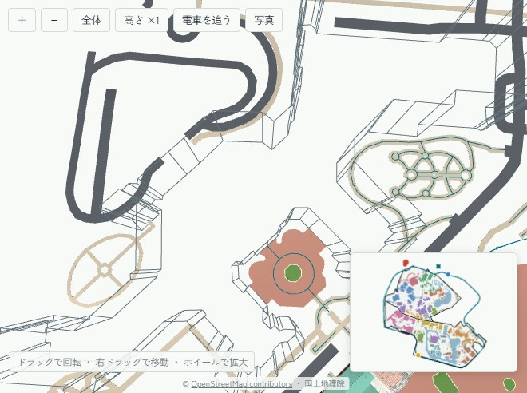 |

## 地面(`ds_ground.py`: ランド全体・シー全体)と駐車場のレイヤー

2 つのパークの中の地面(パークの外、舞浜駅・イクスピアリ・ホテル群・住宅地などの地面は作らない)。エントランス広場・ホテル周辺(`ds_tdl_ground.py` `ds_tdl_hotel_ground.py`)と同じ作り方で、それ以外を埋める(Blender なし、木は作らない)。ゾーンごとに 1 ファイル。

| ゾーン | 範囲 | 格子 | 大きさ |
|---|---|---|---|
| `tdl_land_ground`(ランド全体の地面) | ランドの外形(南西の大駐車場を含む)と、30 m 以内の平面駐車場(西のグーフィー・ピノキオ・ティンカーベルなど)。25 m のクロージングですき間も含める | 8 m | 約 6.8 万三角形・3.4 MB |
| `tds_ground`(シー全体の地面) | シーの外形 | 8 m | 約 7.6 万三角形・3.8 MB |

- **作らない所**: エントランス広場とホテル周辺(作成済み)。既存モデルの平面形(モデルの glTF の三角形を 0.5 m の画像に描いて輪郭を取る): シーの水面(護岸・桟橋ごと)、プラザ、アクアスフィア、火山。**水面は作らない**(水面モデルは別に作る。シーの分は済み、ランドの分は別タブで作成中)。OSM の水面(`natural=water` など)は穴として空けておき、地面は岸で止めて、水面モデルの護岸と合うように 0.15 m のふちを付ける。建物の場所(屋根だけの構造物と 50 m² 未満の小屋は除く)も作らない。
- **建物を抜ける通路**(`tunnel=building_passage`・`covered=yes`、建物の中に収まる地下通路・アーケード)は、幅 4 m の地面を作る(シンデレラ城の下の通路、シーのミラコスタのアーチなど)。
- **種類**(先に当てはまったもの): 舗装(`highway=pedestrian` の面、園路 3.5 m・歩行者道 8 m)/ 道路(`service` 5 m、`tertiary` 以上 10〜12 m など。高架は除く)/ 駐車場 / 線路敷 / 岩場・砂浜 / 芝・庭・運動場 / 林(木は無し)/ 工事中 / その他の地面(多くは舗装や空き地。明るい石の色)。
- **高さ**: DEM5A(約 5 m でならす)。建物と水面の下は DEM が地面ではないので、周りから補間する。エントランスの下は平ら、リゾートラインの駅の周りは駅の床(-1.79 m)、シーのプラザの周りはプラザの面にそろえる。
- **形の単純化**: 隣り合う面を境界を保ったまま 0.3 m で単純化(`shapely.coverage_simplify`)、既存モデルの平面形は 0.6 m。ふち(スカート)は建物の穴には付けない。
- **駐車場のレイヤー**(`ds_disneyland.py` → `D.parking`): ランドの外形から 150 m 以内の `amenity=parking` 42 か所(平面 39、立体 3)。地図では灰色の塗り(立体は濃く、関係者用は点線)と名前、俯瞰では地面の枠と立体駐車場の箱(高さはタグ、無ければ推定 15 m)。検索欄で「グーフィー」などの名前で探せる。
- **推定・未確認**: 幅、色、どの駐車場を含めるか。アトラクションの建物の中の地面は作っていない。
- ランドの水面モデル(別タブ)がモックに入ったら、`ds_ground.py` の `WATER_MODEL_TDL` をそのモデルの id に合わせて作り直すと、その平面形でも地面を抜く(今は OSM の水面の形で空けている)。

| モックでの表示(俯瞰、「モデルのみ」。パークの外には地面を作らない) |
|---|
| 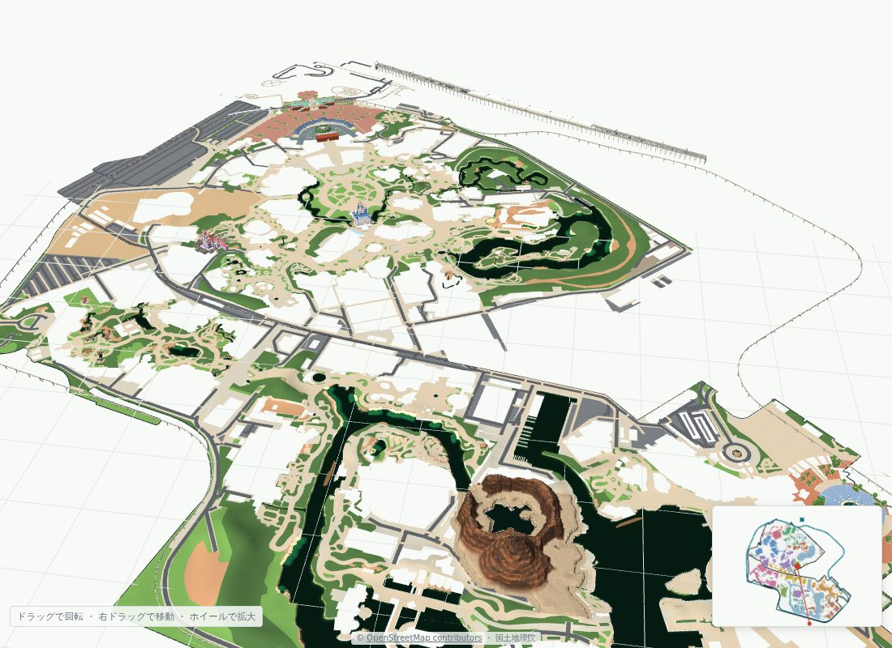 |

## 美女と野獣の城(`ds_tdl_bb_castle.py`)

- **資料**: Web の画像検索で集めた写真 401 枚(重複を除いた外観 約 150 枚。見て参考にしただけで、リポジトリには入れていない)、Wikimedia Commons、日本語版 Wikipedia などの記事、OSM(城の点、行列の橋、アトラクションの建物)。参考動画(同じ投稿者の通常の動画 1 本)はバラのショートフィルムなので、ガラスのドームのバラを中庭に置いた。ショート動画は参考にしない(ユーザーの指示)。
- **作り方**: 写真と同じ視点から Blender でレンダーして並べて比べ、比率を合わせた(9 回)。ユーザーの確認で 2 回直した(写真 100 枚規模で作り直し、開いた扉・レンガ調の壁・窓枠と装飾)。
- **形**: 岩の谷にかかる橋(ブロンズのガーゴイルが支える街灯)、門(開いた扉と奥の階段、ライオン像のくぼみ、ライオンの顔の浮き彫り、ピンクの角錐屋根の塔)、低く長い両翼(ガーゴイルの並ぶ手すり、緑青のドーム)、2 m 高い中庭(アーチの回廊、紋章の円)、大階段とライオン像、左右の太い円塔、段が積み重なる本館(どの段にも軒・手すり・急なピンクの屋根・装飾の多い屋根窓)、その上にそびえる細い天守と円塔、横と裏の岩山と滝。
- **細部**: 窓は縦横の桟・ひし形の鉛の格子(Blender のみ)・アーチの上の縁取りと要石・窓台の持ち送り。隅石、軒下の持ち送りの列、段の角の小尖塔、屋根の棟の鉄の飾り。
- **質感**: 石を積んだ壁(紫・灰・ピンクの石の混ざり)、土台の大きな暗い石、ピンクの丸い瓦は、`make_textures()` で描いた画像(`plateau_data/bb_castle/`。Blender には PIL がないので普通の Python で作る)。
- **大きさ(2026-09-25 にユーザーの指示で決め直し)**: 門の正面の扉を高さ 3 m と決め、城全体をその比で縮めた(形の比率は写真のまま)。写真で扉を物差しに確かめ直し、門の扉と両脇のくぼみが約 1.6 倍高すぎたのを直した。結果: 門の屋根の頂 10.6 m、両翼の手すり 13.5 m、本館の扉 約 5 m、天守の胸壁 約 37.5 m、尖塔の先 42.6 m。公表の約 30 m より高いが、扉を物差しにした値を採った。
- **レイヤーとの違い**: 「ディズニーランド」レイヤーの枠線(紫の箱)は、OSM のアトラクションの建物(高さタグなし)を推定 12 m で描いたもの。城のモデルとは高さも形も違う。
- モック用は鉛の格子を外して約 16 万三角形。Blender の色と画像をそのまま使う。
- カメラ: `CAM_bridge` `CAM_front` `CAM_courtyard` `CAM_village` `CAM_keep` `CAM_aerial` `CAM_rose`。

| 橋から | 中庭 |
|---|---|
| 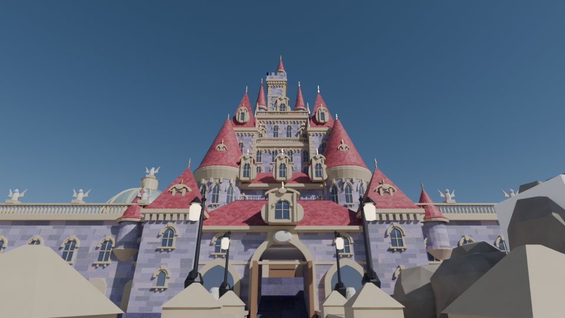 | 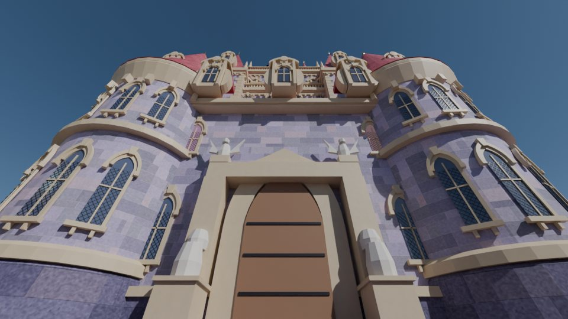 |
| **斜め前** | **モックでの表示** |
| 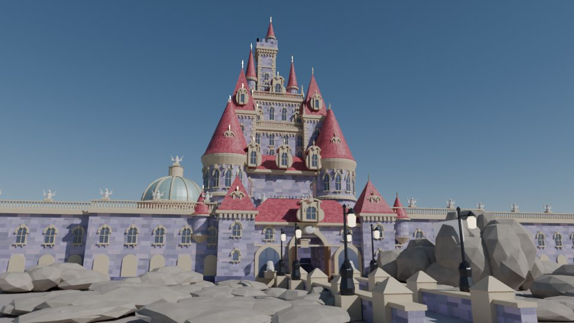 | 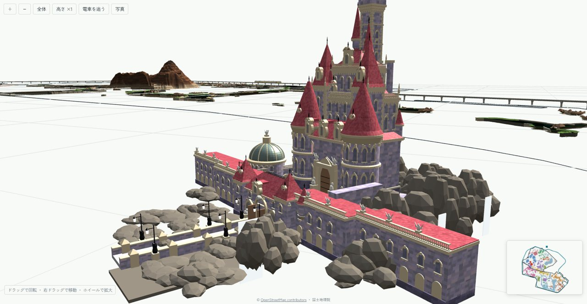 |

## シンデレラ城(`ds_tdl_cinderella.py`)

- **参考**: ユーザーが選んだ 3D モデル(TurboSquid 1439041 / free3d 6339、同じモデル)と「全く同じもの」を作る方針(個人利用)。360° 回転画像 72 枚(5° ごと)と静止画 39 枚を見て比べた。リポジトリには入れていない。
- **比べ方**: 回転画像と同じ角度のカメラを置いてレンダーし(`--tt` にコマ番号。コマ k の方位は +X から -5°×(k-31)、見下ろし 14°、距離 400 m、96.7 mm)、並べたり重ねたりして直した。正面の静止画(s06)と同じカメラ `CAM_ref_s06` もある。
- **形**: 前庭の島(角を落とした下の広場とコンパス、白い付け柱と扉 2 つの舞台、左右の曲がったスロープ、左の白いアーチと金の手すり、右の丸いバルコニーへ回り込むスロープと 3 つのアーチ、金の縁の青い旗 8 本)、アーチ橋、城の島(灰色の石の土台と円塔、正面の門・バルコニー・二連のアーチ・時計の破風、段になったピンクの本館、天守と金の尖塔 51 m)、T 字の裏のテラス、池と島の下に浮かぶ岩。
- **大きさ**: 正面の門の開口を高さ 3 m・幅 2.5 m とした(ユーザーの指示)。裏の出口も同じ大きさ。尖塔の先は 51 m。
- **配置(2026-09-25 にユーザーの指示で直した)**: 正面はワールドバザール(OSM の Main Street、ways 629990046 と 119893380)の軸の方向、+X から 114.9°(北北西)を向く。石の土台の真ん中を、OSM の城の外形(way 217727348)の重心 (-385.4, 594.0) に置く。Main Street の軸はこの重心から 2.5 m。高さは、下の広場の前の縁がハブの地面(DEM)と同じになるようにした。
- **ユーザーの確認で直したところ**: 城と前庭の配置、正面の中央(門まわり・装飾)、階段ではなくスロープ(しかも曲がっている)、正面から見た横幅、横から見た段の形、裏の出口の大きさ。
- **参考との違い**: 門の脇の塔の円錐屋根が少し太い、本館の壁は参考より平らな面が多い。
- モック用は約 18 万三角形。金の部品は、モックに環境マップがないので金属感を弱めて表示する。池と島の下の岩は地面より下なので、モックではほぼ見えない。

| 正面(Blender) | モックでの表示 |
|---|---|
| 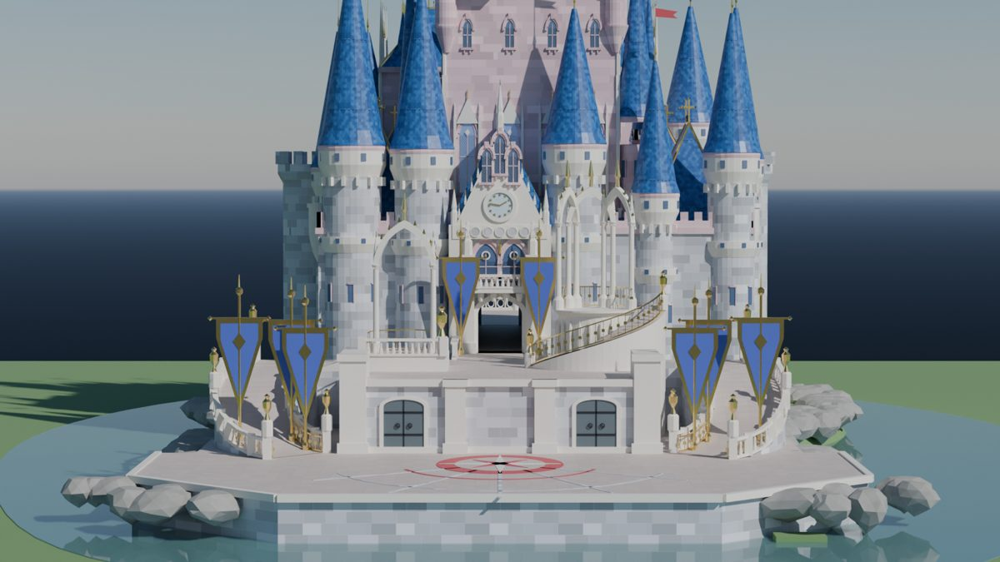 | 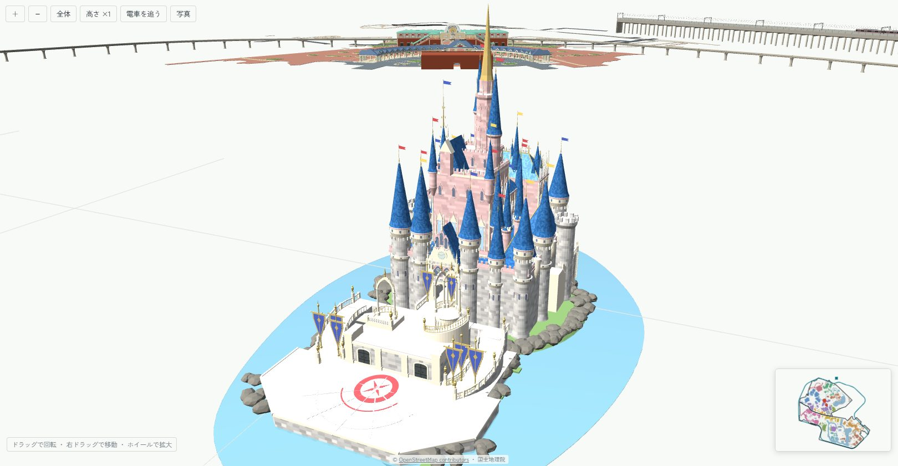 |

参考の正面の静止画(上)と Blender のレンダー(下): 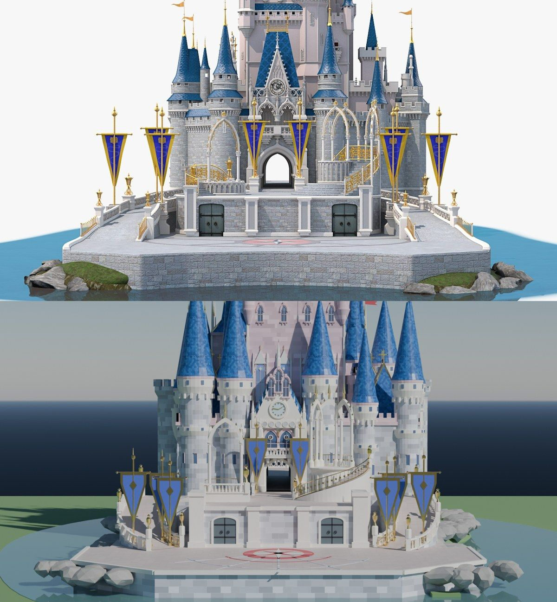

## 線路(`ds_tracks.py`)

モックの線(OSM)をなめらかにして、その上に作った。高さはモックの電車と同じ(リゾートラインの桁の上面 4.21 m、京葉線のレールの上面 10.0 m、基準面から)。

- **リゾートライン(跨座式モノレール)**: 幅 0.85 m・高さ 1.5 m のコンクリートの桁(カーブでは最大 6° 内側へ傾ける)、約 22 m ごとの継ぎ目と鋼の伸縮板、その下にラッパ形の頭の丸い橋脚と支承、桁の側面の電車線(Blender では碍子の腕木を 1 個 +「配列 + カーブ」で並べる)。リゾートゲートウェイ・ベイサイド・東京ディズニーシーの 3 駅は、あとで駅ごとに作るので、今は入れていない(ユーザーの指示、2026-09-25。ホームの下書きは `build_rl_platforms()` に残し、`RL_STATIONS = False` で外している)。東京ディズニーランド・ステーションの区間は駅のモデルに任せる。
- **京葉線(高架・複線)**: 2 本の線路に合わせて幅が変わる高架の床(舞浜駅で広がる)、防音の壁と上の防音板・支柱、10 m ごとの 2 本柱の橋脚、両側のケーブルの溝、暗い防水面、コンクリートの板の上のレール(頭・腹・底の断面)と締結具、50 m ごとの架線柱とトラスの梁、トロリー線・吊り線と 5 m ごとの吊り下げ線。舞浜駅は島式ホーム(OSM の形)、切妻の屋根と柱、両側の黄色い線。データは舞浜駅の前後 約 790 m だけなので、両端は壁で閉じている。
- **作り方(3 回の見直し)**: 1 回目: カーブでの桁の傾き、継ぎ目、ラッパ形の橋脚、ホームの屋根を切妻に、黄色い線、ケーブルの溝。2 回目: 風化したコンクリートの色、ホームの下の柱、架線の吊り下げ線、端の壁、電車線を太く。3 回目: 高架の暗い防水面、防音板と支柱。
- **モック用**は間隔を粗くし(リゾートライン 4 m、京葉線 5 m)、腕木を外して約 16 万三角形。線路とホームの枠線(舞浜駅・周辺)を置き換える。
- **推定**: 図面がないので、桁の断面、継ぎ目の間隔、橋脚の形、電車線の高さ、高架の幅、防音壁の高さ、架線の高さと間隔、ホームの屋根はすべて推定。

| リゾートライン(ベイサイドのカーブ) | 京葉線(舞浜駅の東) |
|---|---|
| 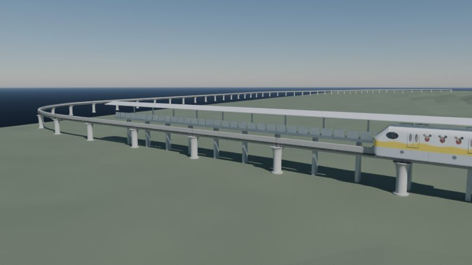 | 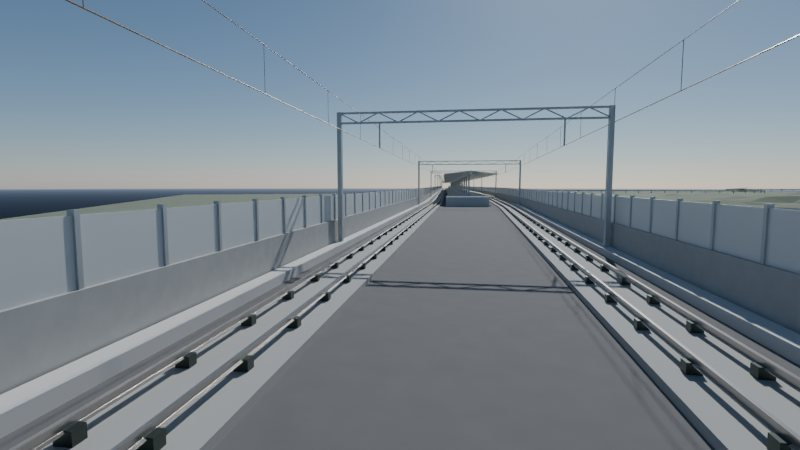 |
| **モック: リゾートラインの電車と桁** | **モック: 京葉線の高架と舞浜駅** |
| 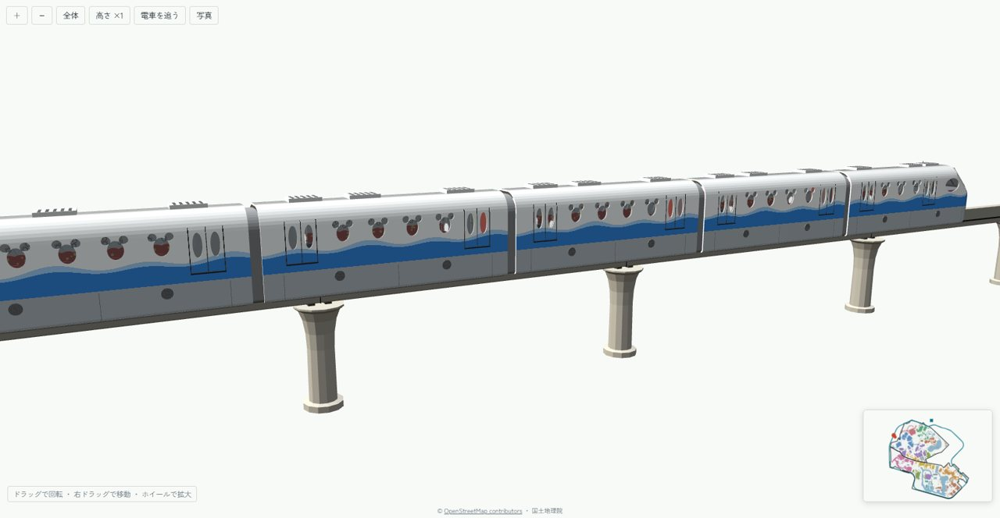 | 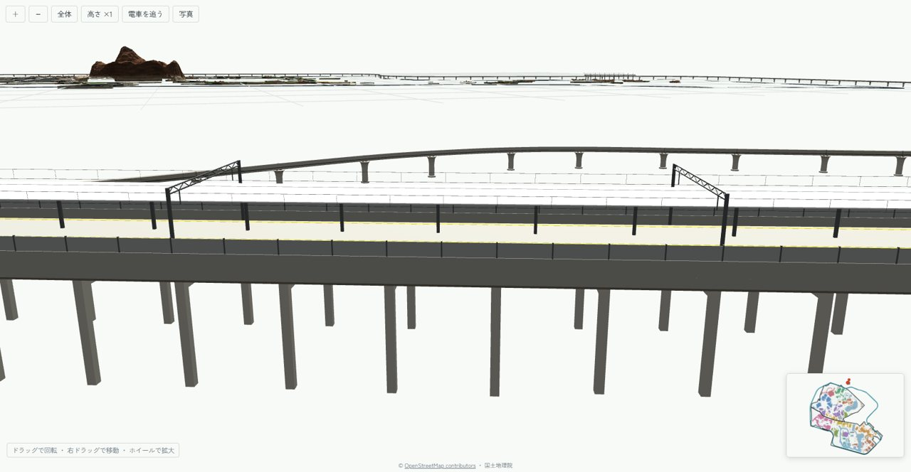 |

## 電車(ディズニーリゾートライン)

`output/disneysea/train.html`(公開 URL の `/train.html`)は、リゾートラインの 6 両編成を JS(three.js)だけで作った単独のページ。車両の作り方は `output/disneysea/train_model.js` にまとめてあり、モックも同じファイルを使う(下の「モックで走らせる」)。

- 寸法は Wikipedia の値。形と色は、Wikimedia Commons の写真(CC0 / CC BY-SA。個人利用の参考として見ただけで、リポジトリには入れていない)に合わせた: 白い車体 + 波形の色帯 + 銀灰のスカート、縦長のミッキー窓、楕円窓のドア、後ろへ傾いた先頭部と回り込む大きなフロントガラス。
- 窓は実際に穴が開いていて、ガラス越しに車内が見える。車内は、柄入りの長い座席、黄色い床、アーチ形の手すり、つり革、照明、貫通路、先頭車の運転台と展望席まで作った。
- 視点(外から 6、断面、車内の通路・運転席・座席)、断面表示(手前の壁・屋根を外す)、5 色の編成、走行を切り替えられる。
- 仕様・参考写真の一覧・JS と Blender の比較は `docs/train/spec.md`。
- **2026-09-24 からモックの電車は Blender 版**(`train_blender.py` → `export_models.py --parts train` → `models/train.json`)。ユーザーの指示で JS 版はモックから外し、`train.html` にだけ残している。

### Blender 版(v2)

Type C の写真(Wikimedia Commons。一覧は `docs/train/spec.md`)と、跨座式(アルウェーグ式・日立式)モノレールの作りを参考に作り込んだ。

- **外装**: 厚み 10 cm の殻に窓の穴(ミッキーの頭・展望窓・ドアの楕円窓)を開け、穴の内側は白い額縁になる。全部の窓にガラス。ドアの合わせ目と戸袋の線、ドア下のステップ、スカートの丸いルーバーと点検蓋の線、屋根の空調装置とグリル、傾いた前面ガラスと中央の柱、縁取りのある丸い前照灯、連結器。
- **走行部(跨座式の構造)**: 各車に台車 2 つ。桁の上面にゴムタイヤの走行輪(1 軸 2 本 × 2 軸)、桁の側面の上に案内輪、下に安定輪、それを支える側枠、桁の側面の電車線から電気を取る集電靴。スカートの中に隠れる。
- **車内**: 市松模様の床、天井の照明 2 列、赤い妻壁とガラスの貫通扉、黒い座面と赤い波形の背もたれ(黄色い水玉)、端の丸い透明の仕切りと赤い玉、白いポール、天井の 2 本のレールとミッキーの輪のつり革(黄色い帯・赤い玉)、ドアの上の案内画面。先頭車は運転台(画面・スイッチ盤)、ガラスの仕切り、マゼンタに黄色い水玉の展望ソファ。
- **色**: 車体の色帯は、モックで編成ごとの色(ブルー・イエロー)をシェーダーで塗る(式は JS 版と同じ)。ほかの材質は Blender の色をそのまま使う。
- 三角形: 先頭車 約 2.9 万、中間車 約 2.0 万(車内込み)。モックでは車内をカメラから 150 m 以内の車両だけに出す。

| 外観 | 車内 |
|---|---|
| 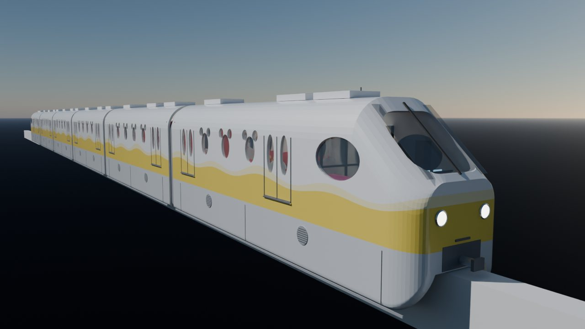 | 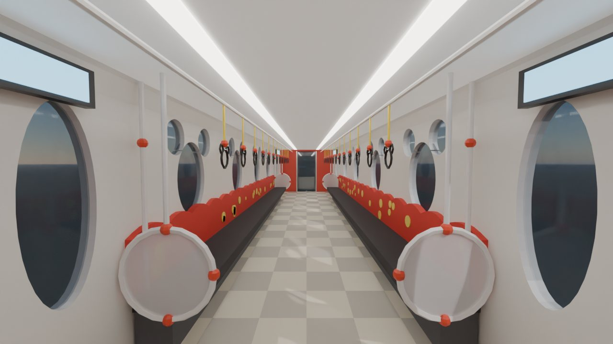 |
| **側面(窓とガラス)** | **運転台・展望席** |
| 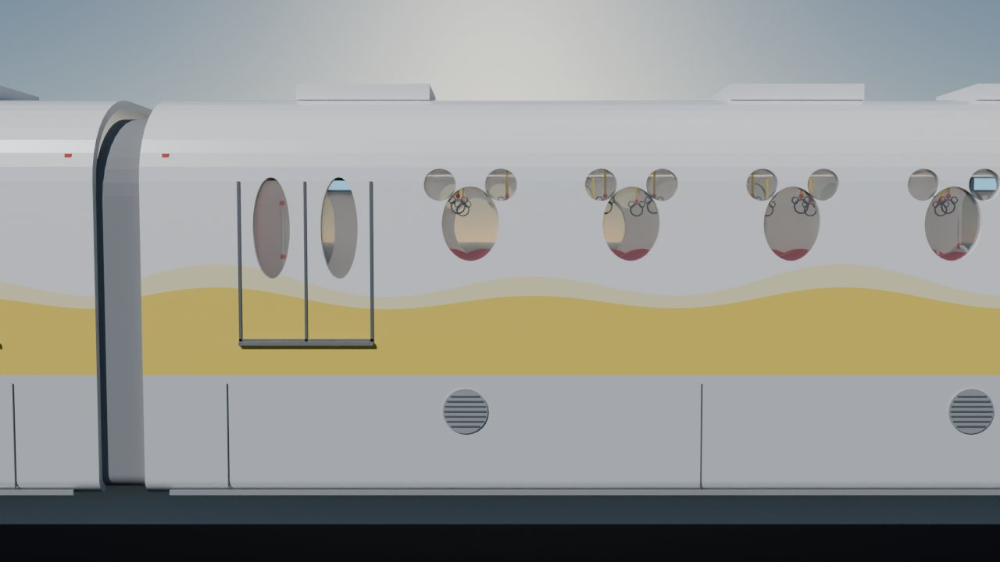 | 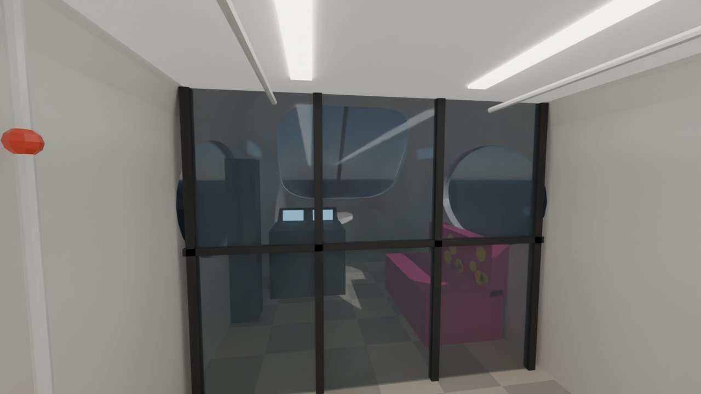 |

| 外観 | 車内 |
|---|---|
| 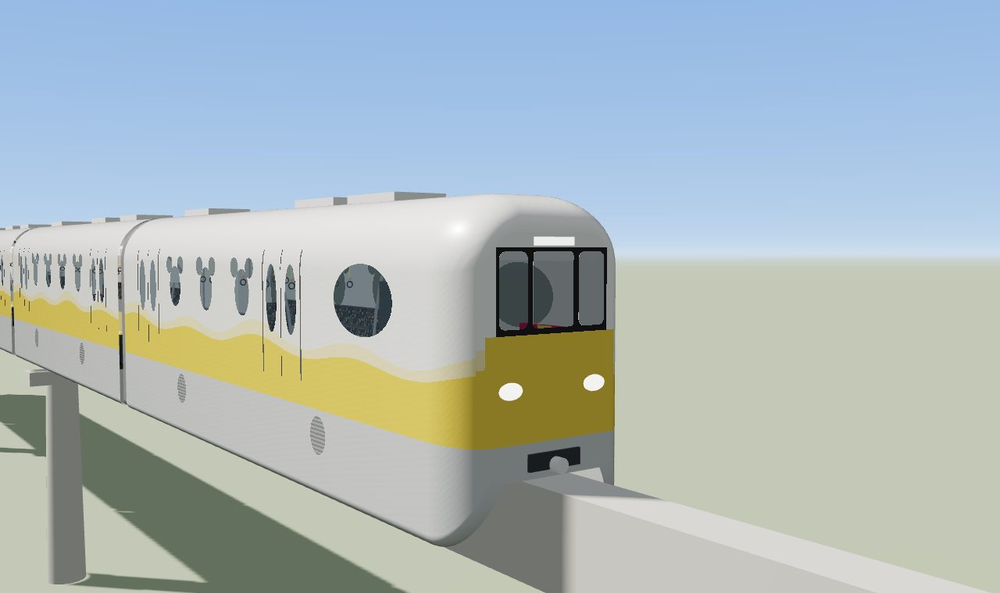 | 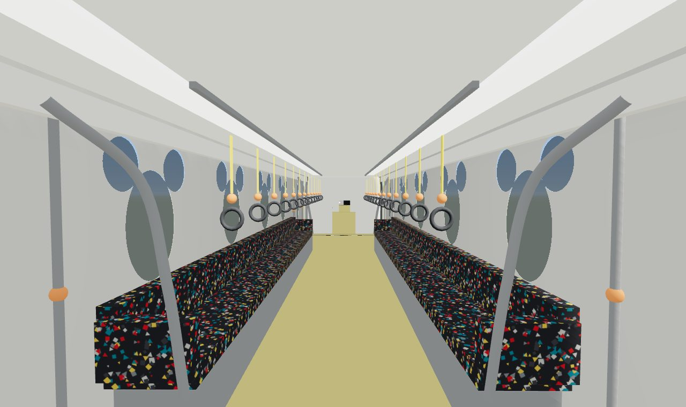 |

### モックで走らせる

- **範囲**: 「舞浜駅・周辺」レイヤーのリゾートラインの全周(OSM の 4 本の線をつないだ 1 周 4,998 m)。反時計回り(リゾートゲートウェイ → 東京ディズニーランド → ベイサイド → 東京ディズニーシー)。
- **駅**: リゾートラインの 4 駅すべてで停まる。停車位置は、駅のホーム(OSM)の中心に編成の中央を合わせる。モックの駅の一覧にある 5 つ目の「舞浜」は JR 京葉線の駅で、線路から 90 m 離れているので停まらない。
- **編成**: 2 本(ブルーとイエロー)。同じ走り方を半周期ずらしてくり返すので、ほぼ反対側を走る。
- **走り方**: 最高 時速 35 km(営業は最高 50 km)。加速・減速は 0.9 m/s²、各駅 20 秒停車。1 周 10 分 37 秒。実際の時刻表ではない。
- **向きと高さ**: 車両ごとに、前後の台車の位置から線路の向きを取る(カーブで車両が折れ曲がる)。桁の上面は基準から 4.21 m(全周で一定)。東京ディズニーランド・ステーションの Blender モデル(地面から 6.0 m、地面は基準 -1.79 m)に合わせた。線路沿いの地面は -3.2〜-0.1 m なので、桁は地面から 4.3〜7.4 m。車両の床は桁の 1 m 上で、4 駅のホームもその高さ。
- **見え方**: 地図では線路の上の色付きの印(黒い点が先頭)。俯瞰・散歩では 3D。カメラから 170 m 以内の車両だけ詳細版(窓の穴・車内。1 両約 1.6 万三角形)、それより遠い車両は簡略版(窓を塗った殻。1 両数百三角形)。詳細版は近づいたときに初めて組み立てる。散歩では当たり判定がなく、すり抜ける。ミニマップにも位置を出す。
- **表示の切り替え**: レイヤーの「電車(リゾートライン)」は、地図の印・ミニマップの点と、俯瞰・散歩の枠線の電車(編成の色の線)。3D モデルの「電車(リゾートライン)」は立体の電車。ほかのパーツと同じく、3D モデルがオンのときは枠線の代わりに立体を出し(「枠線も重ねて表示」なら両方)、プリセット「枠線のみ」では枠線の電車、「3Dモデルのみ」では立体の電車になる。
- **電車を追う**(俯瞰): 左上の「電車を追う」、F キー、または「エリア・移動」タブの「1本目(ブルー)を追う」「2本目(イエロー)を追う」(地図からでも俯瞰に切り替わる)。「電車を追う」と F は 1 本目を追う。電車のレイヤーも 3D モデルもオフなら、3D モデルをオンに戻す。
  - カメラは斜め後ろの上(後ろ 70 m・右 24 m・上 32 m)から始まり、1.2 秒かけて滑らかに移る。追っている間もドラッグで回す・ホイールで寄ることができ、電車が曲がるとカメラも一緒に回る。
  - 追っている間は「電車を追う」の隣に「2本目へ」(2 本目を追っているときは「1本目へ」)が出て、押すか T キーで、もう一方の電車へカメラが滑らかに移る(離れているほど長く、最大 3 秒)。
  - もう一度「電車を追う」・F・Esc でやめる。散歩・地図・ミニマップ・エリア移動・「全体」でもやめる。
- **情報**タブに、2 編成の今の状態(停車中の駅・速度・次の駅)を出す。確かめるときは、ブラウザのコンソールで `TDS_TRAINS.setClock(秒, 倍速)` で時計を動かせる(`TDS_TRAINS.state()` で位置)。
- 3D の車両は `models/train.json`(先頭車 `TRH`・中間車 `TRM`・幌 `TRG`、それぞれ材質ごとのメッシュ)を読み、編成ごとに 6 両を複製する。電車を直したら `blender -b --python src/export_models.py -- --parts train` と `python src/export_mock.py` を実行する。読み込めなかったときは、画面に理由を出す(地図の印と「電車を追う」のカメラは、それでも動く)。コンソールの `TDS_TRAIN3D` で 3D の電車を調べられる。

| 地図(印と説明) | 俯瞰(駅に停車中) |
|---|---|
| 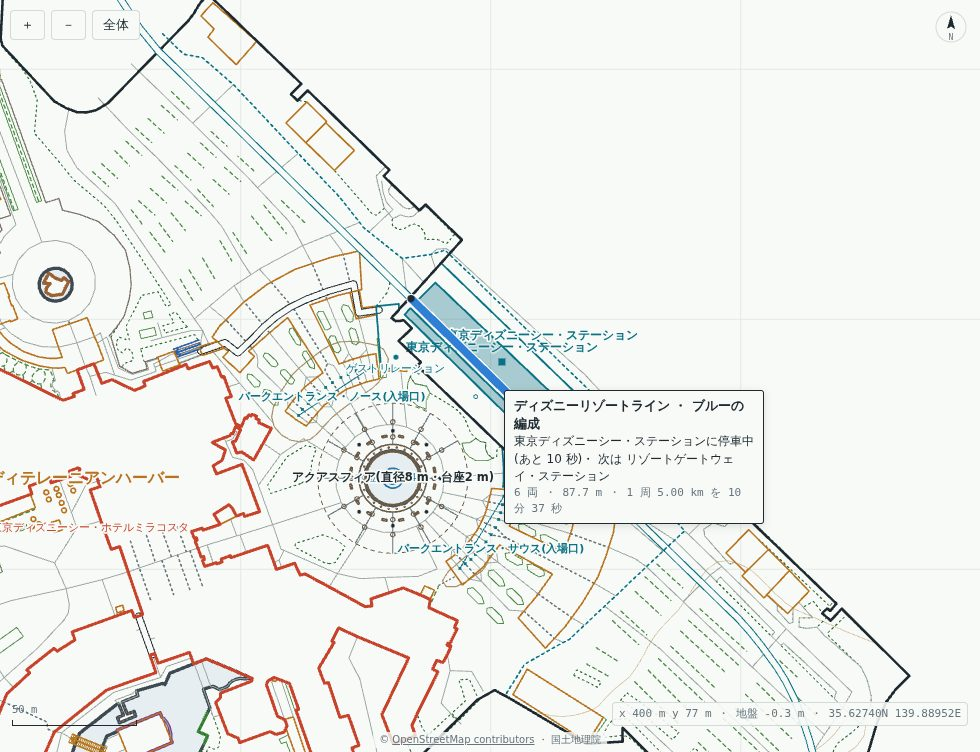 | 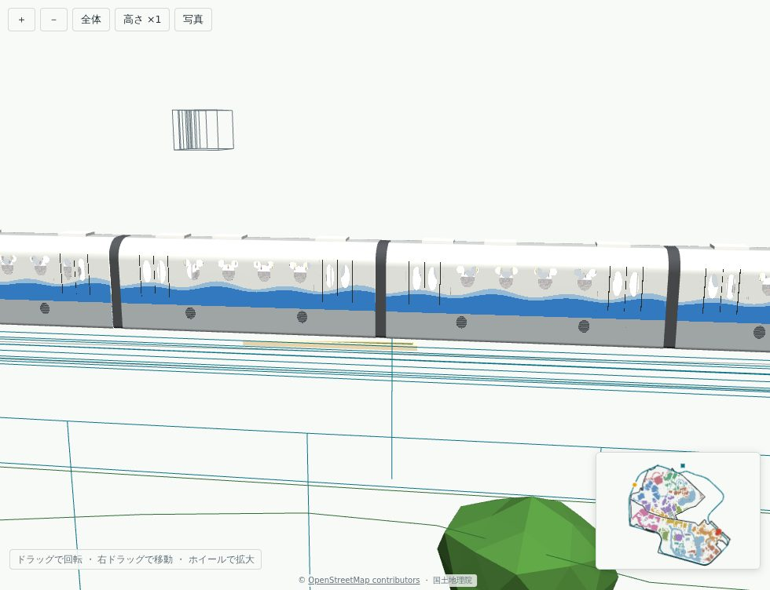 |
| **カーブ** | **散歩(プラザから)** |
| 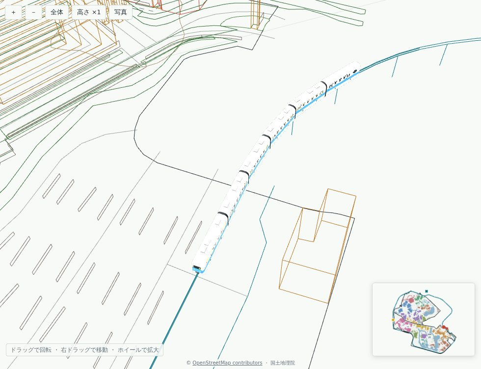 | 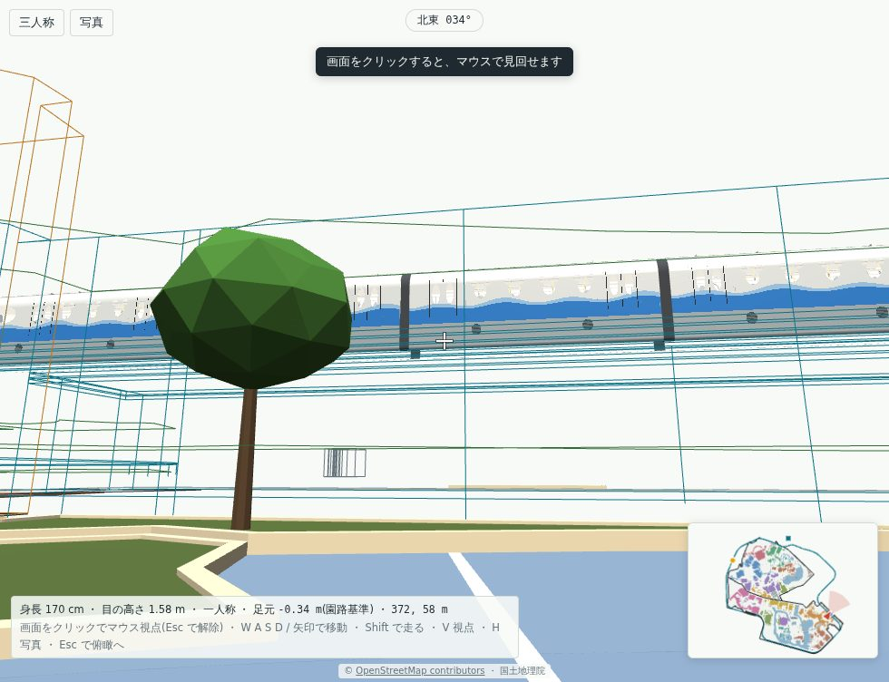 |
| **電車を追う** | |
| 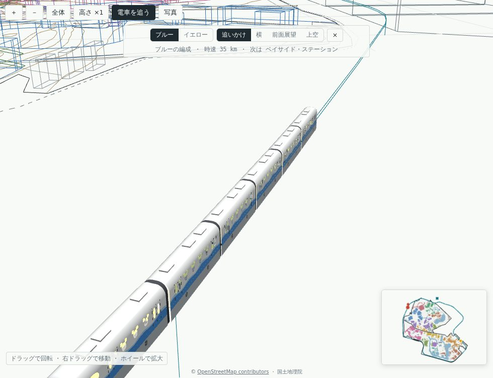 | |

## 入場口・駅(`ds_core.entrance_layer()`)

ディズニーリゾートラインの東京ディズニーシー・ステーション(ホームと駅の前後の線路。ホームは電車の床の高さ、地面から 5.5 m)、入場ゲートの列(パークエントランス・ノース / サウス、各 12 か所。高さ 1.2 m の枠)、回転式の改札、ゲストリレーション、駅前の通路。

## ディズニーランドと舞浜駅(`fetch_disneyland.py`, `ds_disneyland.py`)

- **ランド**: 園の境界・建物(375 棟。7 エリア + バックステージ)・水面・緑地・樹林・園路・ウエスタンリバー鉄道・階段・橋・トンネル・壁・1 m の等高線。シンデレラ城は 51 m。OSM の建設工事の区域は点線で示す(旧スペース・マウンテン跡の新アトラクションの区域内の建物はトゥモローランド、ウエスタンリバー鉄道の機関庫など裏手の建物は「その他」)。
- **舞浜駅・周辺**: 舞浜駅(JR 京葉線。高架は推定 10 m)、リゾートラインの全周と 4 駅(桁の上面は基準から 4.21 m。東京ディズニーランド・ステーションに合わせた)、イクスピアリ、ホテル(ディズニーのホテルと範囲内のオフィシャルホテル)、舞浜駅からランドのエントランスまでの歩道。
- データはシーとは別の OSM ファイル(`disneyland_osm.json`)。シーのデータを取り直すと火山などの元データまで変わってしまうため。標高はシーと同じ DEM5A のタイルがランドと舞浜駅まで覆っている。

## プロメテウス火山(`ds_volcano.py` → `ds_volcano_model.py`)

最初は半径 70 m の円錐を置いていたが、カルデラ湖を埋めてしまっていた。DEM を見ると、ミステリアスアイランドは園路より約 5.3 m 高い平らな台地で、その中央にカルデラ湖がある。そこで岩山を、台地の上に湖を囲むリングとして作り直した。

- 山頂: 51 m(OSM の山頂の位置、南側の縁)。縁: 高さ約 20 m、湖岸から約 22 m 外側。湖岸から 6 m 以内と、園路・建物の周りは岩を置かない。
- Blender(`ds_volcano_model.py`)は、この高さのグリッドを岩山として作り込む: 0.6 m 間隔に細かくし、ゆがませた稜線状のノイズで尾根・谷・副峰を付ける。約 1.8 m ごとに間隔が揺らぐ地層の段(棚)、台地の縁は園路へ・カルデラの縁は湖へ落ちる崖、山頂の火口のくぼみ。
- 色は頂点カラー: 赤茶・黒い玄武岩・黄土の縞、急な崖は暗く、棚はほこりっぽく、火口の周りは焦げた色、台地の床(通路)は砂色。

| 港から | 上空から | モックでの表示 |
|---|---|---|
| 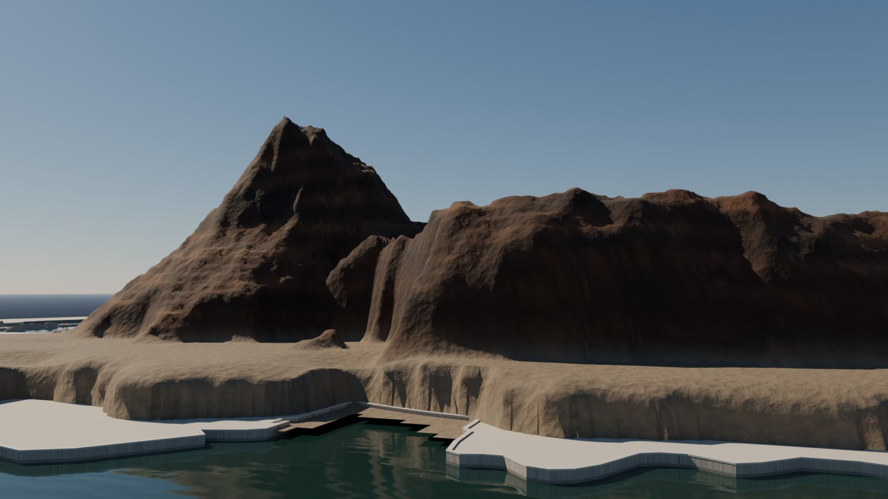 | 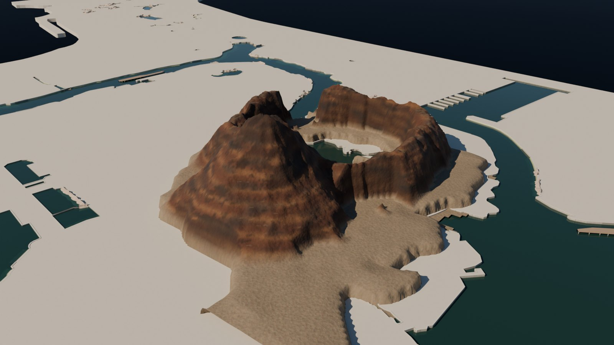 | 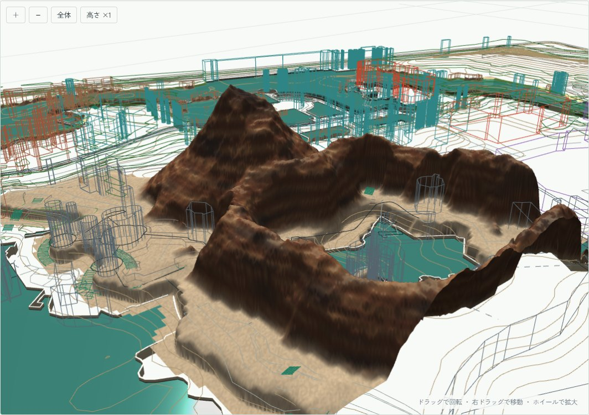 |

## アクアスフィア(`ds_aquasphere.py`)

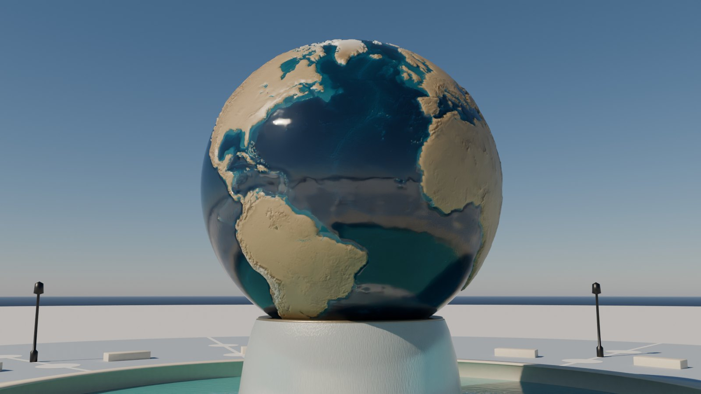

直径 8 m の地球儀を高さ 2 m の台座に載せ、周りを水盤(半径 11.16 m、縁の高さ 0.40 m)が囲む。石のブロックや街灯の数・配置は推定なので、確認が必要。

- **テクスチャ**: NOAA ETOPO(パブリックドメイン)の地形から `python src/ds_aquasphere.py --textures` で作る。海は深さに応じて紺から青緑、大陸棚は明るい青緑、陸は風化した石の色で、強めの陰影を付けて彫り込んだように見せる。氷床は白。
- **浮き彫り**: 海岸で約 4 cm の段差を付け、山は最大約 12 cm まで盛り上げる。
- **水の膜**: 地球儀の表面を流れ落ちる水を、少し大きい透明な球で表す。縦の筋が入り、地球儀と一緒には回らない。
- **根元**: ブロンズの受け皿で地球儀を受け、そのふちからあふれた水が白いカーテンになって池へ落ち、泡の輪になる。

| 根元 | 全体 |
|---|---|
| 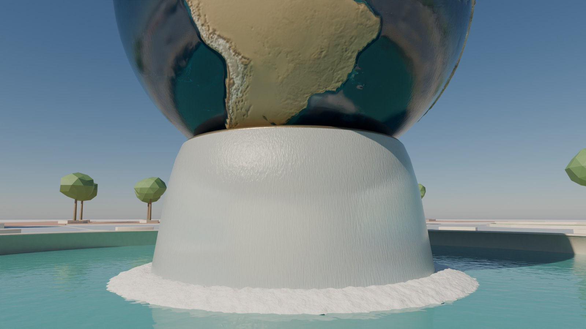 | 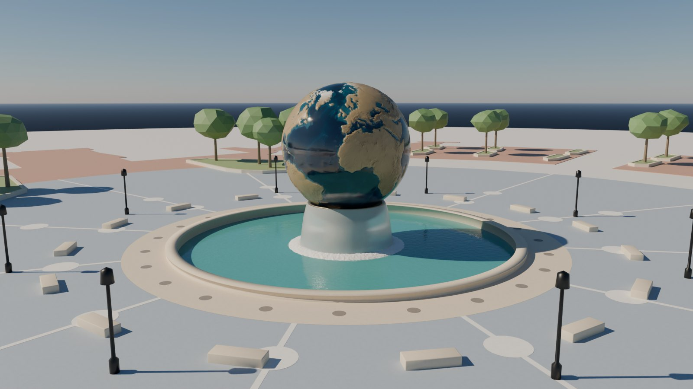 |

## ディズニーシー・プラザ(`ds_plaza.py`)

アクアスフィアの周り半径 85 m の地面。

- **舗装**: 地球儀から 42 m 以内は青灰色の石、その外側は赤茶のレンガ(航空写真の見た目に合わせた)。OSM のプラザ(relation 3297581)は中央の円と西のアーケードだけなので、ホテルミラコスタの中庭(植え込みの周り)も舗装する。地上の建物は除く。
- **白線**: アクアスフィアの 12 本の放射状の線を、42 m まで延長する。
- **植え込み**: プラザの内側の楕円形の穴と、OSM の庭・樹林・花壇。0.45 m の石の縁、芝の土、丸い樹冠の木(約 5 m 間隔、41 本)。同じ植え込みが二重に登録されている分は除く。

| 計画(航空写真に重ねたもの) | 植え込みと木 |
|---|---|
| 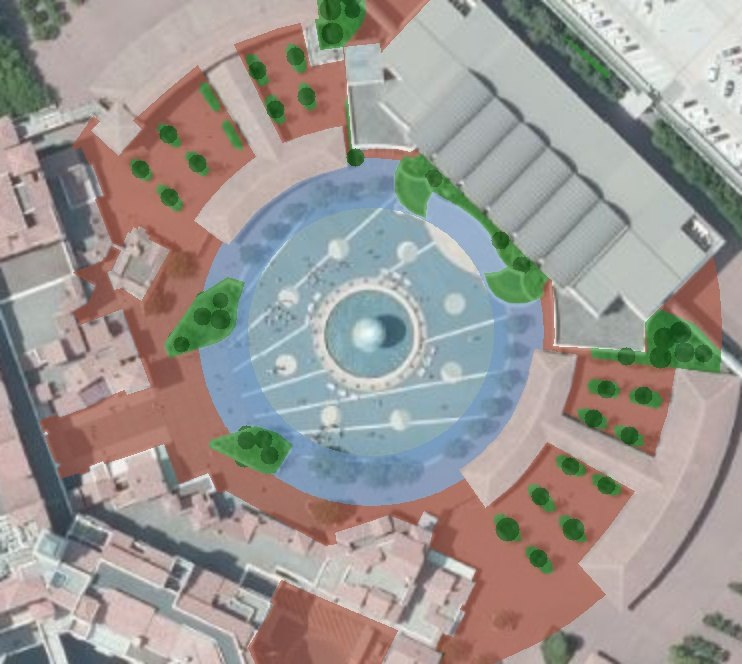 | 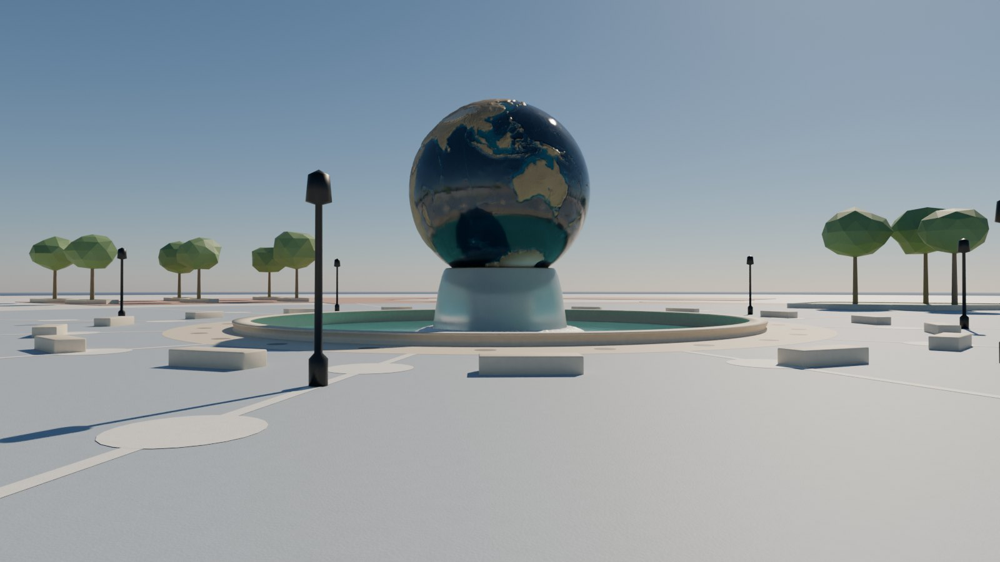 |

## 水面(`ds_water.py` → `disneysea_water_blender.py`)

| | |
|---|---|
| 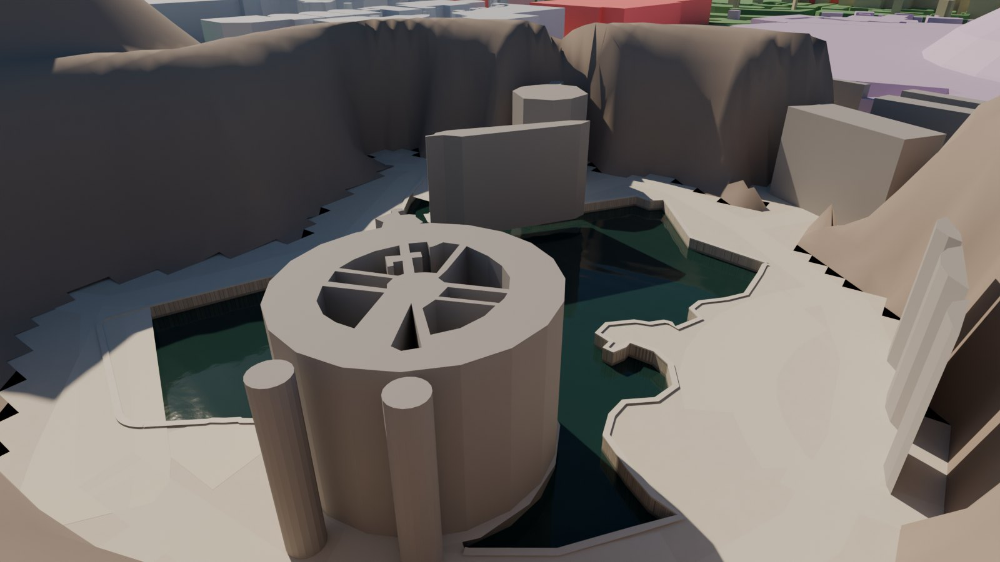 | 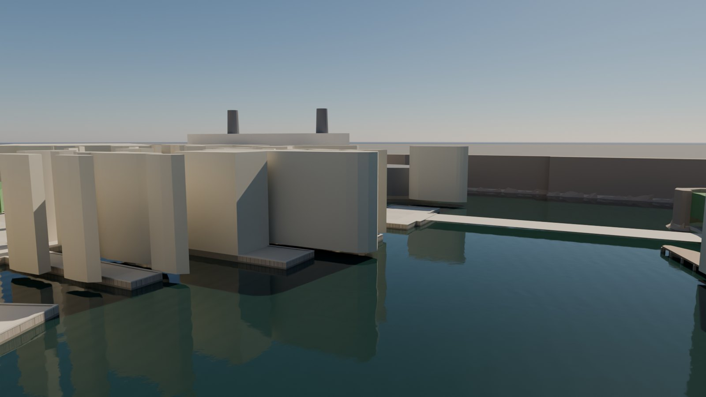 |
| 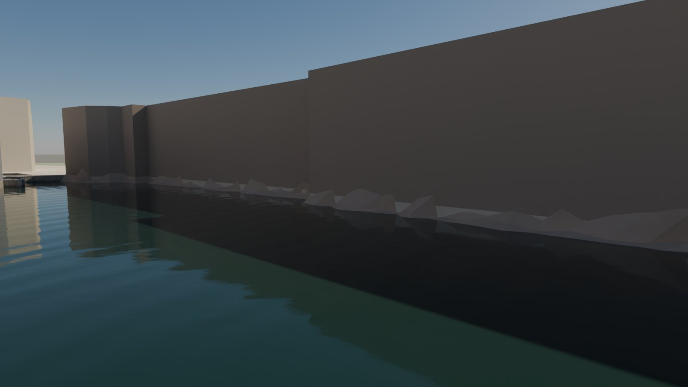 | 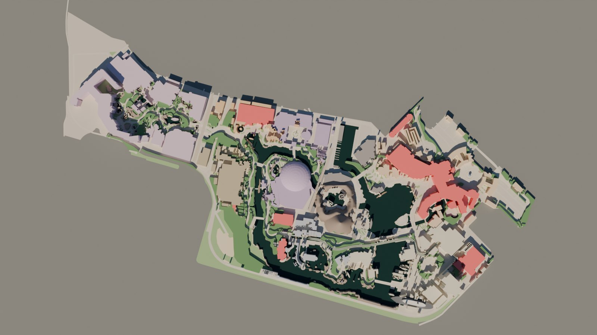 |

- **水域 38 か所**: OSM の `natural=water` から取っている。メインの港(relation 3531413)はミステリアスアイランドの中を通っている(ロストリバー → トンネル → カルデラ湖 → トンネル → 港。トランジットスチーマーラインの経路)。空が見えているカルデラ湖だけを航空写真の色から切り出し、岩の下を通る部分は `tunnels` に分けた(地面に穴を開けない)。

  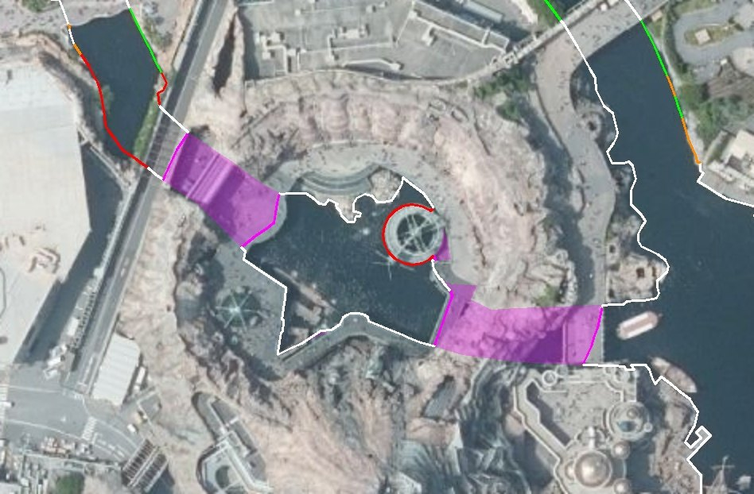

- **水位**: 岸の地面の高さ(DEM)から、水域の種類ごとの余裕高を引いて決める。余裕高は、港 1.0 m、カルデラ湖 1.3 m、水路 0.7 m、池 0.35 m、噴水 0.25 m。DEM の水面部分は補間された値でしかないので、水位そのものは DEM から読まない。カルデラ湖は港とつながっているので、港と同じ水位にしている。
- **水深**(推定): 港 2.5 m、カルデラ湖 3.0 m、水路 1.2 m、池 0.6 m。
- **岸の種類**: 岸の各区間について、陸側 2.5 m の地点に何があるかで決める。

  | 種類 | 判定 | Blender での形 | 長さ |
  |---|---|---|---|
  | 石積みの護岸 | 下のどれにも当たらない | 垂直の石積み + 笠石 | 4.58 km |
  | 植栽の土手 | 芝・庭・樹林 | 草の斜面 → 泥の斜面 | 1.75 km |
  | 岩場の岸 | scree / bare_rock | でこぼこの岩の斜面 | 1.28 km |
  | 建物が水際に立つ | 建物の敷地 | 濡れた基礎の壁 | 1.25 km |
  | 砂浜 | sand / beach | ゆるい砂の斜面 | 0.36 km |
  | トンネルの口 | トンネル部分 | 石積み | 0.07 km |

  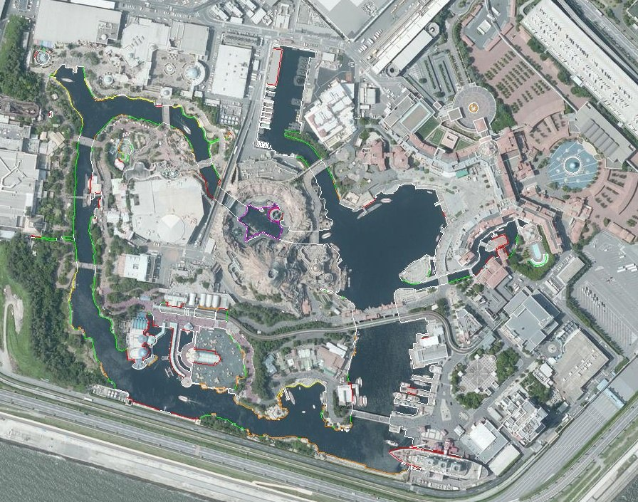

- **桟橋** 3 か所: 板張りの床と杭。
- Blender では、水を閉じた体積として作っている(屈折 + 吸収 + さざ波のバンプ)。地面はブーリアンで水の形をくり抜く。カメラは `top aerial harbor caldera american rock lost_river fantasy`。

## ランドの水面(`ds_tdl_water.py` → `tdl_water_blender.py`)

シーの水面と同じ作り方。データの形も同じなので、Blender ではシーの `disneysea_water_blender.build_water` がそのまま作る(材質・水の体積・水底・岸の種類・桟橋)。違うのはデータと地面の外形(ランドの園の境界 way 1282875870)だけ。

- **水域 35 か所**: OSM の `natural=water`(マルチポリゴンと閉じた線)のうち、真ん中が園の中にあるもの。ランドのデータにはシーの港(relation 3531413)も入っているが、園の外なので除く。重なりは大きい方を優先して削り、隣り合う水域の間には 0.25 m の陸を残す(辺が重なると、地面をくり抜くブーリアンが空になるため)。
- **種類と水位**(推定): アメリカ河とジャングルクルーズの川は川(余裕高 1.0 m・水深 2.2 m)、シンデレラ城の堀(ハブを囲む輪の形)は堀(1.3 m・1.5 m)、150 m² を超えるほかの水面は水路(0.7 m・1.2 m)、小さいものは池(0.35 m・0.6 m)、噴水(0.25 m・0.3 m)。水位は岸の地面(DEM)から余裕高を引いた値。
- **岸の種類**: 陸側 2.5 m の地点で判定(建物・岩場・砂浜・植栽の土手・それ以外は石積みの護岸)。植栽の土手 約 3.6 km、護岸 約 1.5 km、建物 約 0.6 km、岩場 約 0.4 km、砂浜 約 0.2 km。
- **Blender の場面**: 水のほか、ランドの下書き(`disneyland_blender.py`)の建物・緑地・木・ウエスタンリバー鉄道を置く(下書きの平らな地面と水の板は使わない)。カメラは `rivers moat moat_top jungle tom aerial top`。
- **共通の直し**: 輪の形の水域(城の堀)は、真ん中の点が自分の島の上に来る。そのため、島の上の池と取り違えて、島の地面を丸ごとくり抜いていた。島の上かどうかを外形の点で判定するように `disneysea_water_blender.py` を直した(シーでも同じ誤りが 2 か所あり、これで直った。モックのシーの水面は地面を含まないので変わらない)。
| アメリカ河(上から) | シンデレラ城の堀(ハブを囲む) |
|---|---|
| 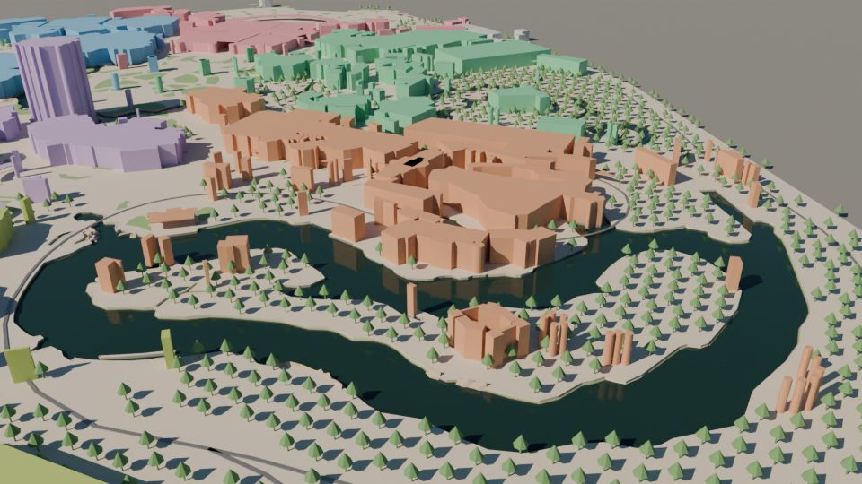 | 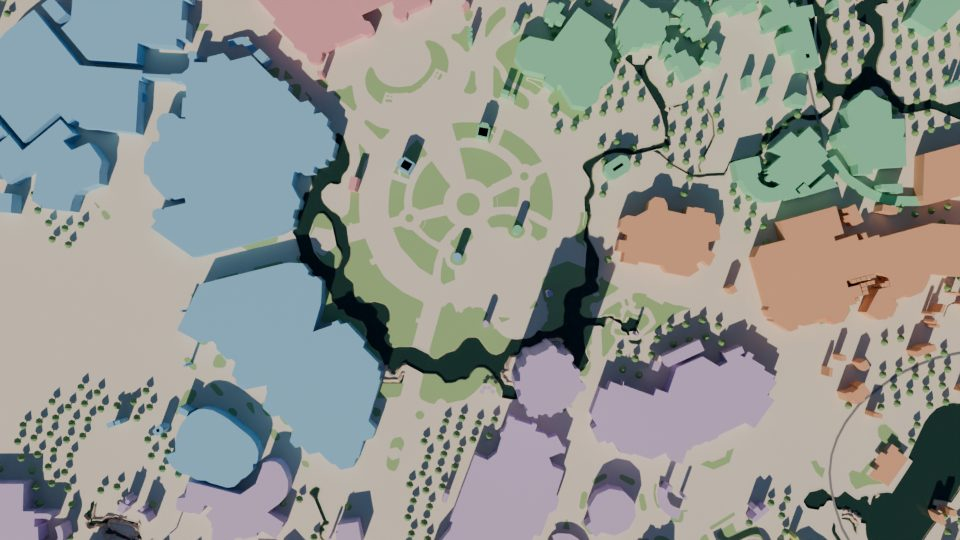 |

| モックでの表示(アメリカ河) |
|---|
| 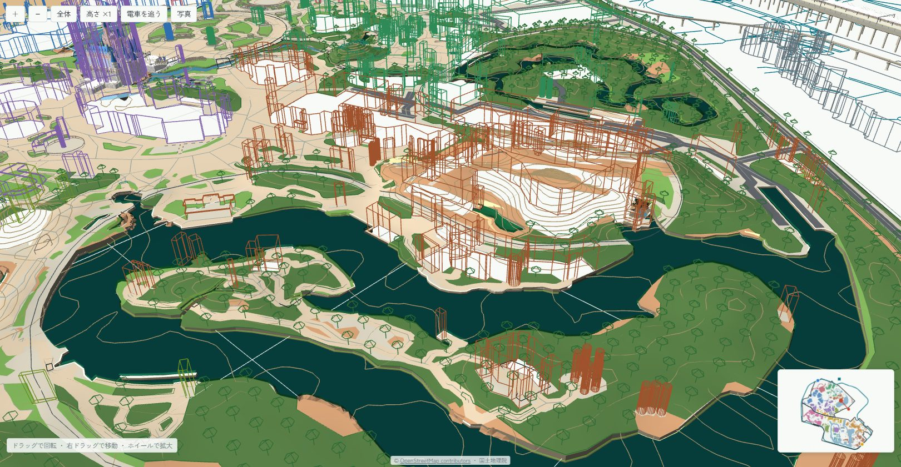 |

- **モック**: `export_models.py --parts tdl_water` で書き出す(約 1.2 MB)。シーの水面と同じ `WS_*` のメッシュ名なので、同じ水面(さざ波)と岸の材質になる。表示すると、ランドの水面の枠線は消える。ランド全体の地面(`ds_ground.py`)は、このモデルがあれば自分の水面を作らず、その外形をくり抜く。
- 水面の高さは、岸の地面(DEM)から余裕高を引いた推定値。
