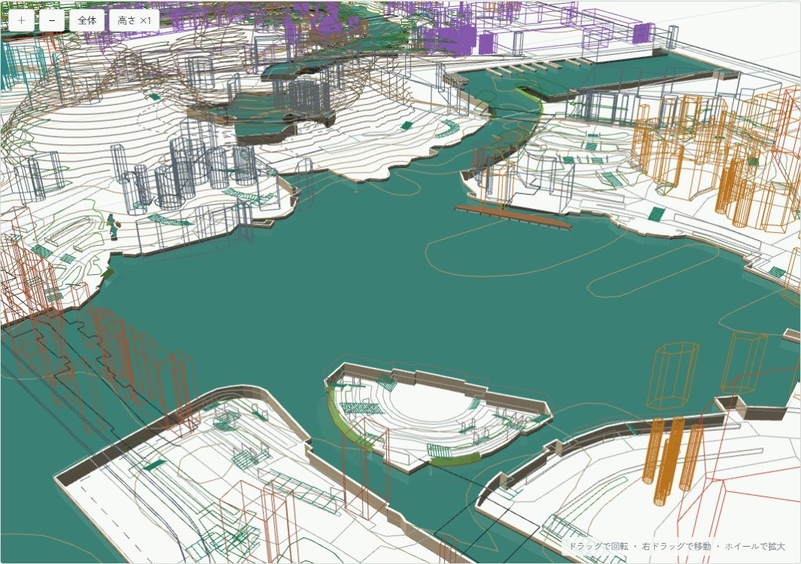
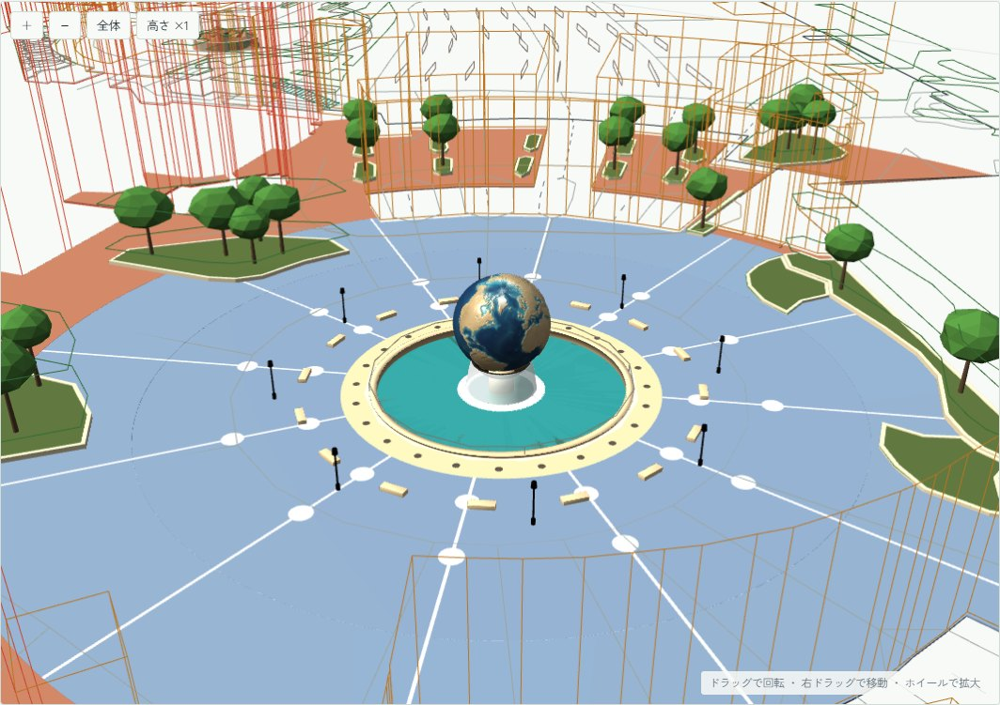

# データと処理の流れ・Blender で作ったもの

```
OpenStreetMap ─ fetch_*.py ─▶ plateau_data/*_osm.json ─┐
国土地理院 DEM5A(plateau_data/gsi_dem5a/)───────────────┤
                                                         ├▶ ds_*.py(高低差・水面・火山・プラザ・ランド)
                                                         │        │
                                                         │        ├▶ export_mock.py ▶ tds_outline.html ─ push ▶ Vercel
                                                         │        └▶ Blender(disneysea_*.py / export_models.py)
                                                         │                 └▶ output/disneysea/models/*.json ─┘(モックに 3D モデルとして重なる)
```

- 元データ(`plateau_data/`)のうち git に入っているのは、`*_osm.json`、`*_levels.json`、水面・火山・プラザの JSON、DEM、地球儀のテクスチャ。生の OSM(`*_osm_raw.json`)と航空写真のキャッシュは入っていない。
- **建物のエリア**(シー 8、ランド 7+その他)は、OSM の施設の点(アトラクション・店・レストラン)と名前付きの建物の名前から決める(`ds_core.PORT_POI_NAMES`、`ds_disneyland.LANDS`)。建物の中に施設の点があればそのエリア、なければ 90 m 以内で一番近い施設の点のエリア、それもなければエリアごとの代表点で決める。水面のエリアも同じ方法。以前は代表点だけで決めていたため、隣のエリアに 127 棟が入っていた(2026-09-24 に修正)。
- **建物の高さ**: OSM の `height` タグ(`10;3` のような値は先頭を使う)。ないものはエリアごとの推定値(シー 10〜16 m、ランド 12 m)。実測があるのは、シーで約 15 棟、ランドでシンデレラ城(51 m)などごく一部。

## Blender で作ったもの

レイヤーの枠線は下書きなので、Blender で作り終えた部分は、3D 表示ではその 3D モデルに置き換える。レイヤーの一覧(表示の切り替え)と平面図はそのまま残る。

| モデル | 置き換えるレイヤー | ファイル |
|---|---|---|
| 水面(水面・水底・護岸・笠石・岩場・砂浜・土手・桟橋) | 水面 | `output/disneysea/models/water.json` |
| アクアスフィア | ランドマーク | `output/disneysea/models/aquasphere.json` |
| ディズニーシー・プラザ(舗装・植え込み・木) | 園路(と一緒に表示) | `output/disneysea/models/plaza.json` |
| プロメテウス火山(岩山・台地・カルデラの崖) | ランドマーク(等高線を置き換え) | `output/disneysea/models/volcano.json` |
| 東京ディズニーランド・ステーション | 舞浜駅・周辺(駅の箱を置き換え) | `output/disneysea/models/tdl_station.json` |
| 東京ディズニーランドのエントランス(ゲート・ワールドバザールの入口・花壇) | ディズニーランド(枠線はそのまま) | `output/disneysea/models/tdl_entrance.json` |
| エントランス広場の地面(ゲートの前後の舗装・縁石・植え込み) | ディズニーランド(枠線はそのまま) | `output/disneysea/models/tdl_ground.json` |
| ホテル周辺の道(車道・園路・歩行者広場) | 舞浜駅・周辺(枠線はそのまま) | `output/disneysea/models/tdl_hotel_ground.json` |
| ランド全体の地面(駐車場からパークの奥まで) | ディズニーランド(枠線はそのまま) | `output/disneysea/models/tdl_land_ground.json` |
| シー全体の地面 | 園路(枠線はそのまま) | `output/disneysea/models/tds_ground.json` |
| 線路(リゾートライン・京葉線) | 舞浜駅・周辺(線路とホームの枠線を置き換え) | `output/disneysea/models/tracks.json` |
| 美女と野獣の城 | ディズニーランド(枠線はそのまま) | `output/disneysea/models/bb_castle.json`(石と屋根の画像 3 枚) |
| シンデレラ城(城・前庭・橋・裏のテラス・池) | ディズニーランド(枠線はそのまま) | `output/disneysea/models/cinderella.json`(石・ピンクの壁・屋根の画像 3 枚) |
| ランドの水面(水面・水底・護岸・笠石・岩場・砂浜・土手) | ディズニーランド(ランドの水面の枠線を置き換え) | `output/disneysea/models/tdl_water.json` |
| リゾートラインの電車(先頭車・中間車・幌) | 電車(3D モデルの「電車」で切り替え) | `output/disneysea/models/train.json` |
| ワールドバザール(ガラス屋根・お店・店内・街路) | ディズニーランド(ガラス屋根の枠線だけを置き換え) | `output/disneysea/models/tdl_world_bazaar.json` |
| 東京ディズニーランドホテル(本館・塔・中庭・New Grand Wing・奥の棟) | 舞浜駅・周辺(ホテルの箱だけを置き換え) | `output/disneysea/models/tdl_hotel.json` |

- パネルの「3Dモデル」欄で、モデルごとに表示を切り替えられる(「すべてオン / オフ」あり)。チェックを外すと、そのモデルに置き換えられていた枠線が出る。「枠線も重ねて表示」で同時に見られる。モデルの表示はレイヤーとは独立で、レイヤーを全部オフにすればモデルだけを表示できる。設定はブラウザの localStorage(`tds-layers` `tds-models` `tds-ui`)に保存する。
- `export_models.py` が Blender から glTF に書き出し、それぞれの地面の高さ(DEM 基準)まで持ち上げる。Artifact のホストは `.glb` を配信しないので、バッファを埋め込んだ glTF の JSON にしている。
- **ページが読むのは Draco 圧縮版**(`models/web/<id>.json`、`compress_models.py`。gltf-transform で圧縮し、バッファを埋め込み直す。画像は元の `models/` のものを指す)。合計 約 120 MB → 約 10 MB。`models/<id>.json`(圧縮前)は残す: `ds_ground.py` と `ds_tdl_hotel.py` がそれを読む。ページは DRACOLoader(three r147、jsDelivr)で読む。
- 枠線をモデルが置き換えるとき、置き換えるのがレイヤーの一部だけなら、その枠線に専用のキーを付ける(`ds_disneyland.py` の `MODEL_KEYS`(way id → キー)と `PLACE_MODEL_KEYS`(名前 → キー)。ワールドバザールのガラス屋根 `dlwbroof`、ホテルの箱 `mhtdlhotel`)。
- Blender の手続き型マテリアルは glTF に残らない。そのため、モック側でメッシュ名(`WS_*` `AQ_*` `PZ_*`)ごとに材質を付ける(three.js r147)。
  - **水面**: Blender の水(屈折・吸収・さざ波・空の映り込み)を物理マテリアルで再現する。建物の映り込みはない。
  - **アクアスフィアの噴水**: 地球儀の水の筋、水のカーテン、泡の輪、しぶき、池の同心円の波を、シェーダーで常に流れているように動かす。池は、透過にすると縞が出たので不透明の色にしている。
  - **火山**: 頂点カラーをそのまま使う(glTF はリニアで保存するので、モックで sRGB に戻す)。

| 水面のモデル | アクアスフィアとプラザ |
|---|---|
|  |  |
