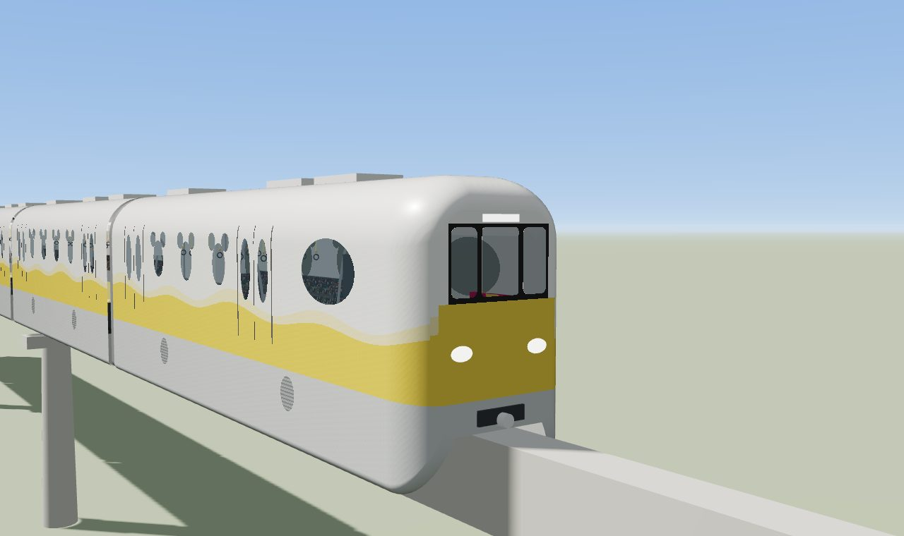
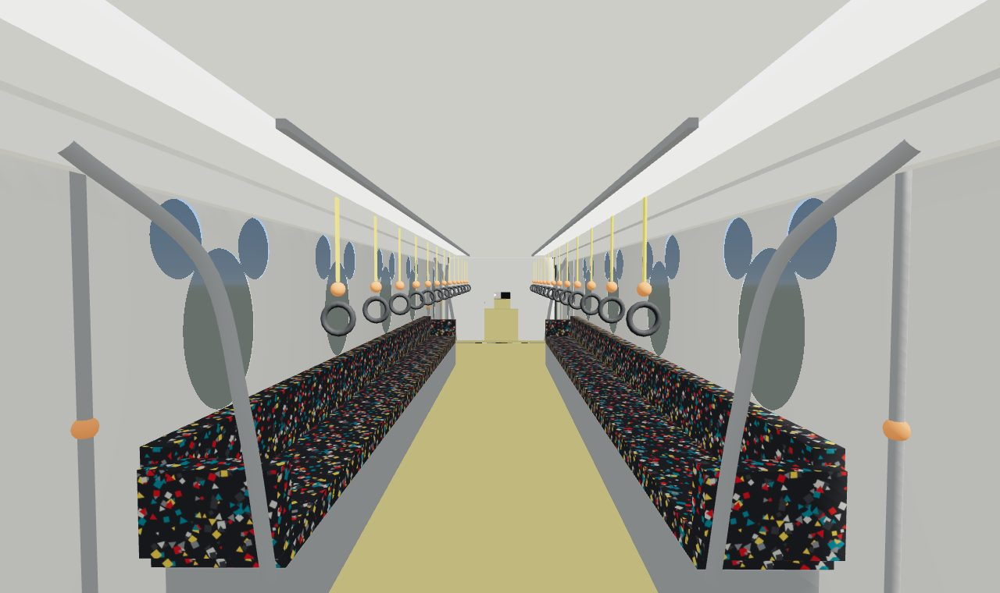
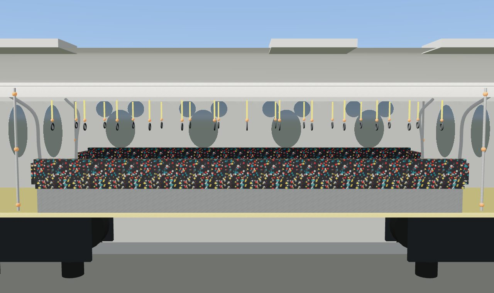
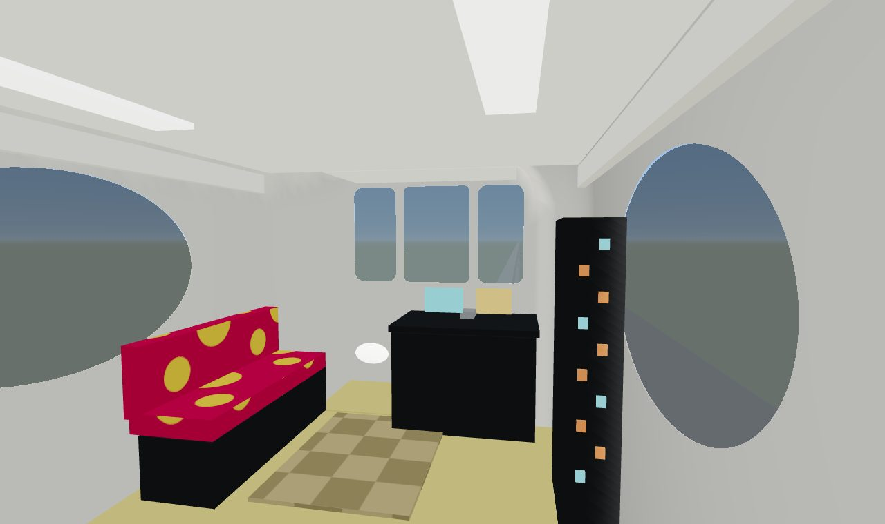
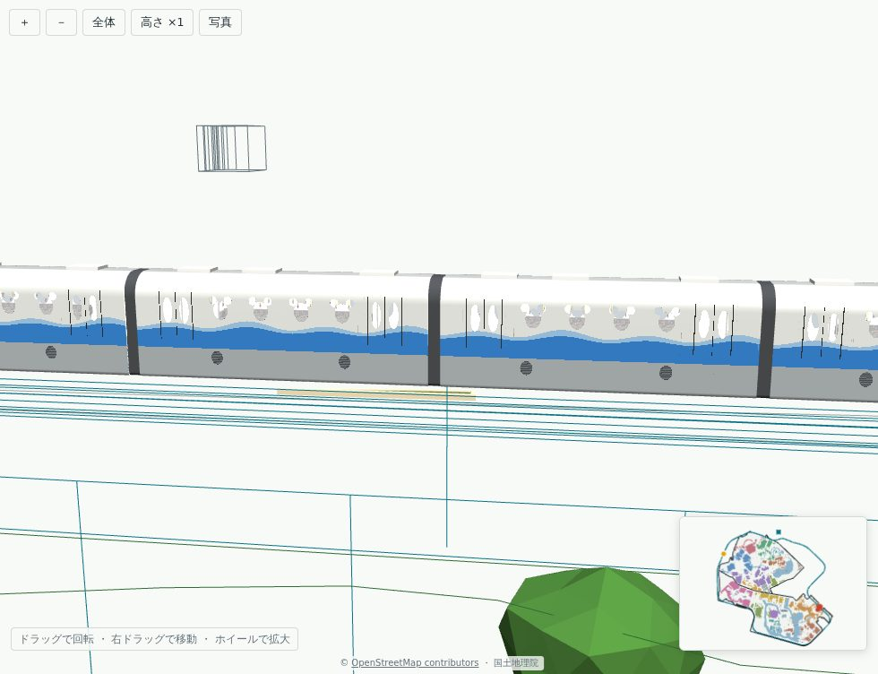
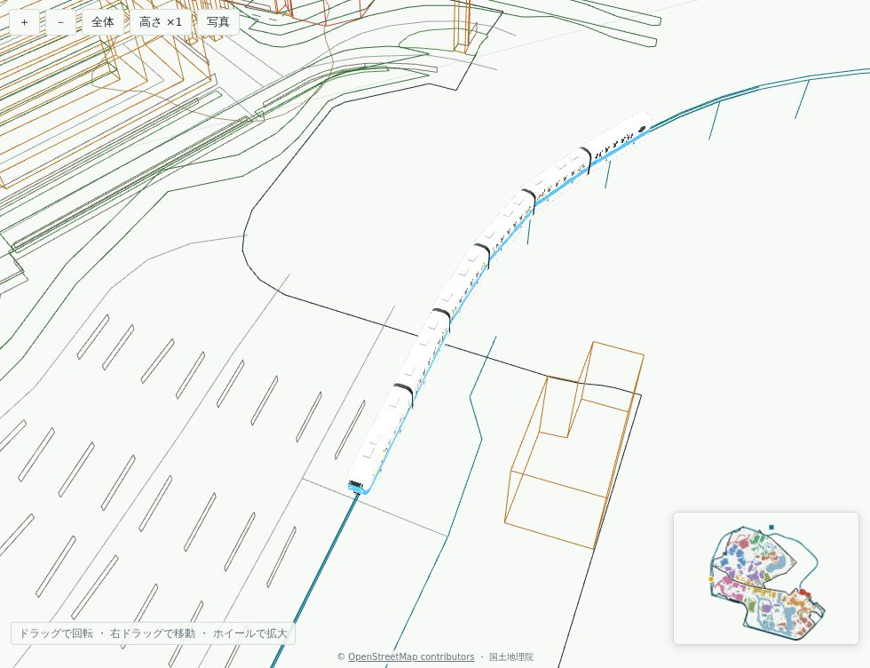

# ディズニーリゾートライン(Type X / Type C の形)の仕様

JS 版(`output/disneysea/train.html`)と Blender 版(`train_blender.py`)で、同じ値を使う。
区分: **実測** = Wikipedia「舞浜リゾートライン」の数値。**写真** = 下の参考写真で形・色を確かめたもの(寸法は測れないので、全長・全幅との比率で決めた)。**推定** = 写真でも確かめられない値。

## 参考にした写真(個人利用の参考のみ。リポジトリにも公開ページにも入れていない)

Wikimedia Commons(2026-09-24 に閲覧)。
- CC0: 「C展望席.jpg」「C車内.jpg」「C運転台.jpg」「ディズニーリゾートラインのミッキー風吊り革.jpg」
- CC BY-SA 4.0: 「Disney-Resort-Line Type-X Inside.jpg」「Disney-Resort-Line Type-C Inside.jpg」「Disney-Resort-Line Type-C Inside door.jpg」「Disney-Resort-Line Type-C Inside Free-space.jpg」「Resort Liner Type C interior.jpg」「Type C(100型)第1編成イエロー.jpg」「リゾートライン100型 Type-C.jpg」
- CC BY-SA 1.0: 「Tokyo Disney Monorail.jpg」

公式サイトの画像は、著作権の都合で使っていない。モデルの絵柄(座席の柄など)は写真を見て手で描いたもので、写真そのものは使っていない。

## 外装

| 項目 | 値 | 区分 |
|---|---|---|
| 編成 | 6 両(先頭車 2、中間車 4) | 実測 |
| 全長 | 先頭車 15.05 m、中間車 13.70 m、連結部 0.55 m。編成 87.7 m | 実測(連結部は推定) |
| 全幅・全高 | 2.98 m ・ 5.237 m | 実測 |
| 車体の色 | 白い車体。下が銀灰のスカート(丸いルーバーの換気口 2 つ)、その上に編成ごとの色の帯。帯の上端は波形で、薄い色の波が重なる | 写真 |
| 編成の色 | ブルー・イエロー・パープル・グリーン・ピーチ(Type X)。Type C はイエロー・ピンク・ブルー・パープル・グリーン | 実測(Wikipedia) |
| 窓 | 縦長のミッキーの頭の形(楕円の顔 + 耳 2 つ)。中間車は片側 4 つ、先頭車は 3 つ + 前寄りの横長の楕円窓(展望席) | 写真(大きさ・間隔は推定) |
| ドア | 両開き、片側 2 か所。各扉に縦長の楕円窓 | 写真 |
| 先頭部 | 桁の上 2.05 m より上が、屋根まで後ろへ傾いている(先端から 2.1 m 後退)。そこに左右へ回り込む大きなフロントガラス 1 枚(黒い縁取り)。その下は垂直な面で、色の帯と楕円の前照灯 2 つ、連結器、下は銀灰。平面の角と下端は丸い | 写真(傾きの寸法は推定。2026-09-24 に斜めの形に直した) |
| 走行部 | 跨座式。桁 幅 0.85 m・深さ 1.4 m。台車は各車 2 つ、走行タイヤは桁の上、案内輪は桁の側面 | 推定 |

## 車内

| 項目 | 内容 | 区分 |
|---|---|---|
| 床・天井・壁 | 黄色い床、白い天井に 2 列の照明、クリーム色の壁 | 写真(Type X) |
| 座席 | ドアの間の長いベンチ(ロングシート)。濃い灰色の生地に赤・黄・白・青緑の小さな四角と三角の柄。ステンレスの台 | 写真(Type X) |
| 手すり | 座席の端に、床から天井へ弧を描くステンレスの手すり。ドア脇にオレンジの玉が付いたポール | 写真 |
| つり革 | 天井の 2 本のレールから、黄色い帯・オレンジの玉・黒い輪(実物はミッキー形の輪) | 写真 |
| 車端 | 貫通路の開口(隣の車両が見える) | 写真 |
| 先頭車の前部 | 黒い運転台(画面 2 つ、ハンドル)、右側に縦長のスイッチ盤、左側に展望席(マゼンタ地に黄色の水玉のベンチ)、市松模様の床 | 写真(Type C) |
| 車内の高さ | 床 1.0 m、天井 3.18 m(桁の上面から) | 推定 |

## JS 版(2026-09-24)

- 車体は断面をつないだ 1 枚の殻。窓はシェーダーで実際に穴を開けていて、そこに半透明の反射するガラスを重ねている。殻の内側は車内の壁として描く。
- 車内(座席・手すり・つり革・照明・運転台・展望席)を作り込んだ。三角形は約 10 万。
- 操作: 10 の視点(外から 6、断面、車内の通路・運転席・座席)、手前の壁や屋根を外す断面表示、5 色の編成、走行。

| 外観(先頭) | 車内(通路) |
|---|---|
|  |  |
| **断面** | **運転席まわり** |
|  |  |

1 回目の試作(推定だけで作ったもの)との違い: 車体の色(青一色 → 白 + 色帯 + 銀灰)、窓(平らな板 → 穴 + ガラス)、先頭部(流線形 → 箱形 + 3 枚のガラス)、車内(なし → あり)。写真を見ると、推定で作った部分の多くが違っていた。

## JS と Blender の比較(更新)

| 観点 | JS(three.js) | Blender(想定) |
|---|---|---|
| 全体の形・色・窓の配置 | 写真どおりに作れた | 同じ |
| 窓の穴と車内の見え方 | 殻に穴を開けて作れた。窓枠の厚み(額縁)はない | ブーリアンで厚みのある窓枠まで作れる |
| 車内の造形 | 箱と管の組み合わせ。座席の丸み、運転台の細部は粗い | 曲面の座席、細かい運転台まで作れる |
| 質感 | 描いた柄のテクスチャ。汚れ・細かい凹凸はない | ベイクで汚れ・陰影を載せられる |
| 光 | 車内の明るさは「自分で光る」材質でごまかしている | 実際の照明で計算できる |
| 反復の速さ・確認 | 数秒で確認できる | 起動とレンダーに時間がかかる。この端末では確認できない |

## 判断(更新)

- 外から見る編成(地図・俯瞰で走る電車)は、**JS 版で十分**。今回の作り込みで、写真と見比べて形・色は合った。
- 車内を近くで見せるなら、座席の丸み・窓枠の厚み・照明の計算の分だけ **Blender が上**。ただし、今の JS 版でも車内の配置と雰囲気は出ている。
- どちらでも、残りの精度を決めるのは寸法(窓・ドアの位置、車内の高さ)。実物の図面か、寸法の分かる写真があれば直せる。

## モックで走らせる(2026-09-24)

- 車両の作り方は `output/disneysea/train_model.js` にまとめ、`train.html` とモック(`tds_outline.html`)の両方が使う。`train.html` の見た目は切り替え前と同じ(画面を比べて確かめた)。
- モックでは 2 種類を使い分ける。**詳細版**は `train.html` と同じ車両で、車内の部品を材質ごとに 1 つのメッシュにまとめて描画の回数を減らしている(見た目は同じ)。**簡略版**は角の丸めを粗くした殻だけで、窓は穴を開けずに暗いガラス色で塗る(1 両数百三角形)。
- モックは sRGB 出力・トーンマッピングなしで描くので、車体の色を 0.6 倍、空の映り込みを 0.5 倍にしている(`train.html` では変えない)。
- 走り方・停車位置・表示の切り替えは README の「電車(ディズニーリゾートライン)」→「モックで走らせる」。

| 俯瞰(駅に停車中) | カーブ |
|---|---|
|  |  |

## Blender 版 v2 とモックへの差し替え(2026-09-24)

ユーザーの指示で、モックの電車を JS 版から Blender 版(`train_blender.py`)に差し替えた。JS 版は `train.html` にだけ残している。

- 追加で見た写真(Wikimedia Commons、Category:Disney Resort Line Type C / Type X。個人利用の参考のみ): 「DRL-TypeC121-wiki.jpg」「DisneyResortLine141.jpg」「Type C(100形)の第1編成であるイエロー.jpg」「Disney-Resort-Line Type-C Inside Free-space.jpg」「Resort Liner Type X windows.jpg」ほか、外観・車内・運転台の写真。
- 跨座式モノレールの作り(一般的な構造): 走行輪(ゴムタイヤ)が桁の上面を走り、案内輪が桁の側面の上、安定輪が下を挟む。電気は桁の側面の電車線から集電靴で取る。台車はスカートで隠れる。
- 外装: 殻の厚み 10 cm(窓の額縁)、全部の窓にガラス、ドアの線とステップ、スカートのルーバー・点検蓋の線、屋根の空調とグリル、前面ガラスの中央の柱、縁取りのある丸い前照灯、連結器。
- 車内(Type C): 市松の床、照明 2 列、赤い妻壁とガラスの貫通扉、黒い座面と赤い波形の背もたれ・黄色い水玉、丸い透明の仕切りと赤い玉、白いポール、ミッキーの輪のつり革、ドア上の画面、運転台・ガラスの仕切り・展望ソファ。
- 寸法(`SPEC`)は変えていない(`tools/blender_smoke.py` が JS 版と突き合わせる)。新しい部品の位置・大きさは写真からの推定。
- モック: `export_models.py --parts train` が先頭車・中間車・幌を材質ごとのメッシュで書き出し、ページが編成ごとに複製する。色帯は JS 版と同じ式のシェーダー。
