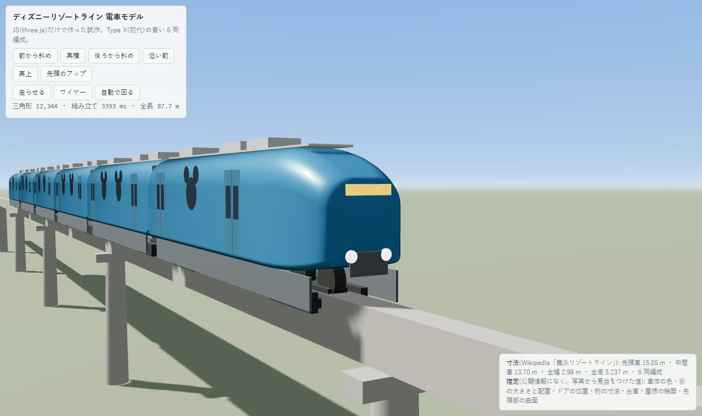
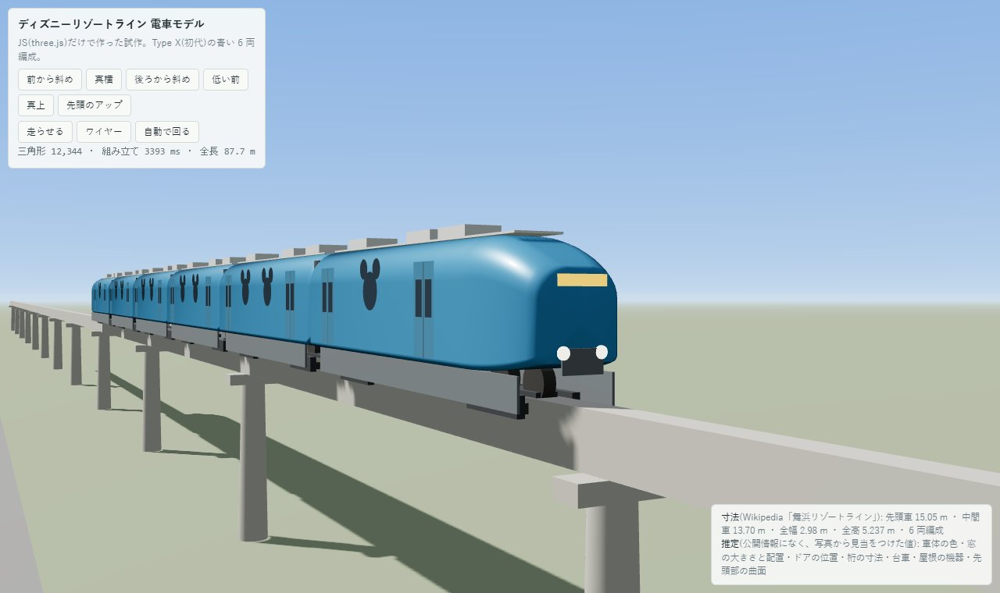

# ディズニーリゾートライン Type X(青い 6 両編成)の仕様

JS 版(`output/disneysea/train.html`)と Blender 版(`train_blender.py`)で、同じ値を使う。
**「実測」は Wikipedia「舞浜リゾートライン」の値。「推定」は写真から見当をつけた値で、実物の写真・図面で直す。**

| 項目 | 値 | 区分 |
|---|---|---|
| 編成 | 6 両(先頭車 2、中間車 4) | 実測 |
| 全長 | 先頭車 15.05 m、中間車 13.70 m、連結部の間 0.55 m。編成 87.7 m | 実測 + 推定(連結部) |
| 全幅 | 2.98 m | 実測 |
| 全高 | 5.237 m(桁の上面からか、桁の下からかは不明。JS 版は桁の上面から車体上端 3.95 m) | 実測(基準は推定) |
| 車体の断面 | 角の丸い長方形。屋根の丸み半径 1.15 m、下端の丸み 0.18 m、車体の下端は桁の上面から 0.62 m | 推定 |
| 先頭部 | 長さ 3.4 m。先端で幅 0.62 倍、屋根が 0.95 m 下がる。先端に前照灯 2 つ、行先表示 | 推定 |
| 窓 | ミッキーマウスの顔の形(円 半径 0.58 m と耳 半径 0.31 m 2 つ)。高さは床から 2.6 m。1 両あたり 4〜5 か所 | 形は実測(「ミッキーの顔を象った」)、大きさと配置は推定 |
| ドア | 幅 1.3 m、両開き、片側 2 か所(車端から 1.9 m)。ドア窓は縦長 2 つ | 推定 |
| 色 | 車体 青(0x1c6fcf)、屋根 明るい灰、スカート 灰、窓ガラス 暗い青 | 推定 |
| 走行部 | 跨座式。桁の幅 0.85 m、深さ 1.4 m。台車は各車 2 つ(車端から 2.7 m)、桁の側面に案内輪、上面に走行タイヤ | 推定 |
| 屋根の機器 | 空調装置 3 つ(1.7×1.1×0.32 m) | 推定 |
| 最高速度 | 営業 50 km/h(モックでの走行は 8.5 m/s ≒ 30 km/h) | 実測 + 推定 |

他の編成の色: 第 2 編成イエロー、第 3 編成パープル、第 4 編成グリーン、第 5 編成ピーチ(Type X)。Type C(2020 年〜)は同じ寸法。

## 比較の記録(2026-09-24、JS 版の試作)

作ったもの: 6 両編成、丸みのある先頭部、ミッキー型の窓、ドア、連結部の幌、台車と案内輪、屋根の機器、桁と橋脚。三角形は約 12,000。
かかった手間: 1 回目で形が出た。修正は 3 回(面の向きが裏返る、背景が黒い、露出が強くて青が白く飛ぶ)とカメラ位置の調整。

| 画像 | |
|---|---|
|  |  |

| 観点 | JS(three.js) | Blender(想定) |
|---|---|---|
| 全体の形・色・窓の配置 | できた。断面をつないで作るので、先頭部の曲面は滑らか | 同じことができる。細分化とベベルで、より自然にできる |
| 窓・ドアの凹み、枠、ゴムのパッキン | 平らな板を貼っているだけで、凹みがない | ブーリアンで実際に切り抜いて凹ませられる |
| 先頭部のフロントガラス | 面の色分けで試みたが、はっきり出なかった | 面を選んでガラスの材質にでき、枠も付けられる |
| 塗装・質感 | 物理マテリアルと環境光で光沢は出るが、汚れ・ロゴ・帯などの絵柄がない | テクスチャをベイクして、絵柄・傷・汚れを載せられる |
| 動き | 桁の上を走らせられる | 走らせるにはモック側で動かす必要がある(glTF に動きは残らない) |
| 反復の速さ | 数秒で結果を見られる | 起動とレンダーに時間がかかる |
| この端末での確認 | できる | できない(別の端末が要る) |

## 判断(私の見立て)

- 地図・俯瞰の全体表示で、編成が桁の上を走る見せ方には、**JS 版で十分**。
- 近づいて見たときのリアルさ(窓の凹み、フロントガラス、塗装の絵柄)は、**Blender で作ったほうが上**になる。
- 分担案: 走る編成のモデルは JS 版で仕上げてモックに入れる。近景用の高精細な先頭車だけを、別の端末の Blender で作って、glTF で入れ替える。
- どちらでも、リアルさを決めるのは寸法・色・絵柄の材料。実物の写真か図面があれば、推定の部分を直せる。
